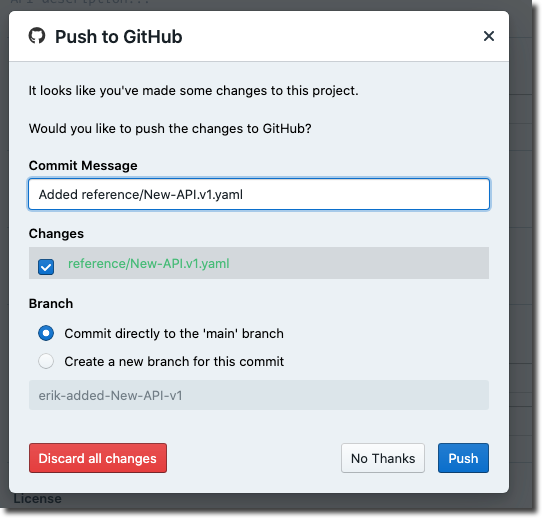

# Add Projects

Projects can contain anything you would expect to find in a repository: source code, API descriptions, images, Markdown articles, maybe some Excel spreadsheets. Stoplight will analyze the contents of a project looking for things it knows what to do with, and ignore the rest.

Stoplight looks for: 

- API Description Documents (OpenAPI v2, OpenAPI v3, and JSON Schema)
- Markdown articles
- Images

## Connecting a Git Repo

The quickest and recommended way to get projects into Stoplight is to pull them in from Git.

1. Select **+** on the top left, then click an option under **Add Git Project**.

2. Select your Git provider of choice and then click **Connect with Your Git Provider**. Follow the instructions on the pop-up screen to authenticate.

3. Upon successful authentication, you should see your organizations listed. Choose the organization and select the repositories you want to import. Click **Add Projects**.

Once the repository data has been analyzed, your workspace landing page should now contain projects populated with data.

Next, lets [share this project](share-documentation-quickstart.md). 

## Creating a Blank Project

If you don't have your API artifacts, like OpenAPI or JSON Schema, on a Git repository or want to get started with creating a new one, you can get started directly from Studio by selecting the **+** on the top left of the screen, and then clicking an option under **Create Local Project**.

<!-- theme: danger -->

> ### Warning!
>
> Projects *not connected* to a Git repository will **only be editable on your current browser session**. This means that you could potentially lose the ability to edit your project should you lose your session data.
> 
> If you either need to edit your content on multiple browsers or collaborate with others, it is strongly recommended that you use the "**Connecting a Git Repo**" option listed above.

### Importing Files

From within Studio - Click **+** at the top of the screen and then "Import File" in order to open existing OpenAPI, JSON Schema, Image, or Markdown files.

### Promoting to Git

To start sharing this project, you can promote it to a new Git repository. This will create a new private Git repository under your VCS of choice and push the newly-created content to it.

Click the **Push** icon, and then click **Promote to Git Repo** to use this option.

Once done, choose your desired Git provider, organization, repo name, and then click **Create Git Repository**.

<!-- theme: warning -->

> After making change within Studio please ensure you push the changes to avoid any work being lost. Click **Push** and follow prompts to do this.
> 

Next, lets [share this project](share-documentation-quickstart.md). 

### Push to Workspace

If you don't want to push this content to a Git repo, you can push it to the workspace to start sharing it immediately.

<!-- theme: danger -->

> ### Warning!
>
> Projects *not connected* to a Git repository will **only be editable on your current browser session**. This means that you could potentially lose the ability to edit your project should you lose your session data.
> 
> If you either need to edit your content on multiple browsers or collaborate with others, it is strongly recommended that you use the "**Connecting a Git Repo**" option listed above.

Give it a useful name. Click **Push**, then click **Push to workspace**. 

Next, lets [share this project](share-documentation-quickstart.md). 
