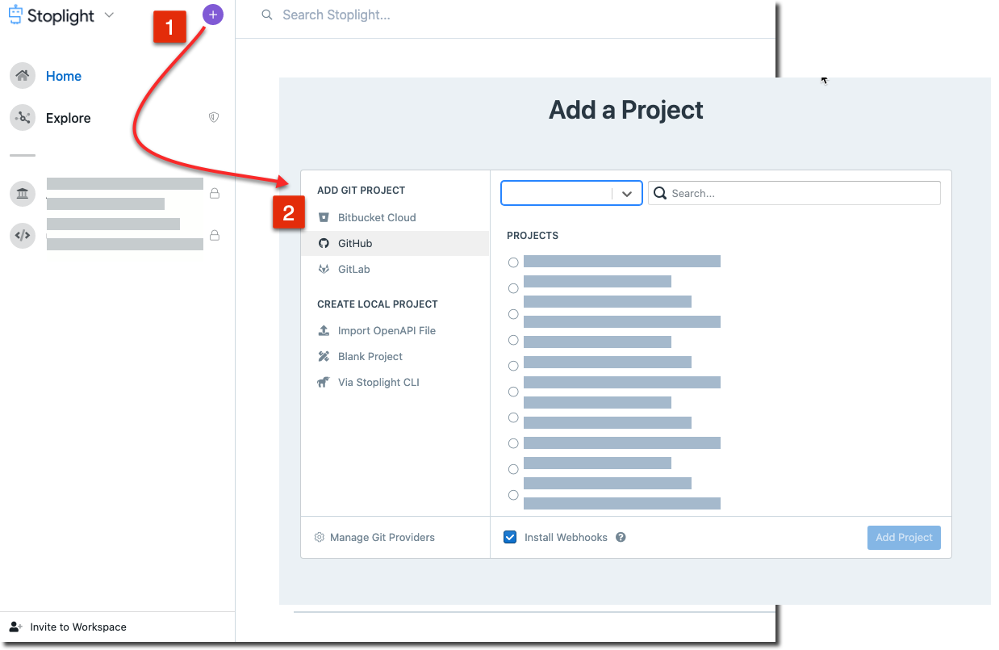
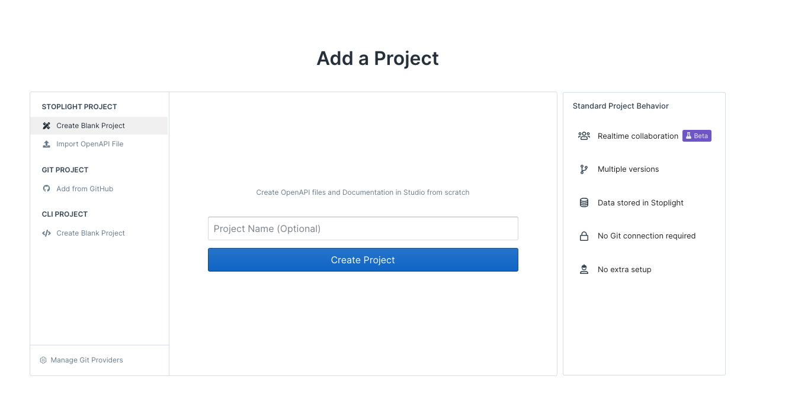
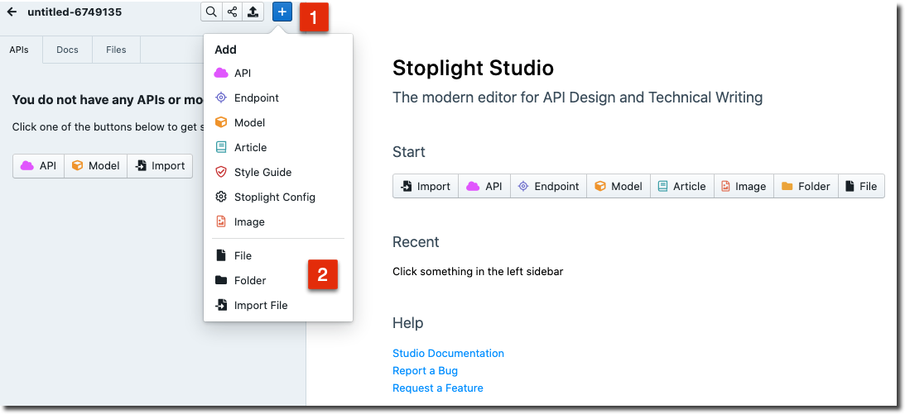
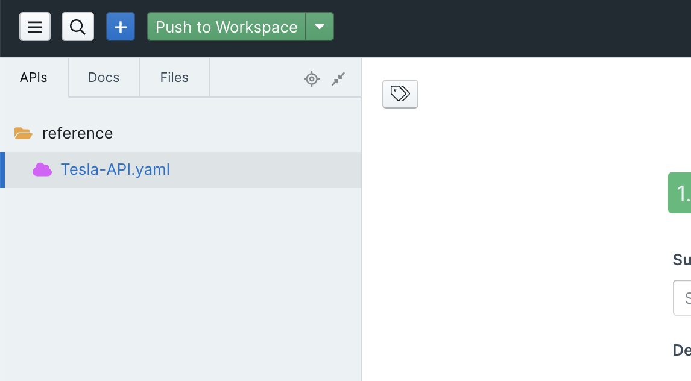
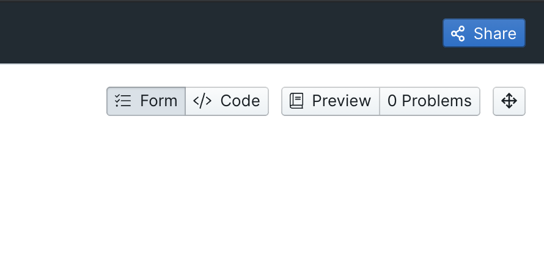

# Add Projects

Projects can contain anything you would expect to find in a repository: source code, API descriptions, images, Markdown articles, maybe some Excel spreadsheets. Stoplight will analyze the contents of a project looking for things it knows what to do with, and ignore the rest.

Stoplight looks for: 

- API Description Documents (OpenAPI v2, OpenAPI v3, and JSON Schema)
- Markdown articles
- Images

## Connecting a Git Repo

The quickest and recommended way to get projects into Stoplight is to pull them in from Git.

1. Select **+** on the top left, then click an option under **Add Git Project**.

2. Select your Git provider of choice and then click **Connect with Your Git Provider**. Follow the instructions on the pop-up screen to authenticate.

3. Upon successful authentication, you should see your organizations listed. Choose the organization and select the repositories you want to import. Click **Add Projects**.

Once the repository data has been analyzed, your workspace landing page should now contain projects populated with data.

Next, lets [share this project](share-documentation-quickstart.md). 

## Creating a Blank Project

If you don't have your API artifacts, like OpenAPI or JSON Schema, in a Git repository or want to get started with creating a new one, you can get started directly from Studio by selecting the **+** on the top left of the screen, and then clicking an option under **Create Stoplight Project**.

### Importing Files

From within Studio - Click **+** at the top of the screen and then "Import File" in order to open existing OpenAPI, JSON Schema, Image, or Markdown files.

### Push to Workspace

Once you're done making changes, you can click the "Push to Workspace" button to save your changes to Stoplight.

### Share

Finally, click the **Share** button in the top right to [share this project](share-documentation-quickstart.md) with your teammates. 

