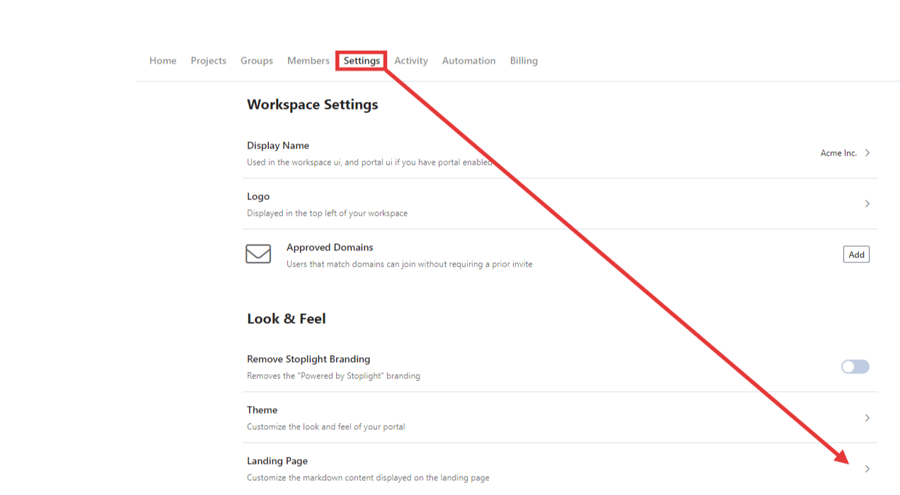

# Sharing Documentation

With your project added to Stoplight, you are now ready to share your API documentation. You can think of your [workspace](./../2.-workspaces/a.creating-a-workspace.md) as a developer hub that can be viewed by either authenticated or anonymous users, depending on your project visibility settings.

Keep in mind that users will see different projects depending on the following criteria:
- Their permissions in the **workspace**, or
- Their permissions in the **project**, or
- The **visibility settings** of the project (private, public, or internal)

## Manage Project-Level Access

There are two ways to set project visibility.

From the project:

1. Edit a project.
2. Select the **Share** button.
3. From the **Project Visibility** list, select Public, Internal, or Private. 

From the project settings:

1. From the workspace home page, select **Projects**.
2. Select one or more projects from the list, and then select Public, Internal, or Private from the **Visibility** list. 

### Public Documentation

Set the project visibility as **Public** to allow anyone, including anonymous users, to view the project contents.

### Internal Documentation

Set the project visibility as **Internal** to allow authenticated workspace members to access the project. Projects with **Internal** visibility are not accessible to unauthenticated users.

### Private Documentation

Set the project visibility as **Private** to restrict access only to users with direct access. Give authenticated users access to the project documentation by sharing the project with them. Use the **Share Project** page to change users' assigned roles. 

## Customize Your Landing Page

The **Home Screen** is the landing page for your workspace and the first thing users will see. Use the landing page to highlight important APIs, getting started guides, or tutorial videos.

> Use the example template available to get started quickly. You can edit or completely replace the default template using [Stoplight Flavored Markdown](https://meta.stoplight.io/docs/studio/docs/Documentation/03a-stoplight-flavored-markdown.md) from the workspace settings.

## Add a Company Logo

The ideal icon is a rectangular image approximately 250 pixels wide and 75 pixels high. The logo should have a transparent background. 

1. From the workspace home page, select **Settings**.
2. Select the right arrow next to **Logo**.
3. Add a URL to your company's logo. Make sure the URL is accessible to your users. 

## Add a Favicon

Customers on the Starter plan can customize the site's favicon. The ideal size is 16x16 pixels, and the favicon should have a transparent background. 

1. From the workspace home page, select **Settings**.
2. Select the right arrow next to **Favicon**.
3. Add a URL to you favicon. Make sure the URL is accessible to your users. 

## Share with Users

With your landing page ready and projects set to the correct visibility, **share your workspace URL with users** to let them access your documentation. For internal or private projects, [invite users](../2.-workspaces/d.inviting-your-team.md) to the workspace directly. 
