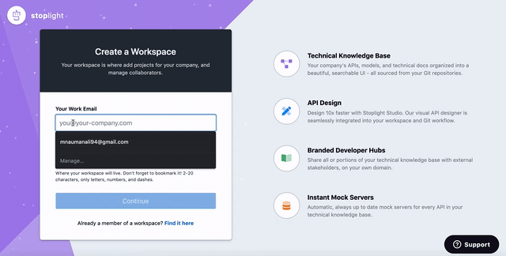

# Creating a Workspace

Stoplight enables you to drive consistency, discipline, and efficiency across your API teams by helping members across your organization work in a collaborative manner. The first step to enabling collaboration across your API lifecycle is creating a workspace for your content.

## What is a workspace?

A workspace in Stoplight is a place for you to group API projects across your organization in order to promote visibility, standards, and reuse of artifacts.

> Stoplight recommends making a single workspace for your organization, and then using roles and permissions to manage your workflows.

To create a new workspace, navigate to the [Stoplight homepage](https://stoplight.io/welcome) and select **Create a Stoplight workspace**.

Once you have registered your workspace, you will be prompted to confirm your email address using a 6-digit verification code.

Now that your workspace is ready, start collaborating by [adding your first project](b.adding-projects.md) and [inviting users](d.inviting-your-team.md).
