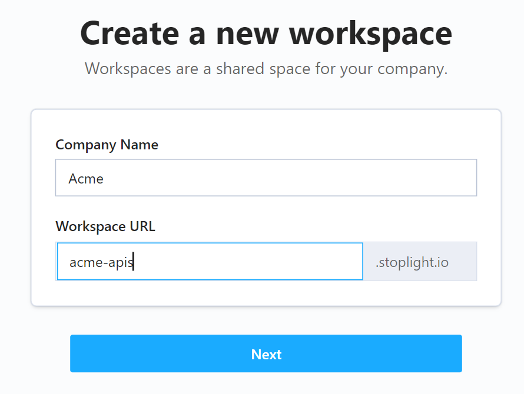

# Creating a Workspace

Stoplight enables you to drive consistency, discipline, and efficiency across your API teams by helping members across your organization work in a collaborative manner. The first step to enabling collaboration across your API lifecycle is creating a workspace for your content.

## What Is a Workspace?

A workspace is a place for you to group API projects across your organization to promote visibility, standards, and reuse of artifacts.

> Stoplight recommends making a single workspace for your organization, and then using roles and permissions to manage your workflows.

To create a new workspace:

1. Navigate to the [Stoplight home page](https://stoplight.io/)

2. Select **Get Started for Free**.

3. Provide your business email address.

4. Provide your company name and a URL for your workspace, and then select **Next**.

<!-- focus: center -->

5. Check your email and confirm your registration using the verification code.

Now that your workspace is ready, start collaborating by [adding your first project](b.adding-projects.md) and [inviting users](d.inviting-your-team.md).

## Delete a Workspace

Workspace owners can delete workspaces. Be aware that deleting a workspace removes all workspace data stored in Stoplight.

To delete a workspace:

1. Log in to your workspace.
2. Select **Settings** from the workspace toolbar.
3. Scroll to the bottom of the page, and select the arrow next to **Remove Workspace**.
4. Enter your workspace name to acknowledge that you are deleting all workspace data, and then select **Remove**.