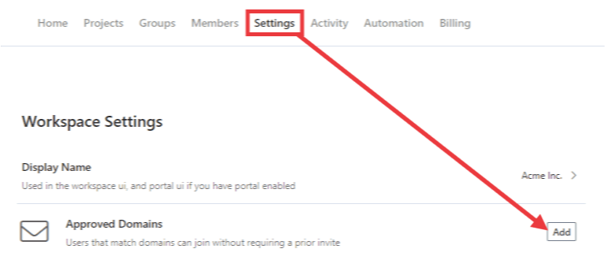
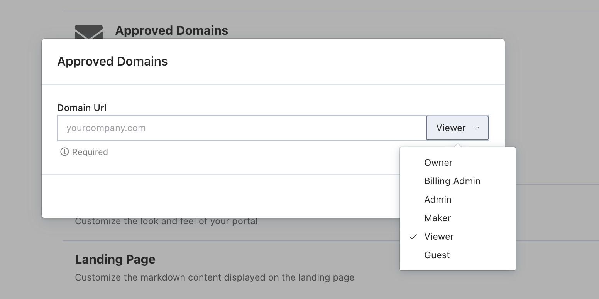

# Approved Email Domains

Domains are how you identify things on the internet. For example, you can see domains in website URLs, such as https://example.com, and email addresses, such as hello@example.com.

Approved email domains let Stoplight know who should have automatic access to your workspace and who needs membership approval. You can configure one or more approved email domains.

> This feature is available on the [**Starter** plan](https://stoplight.io/pricing/) and above.

## Overview

To approve email domains:

1. Select **Settings** from the workspace home page. 
2. Select **Add** to the right of **Approved Domains**.
3. On the page that opens, add your email domain and then choose the role for users who join with that matching domain.

Now that you've configured your company's email domain, you can send your workspace URL to teammates and they will be automatically added to your workspace. 

## How it works

When someone tries to join your Workspace, Stoplight will first have them confirm their email address. 

If their email address matches one of your workspace's approved email domains, they're added as a workspace member with the role configured with the approved domain.

If their email address **doesn't match** one of your workspace's approved email domains, a pending "join request" is created and approval from a workspace owner or admin is required.