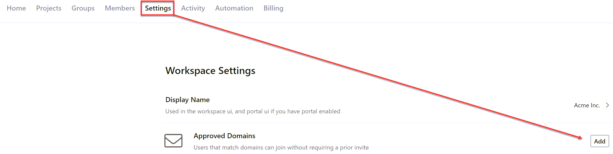
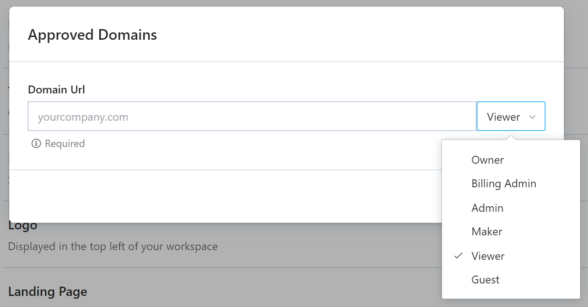

# Allowed Email Domains

Domains are how we identify things on the internet. For example, we can see domains in website URLs https://stoplight.io and email addresses support@stoplight.io.

Allowed email domains let Stoplight know who should have automatic access to your Workspace and who needs membership approval.

> This feature is available on the [Stoplight **Starter** plan](https://stoplight.io/pricing/), and above.

## Overview

You can configure one or more allowed email domains by navigating to your Workspace settings.

After clicking the "Add" button, you will see a dialog where you can input an email domain and choose the role for users who join with that matching domain.

Now that you've configured your company's email domain, you can send your Workspace URL to teammates and they will be automatically added to your Workspace. 

## How it works

When someone tries to join your Workspace, Stoplight will first have them confirm their email address. 

If their email address matches one of your Workspace's allow email domains, Stoplight will add them as a member to your Workspace with the role configured with the allowed domain.

If their email address **does not match** one of your Workspace's allow email domains, a pending "join request" will be created and an approval from a Workspace Owner or Admin will be required.