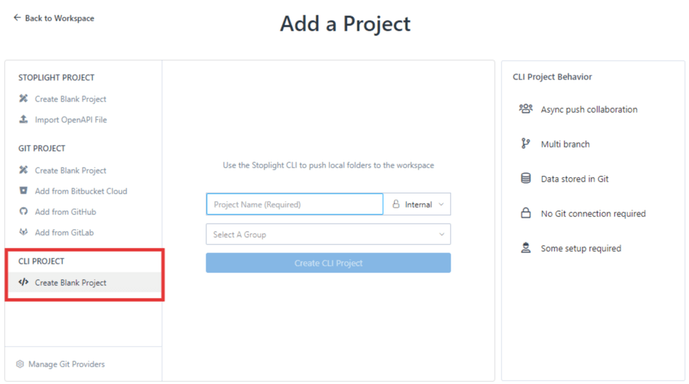

# Add Projects

There are three types of projects you can add to your workspace:

- Stoplight projects 
- Git projects
- CLI projects

To add a project, log in to your workspace, and then:

* Select the **Add** icon (+) at the top of the left pane.
   OR
* Select the **Projects** tab on the workspace toolbar, and then select **New Project**.

## Add Stoplight Projects

Stoplight projects offer real-time collaboration. Data is stored in Stoplight. A Git connection is not required and there is no extra setup. You can:

  - Create a blank project
  - Import an existing OpenAPI file

  

### Add a Blank Project

1. From the **Add a Project** page, select **Create Blank Project**.
3. Provide a name for your project, and then set the [project visibility](l.project-roles.md). 
4. Select **Create Project**.
5. Select **Edit** to design your API with Stoplight Studio.

### Import an OpenAPI File

1. From the **Add a Project** page, select **Import OpenAPI File**.
2. Provide a name for your project, and then set the [project visibility](l.project-roles.md). 
3. Select **Create Project & Import File**.
4. Select the OpenAPI file to import, and then select **Import**.
5. Use Stoplight Studio to update the API.

## Add Projects from Git

The quickest and recommended way to get projects into Stoplight is to pull them in from Git. Git projects offer asynchronous push/pull collaboration across multiple branches. Data is stored in Git, but there is no extra setup. You can:

  - Create a blank project
  - Add a project from Bitbucket Cloud
  - Add a project from GitHub
  - Add a project from GitLab

> Stoplight works with many popular Git providers. Read more about [configuring Git](configure-git/a.configuring-git.md).

To add projects from Git:

1. From the **Add a Project** page, select an option under **Git Project**.
2. Select  **Connect**. Follow the instructions on the popup screen to authorize.
3. Upon successful authentication, choose your organization, and then select the repositories you want to import.
4. The **Install Webhooks** option is selected by default. This enables automatic publishing from your project when changes are pushed to the repository. Clear this option to disable automatic publishing. See [Publishing Git Projects](../7.-projects/publishing-git-projects.md) for details. 
5. Next, select **Add Git Project**.

Once the project is created and the analyzer has completed, it will contain Markdown articles and API descriptions that are stored in the Git repository. Use Stoplight Studio to modify these files.

### Custom Git Configurations

If your Git provider isn't listed or you're using a custom configuration, see [Custom Configuration for Git](#custom-configuration-for-git). 

## Add CLI Projects

If you use a version control system other than Git (Mercurial, SVN, SourceSafe, Bazaar), use the Stoplight CLI to add a local project. 

 

Stoplight CLI is a command-line tool, available as [an NPM module](https://www.npmjs.com/package/@stoplight/cli), that can publish changes to Stoplight. CLI projects are shown in Explorer like other projects. They won't be editable in Studio Web, but the content will be available to read and search like anything else. 

Read more about [working with local projects](f.working-with-local-projects.md).

## Share Projects

For external users, share your workspace URL with users to let them access your documentation. For internal or private projects, [invite users](../2.-workspaces/d.inviting-your-team.md) to the workspace directly. 

