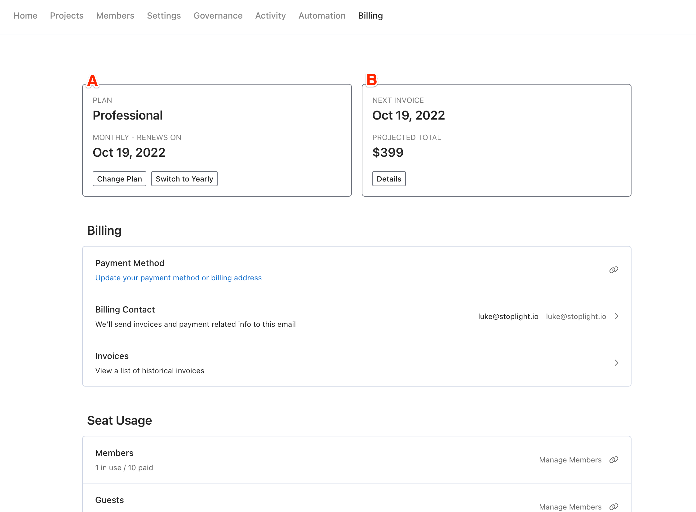
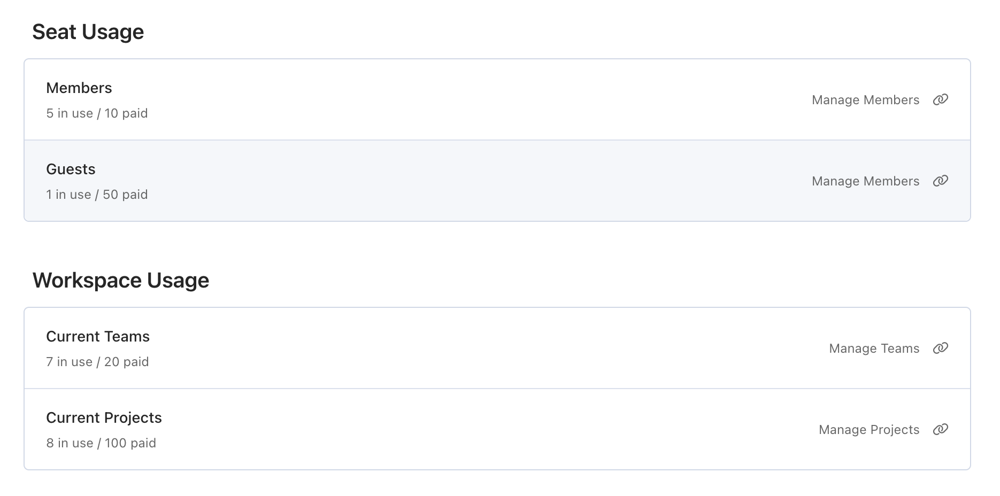
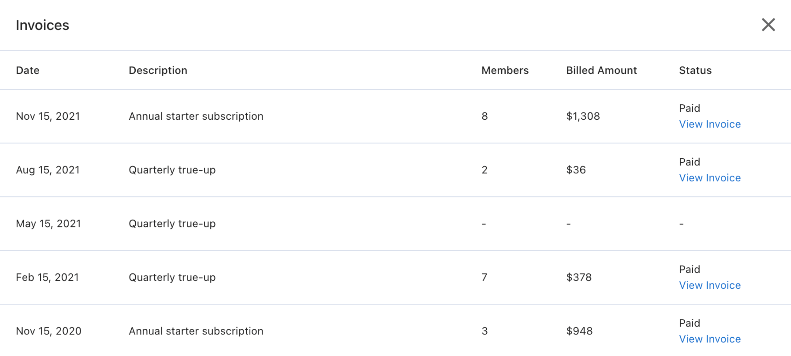
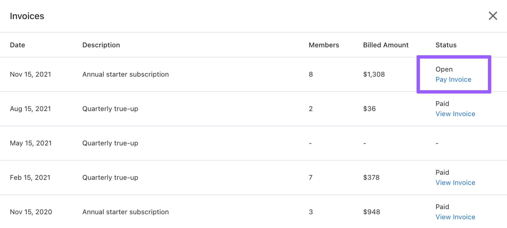

# Billing

Stoplight currently has three paid plans: **Starter**, **Professional**, and **Enterprise**. Your Stoplight workspace includes features that enable a self-serve billing process. This article offers guidance on managing your billing account, subscription, and payments.

<!-- markdown-link-check-disable-next-line -->
Contact Stoplight's support team via the [Support Center](https://support.stoplight.io/) for assistance if you experience any billing issues.

## Billing Dashboard

Manage your workspace billing via the billing dashboard. You must be logged in and have the owner, billing admin, or admin role to access the **Billing** tab.

### A - Current Subscription

See an overview of your active subscription.

- **Plan**: The plan associated with your active subscription. One of Free, Starter, Professional, or Enterprise.
- **Monthly - Renews On**: Displays your billing interval (monthly or yearly), and your subscription renewal date. For monthly subscriptions, this date will always equal the "Next Invoice" date.
- **Change Plan**: Select this if you want to upgrade or cancel your subscription.
- **Switch to Yearly**: Select this if you want to change your billing interval from a monthly subscription to a yearly subscription. Note that this button only displays if you are currently on a monthly subscription.

### B - Current Billing Period

Information about your current billing period and next invoice.

- **Next invoice**: The date of your next invoice. This will display your next [true-up](#quarterly-true-up) invoice date for yearly subscriptions unless you are in the fourth quarter of your annual billing cycle.
- **Projected total**: The expected total of your next invoice is based on the current number of member seats in use, the number of member seats included in your base plan, and the number of member seats you have already paid for during this billing cycle.
- **Details**: Select to see a breakdown of your next invoice. Note that this projection won't reflect a coupon if one is active on your subscription. However, the coupon will apply when the invoice is issued.

### Usage

Information about your billable usage.

#### Seats Usage

Seats usage includes a detailed view of total workspace users and the assigned limits for your workspace in this billing cycle. Depending on the subscription plan you have, you will see:

- **Members**: Members are workspace users with the Viewer, Maker, Admin, Billing Admin, or Owner roles.
- **Guests**: Guests are workspace users with the Guest role. 
- **Viewers**: Viewers are workspace users with the Viewer role.
- **Makers+**: Makers+ are workspace users with the Maker, Admin, Billing Admin, or Owner roles.

See [Workspace Roles](k.workspace-roles.md) for more details about roles.

If you are on a yearly subscription and the number of seats exceeds the members you have paid for, you will be issued a [true-up billing](#quarterly-true-up) invoice at the three/six/nine month mark. This information is also reflected in the **Projected total**.

#### Workspace Usage

Workspace usage includes information about the total number of projects in the workspace, and the maximum number of projects allowed based on your plan.

## Manage Billing

### Upgrade Plan

To upgrade your plan from Starter to Professional, navigate to your billing dashboard and select **Change Plan**.

If you are interested in the Enterprise plan, [contact the Stoplight sales team](mailto:sales@stoplight.io).

### Change Payment Method

To change your payment method, navigate to your billing dashboard and select **Payment Method**. This will take you to a Stripe-hosted page to adjust the credit card on file.

> If you are a customer on the Enterprise plan and need to change your payment method, contact your account manager.

### Change Billing Contact

Stoplight emails invoice receipts and open/past due invoice notifications to the primary billing contact. The billing contact email address **doesn't** need to be associated with a member of the workspace. This can save you a seat in certain situations. For example, you could set the billing contact email to payables@yourco.com, even though payables@yourco.com isn't a member of your workspace.

Navigate to your billing dashboard and select "Billing Contact" to change your primary billing contact. This will open a form for you to adjust the billing contact email.

### Change Billing Interval

Workspaces on a monthly subscription can switch to a yearly subscription at any time by navigating to the billing dashboard and selecting the **Switch to Yearly** button.

You will be invoiced for a new yearly subscription **at the end of your current monthly billing cycle**. You may cancel/revert this decision before the end of your current monthly cycle if you change your mind!

> Note that if you would like to change your billing interval AND also upgrade your plan, you must upgrade your subscription and then change the interval in two separate steps. For example, if you are on Starter monthly, and would like to change your subscription to Professional yearly, first upgrade your subscription to the Professional plan, and then change the interval to yearly.

### View Past Invoices

In your workspace billing dashboard, select **Invoices**. This will display your invoice history in descending order. The most recent invoice is at the top. For each invoice, Stoplight will include:

- Date invoice was created.
- Description of the invoice.
- The number of member seats paid for. Note that each plan includes some member seats as part of the base cost, which is included in this count. For example, if you are the only member of your workspace when you subscribe, and the plan you subscribe to includes three member seats as part of its base cost, the number of member seats paid for in the invoice list will be "3."
- The billed amount in $USD.
- Invoice status, with a link to pay or view the invoice details. Select **View Invoice** for paid invoices or **Pay Invoice** for open or past due invoices.

<!-- focus: center -->

## Payments

### Paying by Invoice

Invoicing is available for Stoplight Enterprise workspaces only. New customers can [contact the Stoplight sales team](mailto:sales@stoplight.io) to get started. You can pay invoices via credit card, ACH, or wire transfer. Invoices will be sent to your workspace billing contact and will include payment instructions.

Open invoices can be found in the invoices list via your workspace billing dashboard, as seen in the image below. They include a link to pay the invoice (this link is also included in the emails sent to the billing contact).

<!-- focus: center -->

### Failed Payments

If you have a credit card on file, Stoplight will automatically attempt to charge it. If a credit card payment fails, Stoplight will attempt the payment again up to three times. If this is unsuccessful, workspace owners, billing admins, and the billing contact will be notified by email.

If your payment fails three times, Stoplight may temporarily lock your workspace. During this time, you will only be able to view your projects, but not edit them.

To unlock your workspace, you will need to make a successful payment. To force another payment attempt, you can update your payment method.

Once you have made a successful payment, your workspace will be unlocked automatically and edit access will be restored.

If you are facing ongoing issues with failed payments or a locked workspace, contact Stoplight's support team via the [Support Center](https://support.stoplight.io/) for assistance.

> **Note**: The most common causes for failed payments are insufficient funds or an expired credit card.

## Renewals

If you are on a monthly plan, Stoplight will bill you for your plan every month. Stoplight bases your plan price on the number of members currently in your workspace.

To reduce admin, you can [switch to a yearly subscription](#change-billing-interval). This allows you to pay for an entire year of Stoplight upfront and is around 20% less expensive than the equivalent monthly plans.

On a yearly subscription, Stoplight will send any billing contacts a reminder 14 days before the renewal date, and again 3 days before the renewal date. You can use the renewal process to remove any members who don't need access or to cancel your subscription to prevent it from renewing.

<!-- theme: warning -->

> If you don't make any changes to your plan, your subscription will auto renew. You will need to cancel your subscription to prevent your monthly or yearly subscription from renewing.

## Quarterly True-up

The Stoplight true-up system allows workspaces on yearly subscriptions to add members without having to pay in advance for those additional seats.

Stoplight will perform a quarterly true-up every three months to account for any new members in your workspace. The true-up period lasts two weeks and gives workspace admins time to review any new members.

Two weeks before payment is due, Stoplight sends a notification to all workspace owners and billing admins to let them know that they're in the true-up period. This includes details of any new members. Stoplight will send another reminder three days before the invoice is locked and payment is due.

You can use this reminder to make any necessary changes to your workspace before the end of your true-up period. At the end of the true-up period, Stoplight will charge the workspace for the total number of new member seats at a prorated rate for the number of quarters remaining in your billing cycle.

You won't be billed if the number of members has remained unchanged from quarter to quarter, or if you remove any additional members before the end of your true-up period.

### True-up Example

A short example true-up scenario:

1. A workspace subscribed to the Starter plan on September 16, 2021.
2. They were using/paid for 10 member seats at the time of their subscription.
3. In the months following their original subscription, they added 7 more members to their workspace, bringing their total members in use today to 17.
4. Since they're using 7 more member seats than they have paid for, their billing dashboard indicates that their next true-up invoice is projected to be higher than the Starter plan base price.
5. Selecting **Details** under "Projected Total" shows a breakdown of the projected true-up invoice. In this case, 7 additional members for the three quarters remaining on this billing cycle.
6. Workspace owners and billing admins will receive emails on December 2nd (14 days prior) and December 13th (3 days prior), notifying them of the upcoming true-up invoice. This gives them time to adjust membership as needed before the invoice is finalized on December 16th. In this example, if all 7 members are removed before December 16th, bringing the # members in use today down to 10, then there will be no additional bill. On the other hand, it's possible for the true-up invoice to increase if the number of members in the workspace increases beyond 17 before the invoice is issued on December 16th.
