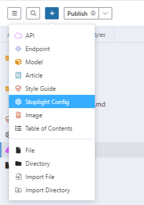

# Configure Projects

Projects can contain all sorts of files, but you might not want Stoplight to analyze specific files. For example, if a project is backed by a Git repo that also contains developer-only, internal Markdown files, you might not want those published in your public documentation.

You can use an `"exclude"` in the `.stoplight.json` config file to blacklist certain files and folders. 

There's also a `"formats"` keyword to determine which files should be read and parsed as APIs, documentation, or other content. When you create an API in Studio, it can use this configuration to know where to put that file so it's not automatically added to the root directory.


## Default Configuration

Projects without a config file use this configuration:

```json
{
  "formats": {
    "openapi": {
      "rootDir": "reference",
      "include": ["**"]
    },
    "markdown": {
      "rootDir": "docs",
      "include": ["**"]
    },
    "image": {
      "rootDir": "assets/images",
      "include": ["**"]
    },
    "json_schema": {
      "rootDir": "models",
      "include": ["**"]
    }
  }
}
```
Any files with the `openapi` and `json_schema` formats will go under the "APIs" panel, and any files with `markdown` or `images` formats will go under "Docs."

The asterisks in the `"include"` are a [glob](https://en.wikipedia.org/wiki/Glob_(programming)) pattern, for finding files based on a pattern. More specifically, Stoplight uses an open-source library called [micromatch](https://github.com/micromatch/micromatch). 

## Change the Default Configuration

To add a config file to your project:

1. Edit the project.
2. Select the **Add** icon at the top of the left panel, and then select **Stoplight Config**.



The config file is added to the root of your project and named `.stoplight.json`. It can include regular JSON or [JSONC](https://github.com/microsoft/node-jsonc-parser) (that's JSON with comments and trailing commas allowed).

After you change the stoplight.config file, select **Apply Config**.

## Reference

### Editor

- `lineWidth` (optional): Set the length that lines can be in Studio before they're wrapped in code view. This will help avoid rewriting YAML values, so long as they're within the line length.

### Exclude

- `exclude`: Any file or directory matching the pattern listed in `exclude` won't be indexed by Stoplight. For example, you can exclude files located in a test directory.

> **Note:** There is a large default list of excluded file paths for things like node modules and other common dependency management files: `.cache/`, `.git`, `log/`, `tmp/`, etc. This is done for performance reasons and will be made more observable and configurable in future versions.

### Formats

- `rootDir` (required): When `include` is unspecified, all files placed under `rootDir` are marked as included. This is used by UI wizards in Studio as a default location for certain kinds of files.
- `include` (optional): At least one pattern needs to match the `rootDir`.

## Example

This example shows a project with multiple APIs in an `apis` directory, some test files that shouldn't be indexed, and some models in a `schemas` directory, which you also use for [contract testing](https://apisyouwonthate.com/blog/writing-documentation-via-contract-testing).

```
help/article.md
apis/petstore.openapi.yaml
apis/address.openapi.json
test/todos.openapi.yaml
schemas/user.json
.stoplight.json
```

This example sets the editor line width at 80 characters, excludes the test files, and shows the rest of the file organization:

```json
{
  "editor": {
     "lineWidth": 80
   },
  "formats": {
    "openapi": {
      "rootDir": "apis"
    },
    "json_schema": {
      "rootDir": "schemas"
    },
    "markdown": {
      "rootDir": "help"
    },
  },
  "exclude": ["test"]
}
```

Next, [invite team members](./d.workspace-access.md) to these excellently configured projects. 
