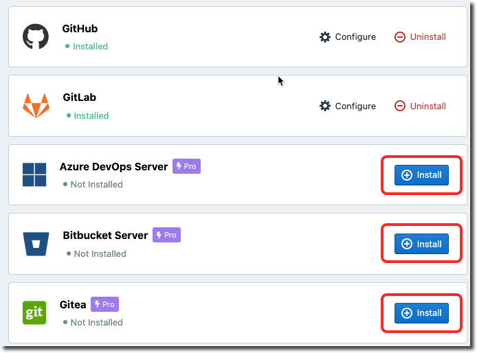

# Overview

Stoplight can connect with popular Git Providers hosted publically or on your servers (even if it's protected by a firewall), letting you work directly with [projects](../b.adding-projects.md) in public or private repos. 

## Git Provider Support

We support the following Git providers.

- <i class="Icon fab fa-bitbucket fa-2x" style="color: rgb(32, 80, 129);"> </i> Bitbucket Cloud

- <i class="Icon fab fa-bitbucket fa-2x" style="color: rgb(32, 80, 129);" > </i> Bitbucket Server

- <i class="fab fa-github fa-2x"> </i> Github

- <i class="Icon fab fa-gitlab fa-2x" style="color: rgb(252, 109, 38);"> </i> GitLab

- <i class="Icon fab fa-git-square fa-2x" style="color: rgb(90, 165, 9);"> </i> Gitea

- <i class="Icon fab fa-microsoft fa-2x" style="color: rgb(32, 80, 129);"> </i> Azure Devops

If you don't see the Git Provider you're looking for, take a look at our [roadmap](https://roadmap.stoplight.io/) to keep an eye on what's coming next. You can also use [Stoplight CLI](../f.working-with-local-projects.md) to push projects to Stoplight Platform.

## Configure Cloud Git Providers

Cloud-hosted Git providers are configured out of the box in Stoplight. The following cloud Git providers are supported:

- <i class="Icon fab fa-bitbucket fa-2x" style="color: rgb(32, 80, 129);" > </i> Bitbucket Cloud

- <i class="fab fa-github fa-2x"> </i> Github

- <i class="Icon fab fa-gitlab fa-2x" style="color: rgb(252, 109, 38);"> </i> GitLab

1. Install your desired Git provider from the integrations section in your workspace settings. 

2. Select **Use Default Configuration** and click **Install**. 

If you have a self-hosted deployment or are looking for custom integration settings, use the guides below.

## Configure Self Hosted Git Providers
<!-- theme: warning -->
> This feature is available on the **Pro** plan and above

Configure your Git Provider using the guides below:

- [Bitbucket Cloud](b.bitbucket-cloud.md)
- [Bitbucket Server](c.bitbucket-server.md)
- [GitHub Enterprise](d.github-enterprise.md)
- [GitLab](e.gitlab.md)
- [Gitea](f.gitea.md)

> If your self hosted Git provider is behind a firewall, please [add our IPs to your allowlist](../i.allowlisting-ips.md) on port 443 over HTTPS. 