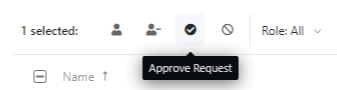

# Manage Workspace Members

Stoplight is an all-in-one platform that covers all integral parts of the API lifecycle including design, documentation development, and governance. This requires different stakeholders from your organization to be on the platform.

Having all of your collaborators on a single platform helps promote **visibility** and **reusability** of artifacts across your organization, but you may need different levels of access for your stakeholders. You can easily limit that by defining their [workspace roles](k.workspace-roles.md) and [project roles](l.project-roles.md).

Once your workspace is set up, you can invite your colleagues and partners to collaborate on API design, view documentation, and access mock servers.

You can invite up to 5 workspace members on the **Free** and **Starter** plans, then add more members as you scale up. 

## Invite Members to Your Workspace 

1. From the workspace home page, select **Members**. 
2. On the **Member settings** page, select **Invite Members**. 
3. Enter one or more work **Email Addresses** of your teammates, select a **Role**, and then select **Send Invite**. 

Once sent, your invitations are set to pending and your team members are sent an email invitation. When they accept the request, they are added to your workspace. 

## Allow Access by Email Domain

The fastest way to onboard your teammates is by configuring an [Allowed email domain](./allowed-email-domains.md) and sending them a link to your workspace. This enables them to join your workspace without an invitation.

1. From the workspace home page, select **Settings**.
2. In the **Approved Domains** section, select **Add**.
3. Add your domain URL, and then select a default role for your domain users. 
3. Select **Save**.

To change the default role or remove the domain, select the arrow to the right of the domain.

### Approve Join Requests

If users register for your workspace with an email address that does not match your domain, they are not added. You can manually approve join requests for these users from the **Members Settings** page.

1. Select members with a role of "pending."
2. Select the **Approve Request** check box.
3. Select the role for the users.
4. Select **Approve**.

## Manage Workspace Access

Since you will likely invite stakeholders from different parts of the API Lifecycle, you can limit and restrict who gets access to what. 

**Note:**  Learn more about organizing your team and assigning roles here: [**Workspace Roles.**](k.workspace-roles.md) 

