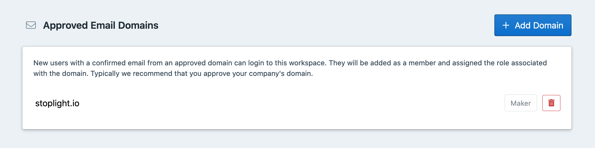

# Organize Your Team

Governance, design, development, documentation, and testing are all integral parts of creating and managing great APIs. Stakeholders across the API lifecycle end up working in silos switching between different tools leading to inconsistencies, lack of collaboration and out of date information. 

Stoplight Platform has been built with the modern API workflow in mind. It provides your team with the tooling to work in a single platform ensuring each stakeholder has the most up to date information, modern tooling, and visibility required to perform their job effectively.  

### Invite Workspace Members

<!--To-Do: Add info about roles-->

1. Sign in to your workspace
2. To add a member, enter the work email address of the person you want to add and select a role.
<!--To-Do: Screenshot-->

### Onboard Your Team

Now that you know how to invite your team to Stoplight. Let's give you an overview of how various folks in your team can use Stoplight to decide how (and when) to onboard each stakeholder in your organization. 

#### API Champion / Landscape Manager

API Champions in an organization are key proponents of bringing API change across an organization. Successful API programs have seen leaders evangelizing the need for key changes in the API lifecycle, identifying issues in the API ecosystem, and leading initiatives among cross-functional teams to solve those. For these individuals, Stoplight Platform is a key tool in their armory as it gives them the required visibility across their organization. 

Champions can:
- Explore APIs across their organization using Explorer
- Gauge the current state of APIs, documentation and identify areas where improvements are required
- Establish guidelines for API design and documentation by creating standards
- Create design libraries to promote reuse
- Invite API teams working in silos to the workspace bringing them into governance initiatives
- Use the explorer and documentation to evangelize the business value of APIs to other leaders in the company

Champions are normally the first to be onboarded to Stoplight. We recommend giving them the **admin** role to give them visibility across teams and getting different API teams onboarded. 

Are you an Champion? Get your fellow Champions on board. 

#### Product Manager

API Product Managers sit at the core of each API team making sure all the team members are successfully collaborating and moving in the direction required to meet the consumer requirements. They are responsible for overlooking the complete API lifecycle by setting clear KPIs, ensuring the design meets the business requirements and establishing good developer experience. 

Product Managers can:
- Verify design on Studio in collaboration with the architect against the API goals
- Use inbuilt mocking to get quick feedback on their API designs from internal stakeholders and API consumers
- Create and verify documentation in collaboration with technical writers
- Provide consistent developer experience in line with industry expectations using workspaces.
- Publish and evangelize API documentation internally and externally
- Create sample implementations while developing using mocking.

Product Managers for different teams are the first to be onboarded from their team. They tend to onboard other members of their team to start collaborating within their team. We recommend giving them the **maker** role. 

Start identifying API teams within your organization and get their API Product Managers on board.

#### Architect / Designer

API Architects or Designers are responsible for all aspects of the design of an API. They make sure the design fulfills the business requirements, uses best practices and offers a great developer experience for API consumers. The designer also ensures that company-wide practices normally created by the API champions in the organization are followed. Normally, each API project would have an architect as part of the team managing it. 

Architects can:
- Design APIs in OpenAPI using an intuitive and easy-to-use graphical interface of Stoplight studio. 
- Write descriptions for endpoints, parameters, and schemas that can be built upon by technical writers 
- Use inbuilt mocking to get quick feedback on their API designs from internal stakeholders and API consumers
- Validate API design inside the Studio against established company guidelines
- Reuse schemas in the design library to ensure consistency
- Test APIs being developed against their API design automatically

Architects are usually invited by Champions or Product Managers of their API team. We recommend giving them the **maker** role to start creating new APIs and work effectively on existing projects.

#### Technical Writers

Technical Writers are responsible for documenting the API for all stakeholders in the API lifecycle. The documentation is used to communicate the usage of the API to external and internal developers, business stakeholders, evangelists and other teams in the organization. They work closely with the Product Manager and the architect to ensure the documentation is up to date and correctly reflects the design of the API.  

Technical Writers can:
- Write detailed descriptions for functions, parameters, and schemas using Stoplight Studio. They usually build on descriptions written by the API designer. 
- Explore documentation for other APIs in the organization to ensure consistency
- Document usage-based scenarios and tutorials for the API in markdown
- Create marketing content signifying the business needs of the API
- Get feedback on documentation from stakeholders

Technical Writers are usually invited by Product Managers or Architects of their API team. We recommend giving them the **maker** role. 

#### Developers

Developers interact with the API in multiple roles at different stages of the API lifecycle. Developers inside the API team are responsible for implementing, maintaining and deploying APIs. They use designs created by the API architect to correctly implement and update the API. External developers are responsible for using the documentation to consume the API in their applications. It's paramount for these developers to have the up to date information about the API.

Developers can:
- Use API designs to implement APIs
- Keep up to date with changes in API design
- Test their API implementations against contracts using proxies
- Use the organization's workspace to explore documentation and try out the API
- Develop and test their implementations against mock servers

Developers are usually invited by Product Managers or Architects of their API team. We recommend giving internal developers the **maker** role. External developers or customers can be given the **Guest** role to give them access to a particular project. 

### Make Your Workspace Discoverable

Inviting and managing team members in large teams can become a cumbersome process, but there are a few ways to simplify this. 

Integrations can be set up for SAML or LDAP if these are already in use at your organization, or even easier is the "Approved Email Domain" approach. 

We recommend approving your company domain to allow folks in your organization get started quickly with predefined privileges and start contributing to your API program. Anyone with an email for the domain you add to this list will automatically be approved with whatever default permissions are configured.

Do remember to share the workspace URL over your company email, Slack, or some other messaging service, so that people can start exploring all the APIs!

1. Navigate to the Settings of the workspace. 

2. Click on **Add Domain**

3. Enter the domain you want to approve. e.g. "yourcompany.com" and select the default role for members who sign up. You can change their roles later. The recommended role would be a viewer or maker. 
