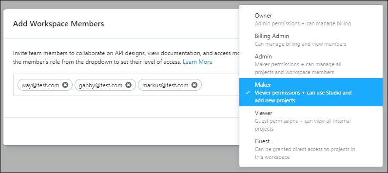
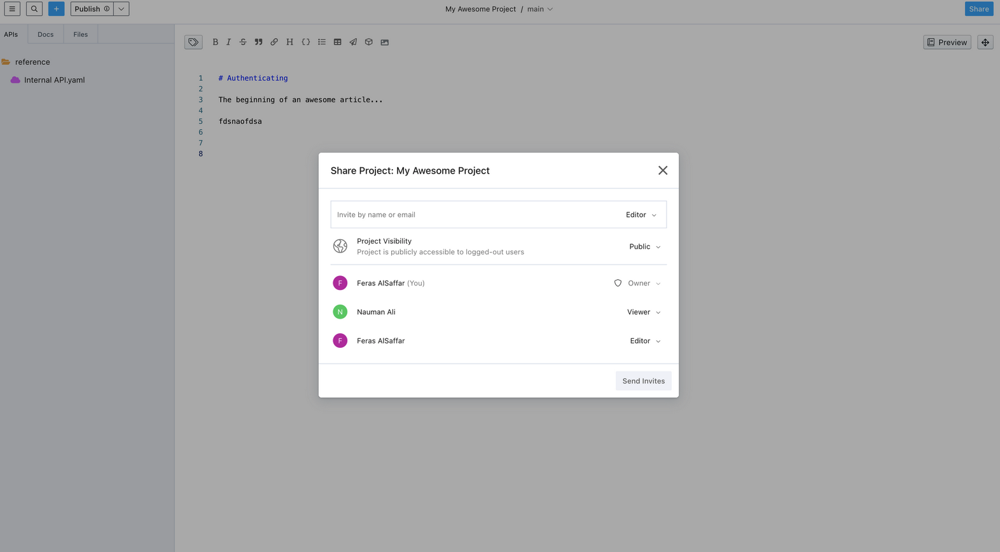

# Manage Workspace Members

Stoplight is an all-in-one platform that covers all integral parts of the API lifecycle including design, documentation development, and governance. This requires different stakeholders from inside and possibly outside your organization to use the platform.

Having all your collaborators on a single platform helps promote **visibility** and **reusability** of artifacts across your organization, but you may need different levels of access for your stakeholders. You can limit that by defining their [workspace roles](k.workspace-roles.md) and [project roles](l.project-roles.md).

Once your workspace is set up, you can invite your colleagues and partners. 

There are two types of workspace users:

- **Members**: Roles can range from viewers to owners. Members are stakeholders in your organization. Depending on their role, members collaborate on API design, view documentation, and access mock servers. 
- **Guests**: Restricted to viewing documentation for projects they've been invited to. These users are people outside your company or organization, such as partners, who require authenticated access to the documentation.

Learn more about [Workspace Roles](k.workspace-roles.md).

>The number of workspace members and guests you can invite depends on your [Stoplight plan](https://stoplight.io/pricing/).

## Invite Members to Your Workspace 

1. From the workspace home page, select **Members**. 
2. On the **Member settings** page, select **Invite Members**. 
3. Enter one or more work **Email Addresses** of your teammates, select a **Role**, and then select **Send Invite**. 

Once sent, your invitations are set to pending and your team members are sent an email invitation. When they accept the request, they're added to your workspace. 

## Allow Access by Email Domain

The fastest way to onboard your teammates is by configuring an [approved email domain](./allowed-email-domains.md) and sending them a link to your workspace. This enables them to join your workspace without an invitation.

1. From the workspace home page, select **Settings**.
2. In the **Approved Domains** section, select **Add**.
3. Add your domain URL, and then select a default role for your domain users. 
3. Select **Save**.

To change the default role or remove the domain, select the arrow to the right of the domain.

## Approve Join Requests

You must approve join requests when users want to join your workspace. If you allow access by email domain, you must approve join requests for users who register for your workspace with an email address that doesn't match your domain.

Workspace owners and administrators are notified by email when users try to join their workspace. Click the link in the email to approve requests. You can also manually approve join requests from the **Members Settings** page.

1. From the workspace home page, select **Members**. 
2. Select members with a role of "pending."
3. Select the **Approve Request** check box.
4. Select the role for the users.
5. Select **Approve**.

## Manage Workspace Access

Since you will likely invite stakeholders from different parts of the API Lifecycle, you can limit and restrict who gets access to what. You can change roles for specific users as needed. 

To assign roles for your workspace:

1. From the workspace home page, select **Members**. 
2. Select one or more users, and then select the **Change Role** icon.

### Change Guest Access 

Guests aren't considered members of your workspace, so their access is limited to viewing projects they're invited to. If the needs of your organization change, you can:

- **Upgrade guest access**: Change guests' roles to the Viewer role or above.
- **Downgrade to guest access**: Change members' roles to guest to restrict their access to only projects they've been invited to.

### Share Project

After you publish a project, the **Share Project** dialog box allows you to:

* Invite members by name or email. 
* Manage project access by assigning members roles as **Viewers**, **Editors**, or **Admins**.
* Manage **Project Visibility** as **Public**, **Private**, or **Internal**.

>All members can invite additional members within their level of access to the project.

