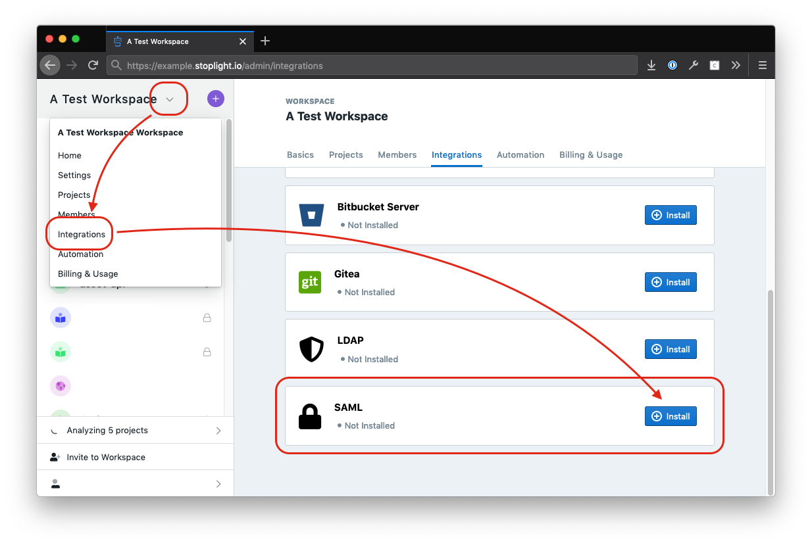
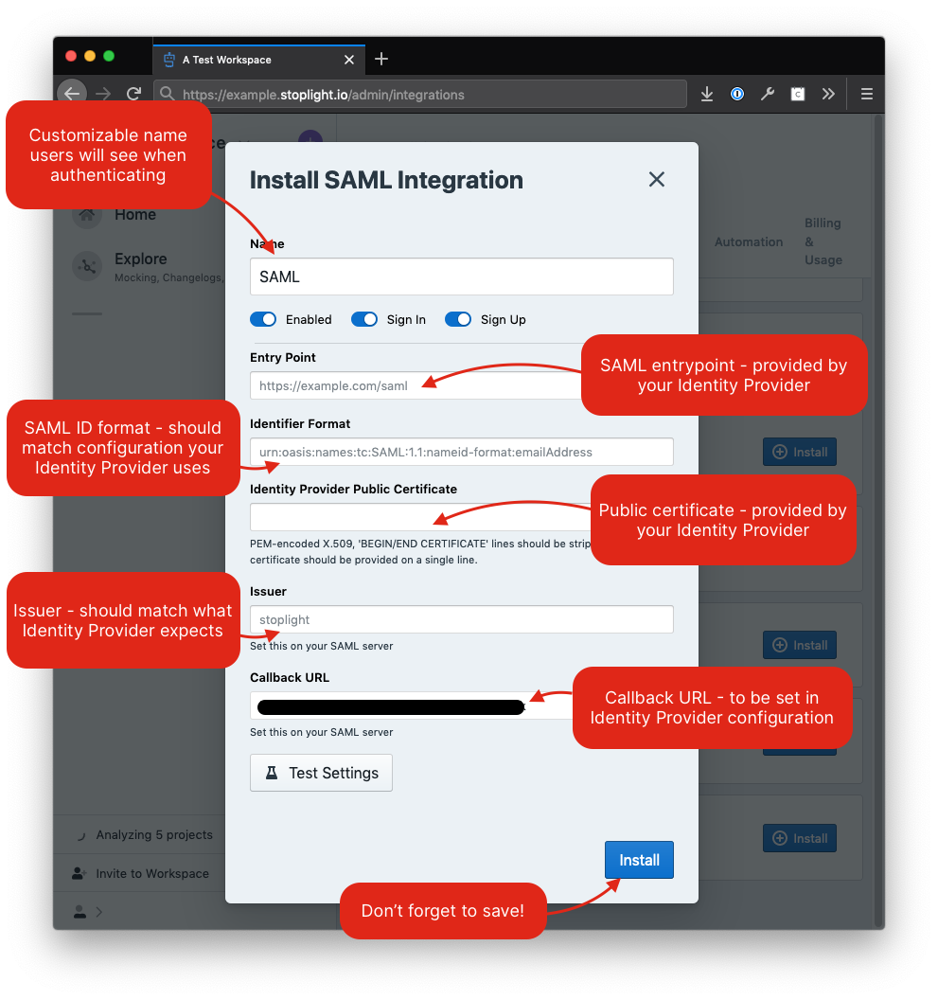
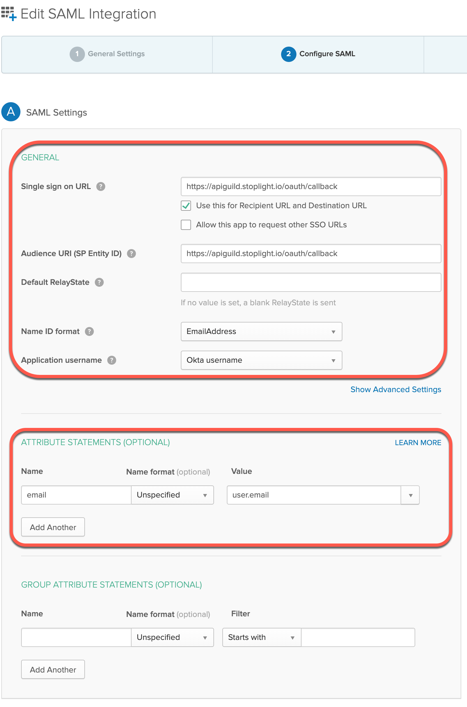

# Single Sign-On

Stoplight can connect with popular auth providers to simplify your authentication flows. 

## Auth Provider Support

We support the following Auth/Single Sign-On (SSO) providers:

- LDAP
- SAML
- Bitbucket Cloud
- Bitbucket Server
- GitHub
- GitLab
- Gitea
- Azure Devops

To configure popular Git providers as auth providers follow [this guide](configure-git/a.configuring-git.md).

## LDAP

> This feature is available on the Stoplight **Professional** plan and above.

You can use a Lightweight Directory Access Protocol (LDAP) authentication server to authenticate users with Stoplight. LDAP is an open-standard protocol for use with online directory services.

1. Navigate to the Integrations section in your Stoplight workspace settings. 
2. Click **Install/Configure** beside LDAP. 
3. Provide the following information:
 - **URL**: The LDAP host, e.g. **ldap://ldap.example.com**. If the hostname is behind a firewall, you may need to [add our IPs to your allowlist](../c.troubleshooting.md#how-do-i-allow-stoplight-to-access-an-internal-git-provider).
 - **Bind DN**: The LDAP user that performs user lookups to authenticate other users when they sign in. This is typically a service account created specifically for third-party integrations. Use a fully qualified name, such as **cn=Administrator,cn=Users,dc=Example,dc=com**.
 - **Bind Credentials**: The password for the domain search user.
 - **Search Base**: The fully qualified Distinguished Name (DN) of an LDAP subtree you want to search for users and groups. You can add as many as you like; however, each group must be defined in the same domain base as the users that belong to it. e.g. **dc=Example,dc=com**.
 - **Search Filter**: Filters can be used to restrict the numbers of users or groups that are permitted to access an application.  In essence, the filter limits what part of the LDAP tree the application syncs from.  Read more about writing filters [here.](https://confluence.atlassian.com/kb/how-to-write-ldap-search-filters-792496933.html)
4. Click **Install**.

## SAML

> This feature is available on the Stoplight **Professional** plan and above.

Organizations that need enhanced security requirements can configure SAML SSO,
allowing you to authenticate users to Stoplight with your own corporate Identity
Provider (IdP).

### Prerequisites

Before continuing, be sure to:

- Contact the team responsible for your organization's SAML configuration for
  the following pieces of information that must be configured within Stoplight:
  - SAML Entry Point URL - This is the URL where applications integrating with a
    SAML IdP must first direct users
  - SAML Identifier Format - Stoplight defaults to using a "persistent" name
    identifier format, however some SAML providers require a specific format
    ("unspecified", for example)
- Some fields will also need to be configured within the SAML IdP directly. Pass
  along the following pieces of information to the team responsible for your
  organization's SAML configuration:
  - Issuer - This value defaults to "`stoplight`"
  <!-- markdown-link-check-disable -->
  - Callback URL - This value is provided during the configuration, and defaults
    to a value similar to https://your-workspace.stoplight.io/oauth/callback
<!-- markdown-link-check-enable -->
  - Attributes - The attributes (described below) are required by Stoplight to
    successfully authenticate users.
- Be logged in to Stoplight as an Administrator

### SAML Assertion Requirements 

In addition to the items above, the following SAML attributes need to be
provided in the assertion data coming to Stoplight upon successful
authentication with the SAML IdP:

- External ID - This corresponds to the "`nameID`" field in the SAML response
- Username - This corresponds to one of the following fields in the SAML
  response (in order of precedence):
  - `userName`
  - `urn:oid:2.5.4.42`
  - `displayName`
  - `urn:oid:2.5.4.4`
- Email - this corresponds to either the "`email`" or
  "`urn:oid:1.2.840.113549.1.9.1`" attributes

### Configuring the SAML Integration

To configure a SAML integration, first navigate to your workspace
**Integrations** screen and find the "SAML" integration option:

Which will open a dialog to configure the SAML settings for the integration:

> If your SAML IdP is behind a firewall, you may need to [add our IPs to your
> allowlist](../c.troubleshooting.md#how-do-i-allow-stoplight-to-access-an-internal-git-provider).

### Okta

If using [Okta](https://www.okta.com), below is a sample service configuration
for Okta that should help get you started:

> **Note** that the `apiguild.stoplight.io` workspace URL should be updated to
> point to your workspace URL instead (ie, `example.stoplight.io`).
