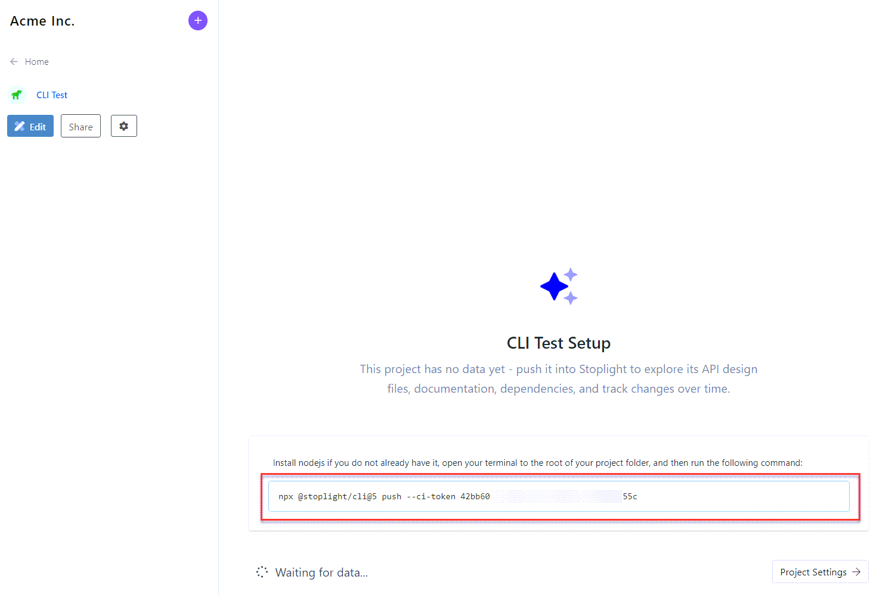

## Work with Local Projects

Git is very popular, but not used by everyone. If a different version control system is in use like Mercurial, SVN, SourceSafe, Bazaar, or your team uses another way to keep all their work organized, Stoplight has you covered.

Stoplight CLI is a command-line tool, available as [an NPM module](https://www.npmjs.com/package/@stoplight/cli), which can publish changes to Stoplight, and have them show up in Explorer just like any other project. They won't be editable in Studio, but the content will be available to read and search like anything else. 

### Create an Empty Project

1. Navigate to the **Add Projects** section and click on **Add projects via Stoplight CLI**.
2. Give this project a name, and click **Add Project**. This is going to create an empty project where you can then push data. 

### Push Local Files

**Copy the command** on the empty project screen. 

Next, navigate to the root folder of the local project and **run this command**. This should analyze the project containing OpenAPI files, JSON Schemas, and Markdown documentation, and push data to Stoplight, and you can view it in Explorer. 

You can add this command to a [Continuous Integration server](g.automating-publishing.md#continous-integration) to update the contents whenever something changes.

### Edit Local Files

1. Download Studio Desktop from [here](https://stoplight.io/studio/). 

2. Open the project in Studio Desktop and edit using the form or code editors. Read the [Studio documentation](https://meta.stoplight.io/docs/studio/) for more specifics.

Once done editing, you can push the files using the CLI, or automate publishing in [continuous integration](g.automating-publishing.md#continous-integration).
