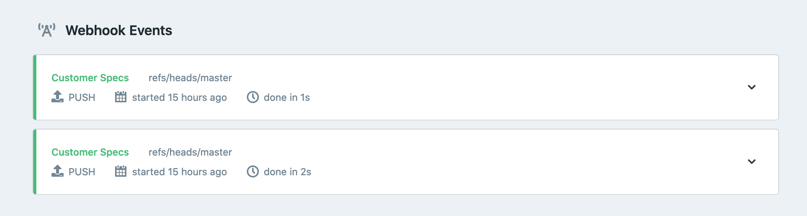

# Publishing

Whenever changes are made to your API descriptions or Markdown documentation, whether that is done in Stoplight Studio or anywhere else, you want to get those changes reflected in Documentation, Mock Servers, Explorer, the Design Library, etc.

For those projects using Git to push changes (either via Stoplight Studio or any other git client), pushing to the "default branch" will trigger a Publish, as will pushing to any other branch which has Publishing enabled. To make this work we use something called [Webhooks](#webhooks).

Alternatively, [Continuous Integration](#continuous-integration) can be used to automate publishing. This can be useful for anyone not using Git, or that have a more advanced use case that webhooks cannot handle.

## Webhooks

Webhooks are HTTP requests triggered by one server to let another server know something has changed, and most Git providers offer these to let integrated applications like Stoplight know about new commits, pull requests, etc.

Any workspaces that are connected with the default Stoplight Git integrations will have webhooks set up on the project automatically. Whenever somebody pushes a change to any branch, the Git server receives the push, and sends Stoplight a webhook. If the branch has Publishing enabled we'll automatically update documentation, mock servers, explorer, etc. usually within a few seconds.

If you have [connected Git providers](configure-git/a.configuring-git.md) with your own hosted Git servers or your own credentials then you will need to set those webhooks up yourself.

Either way, any incoming Webhooks will show up in the Automation tab of your project under Webhook Events.



If changes are not publishing, you can look at Webhook Events to debug the problem. Maybe it's a [firewall](../c.troubleshooting.md#how-do-i-allow-stoplight-to-access-an-internal-git-provider) issue, or webhooks are not being triggered at all.

## Continuous Integration

Stoplight CLI is a command-line tool, available as [an NPM module](https://www.npmjs.com/package/@stoplight/cli) (requires nodeJS v12 or greater), which can publish changes to Stoplight, and have them show up in Explorer just like any other project. They won't be editable in Studio, but the content will be available to read and search like anything else.

Stoplight CLI can be used to [enable local projects](./f.working-with-local-projects.md) which do not use Git, but can also be used to publish projects from a continuous integration server instead of utilizing webhooks.

Why? Maybe you're using an annotation framework to describe your APIs inside your existing source code and you'd like to export those in order to publish documentation. You can do that by running whatever the CLI command is for exporting from that framework, then running the push command to send the contents to Stoplight.

Or more simply, maybe you use Subversion or another version control system instead of Git. 

Whatever the reason, the process is the same.


1. Make sure you are in the root directory of the project.

```bash
cd /home/src/my-project/
```

2. Run the push command, passing in the project token associated with this project. This will send all the API design and documentation related files to Stoplight, and ignore any unrelated files.

```bash
npx @stoplight/cli@4 push --ci-token {project-token} --url https://{workspace-name}.stoplight.io
```

> Note that nodeJS version 12 or greater is required to run the CLI. You can
> double check your version with the command: `node --version`

To find this token, head to `https://{workspace}.stoplight.io/settings/{project}/automation` in your browser. 
