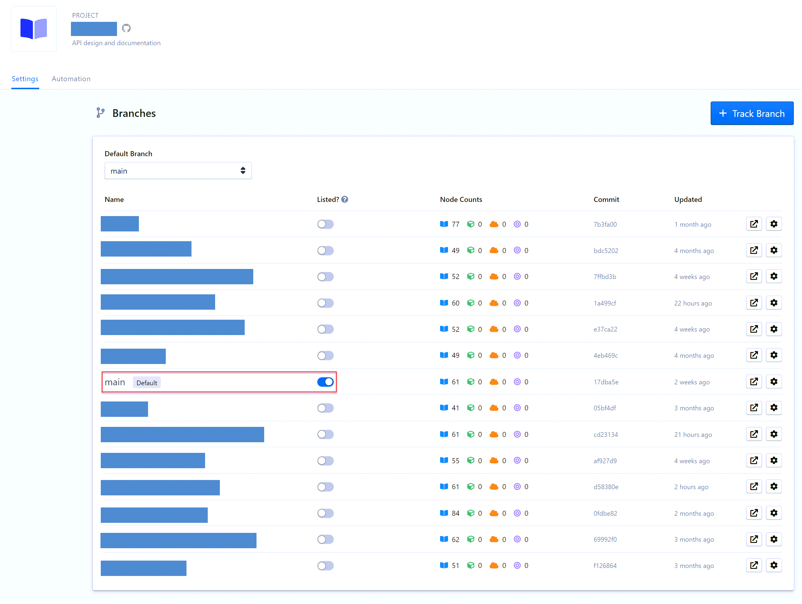
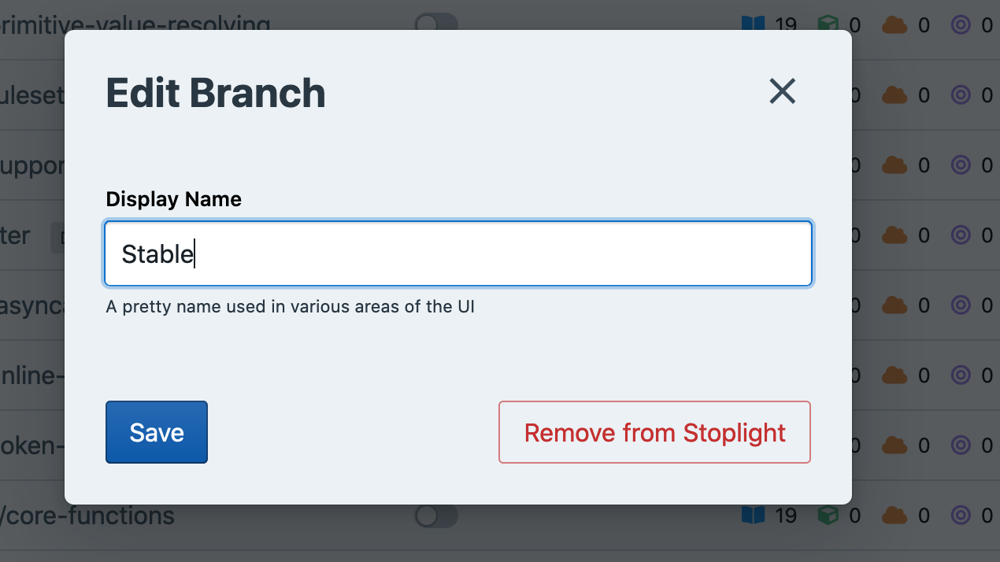

# Branch Management

Projects powered by Git can leverage the power of [Git branches](https://git-scm.com/book/en/v2/Git-Branching-Branches-in-a-Nutshell). 

Sometimes branches are used for versioning, so a repository might have a `v4` and a `v5` branch. Sometimes branches follow certain "branching models" for common workflows such as [Git Flow](https://www.atlassian.com/git/tutorials/comparing-workflows/gitflow-workflow). These repositories will have a `master` and a `develop` branch, along with all sorts of "feature branches" in the format of `feature/adding-a-thing`.

Regardless of the model, there is always a default branch. Branches could be named absolutely anything, but there are some common default branch names used by most of the popular Git providers: `trunk`, `main`, or `master`.

In Stoplight, the default branch for a project determines which branch is automatically published and visible to users. For example, if your project is public, the default branch is presented to users who aren't logged in to your workspace.

You can configure which Git branch is the default branch for Stoplight. 

> [Explorer](../explorer/overview.md), [mock servers](../3.-design/setting-up-a-mock-server.md), and the design library only show content for the default branch.

## Set a Default Branch

To set a default branch: 

1. Open the [**Project Settings**](../7.-projects/project-settings.md) page.
2. Scroll to the **Branches** section.
3. Select a default branch from the list.

## Publish Multiple Branches

> This feature is available on the Stoplight **Starter** plan and above.

While the default branch is always published, you can enable multiple branches for publishing. This is referred to as "listing" a branch and controls what's shown in the **Versions** selector:

- **Published branches**: Called "versions," these branches are viewable to everyone, including Guest and Viewer roles.
- **Unlisted branches**: These branches are only viewable to users with direct access to the project.

In the following example, V1 is set as the default branch and is listed. Main is used for active development, so it's unlisted. 

<!--
focus: false
-->


To list a branch:

1. Use one of these methods to open the [**Project Settings**](../7.-projects/project-settings.md) page:
   * From the projects list, select a project, and then select the **Project Settings** link in the right pane.
   * From the workspace sidebar, select a project, and then select the project gear icon.
2. Scroll to the **Branches** section.
3. Enable the **Listed** option for all branches you want to publish.


> At least one branch must be listed for each project.

## Change Default Branches

Say you want to switch your branch from `master` to `main` at your organization:

1. Run this command in the terminal to push the master branch up, but give it a new name: `main`.

```shell
git push origin master:main
```

2. Now you have two probably identical branches. Pop over to your project settings to change it.



3. Change the default branch using the dropdown, and you should see a message letting you know the default branch was updated successfully.

4. You will probably need to update your default branch on your repository too:

   - [GitHub Cloud Instructions](https://docs.github.com/en/github/administering-a-repository/setting-the-default-branch)
   - [GitHub Enterprise Instructions](https://docs.github.com/en/enterprise/2.21/user/github/administering-a-repository/setting-the-default-branch)
   - [GitLab Cloud Instructions](https://docs.gitlab.com/ee/user/project/repository/branches/)<!-- markdown-link-check-disable -->
   - [GitLab Server Instructions](https://docs.gitlab.com/ee/user/project/repository/branches/#default-branch)<!-- markdown-link-check-enable -->

5. Remove the old branch from your Git repository.

```shell
git push origin :master
```

6. If [webhooks](./g.automating-publishing.md) have been set up then this branch has already been automatically removed from Stoplight. If webhooks aren't enabled, you will need to delete the branch from the list by clicking on the cog and clicking the "Remove from Stoplight" button.

## Track Branches

The default branch and all branches associated with a pull request will be automatically tracked for you.

If you want to track Git branches that aren't associated with a pull request, such as a development or version branch, there's a freeform text box input to enter the branch name to track.

Tracking a Git branch will analyze it and add it to your list of branches in Stoplight.

This won't create a new Git branch. It's just going to tell Stoplight to keep an eye out for webhooks mentioning a branch of that name.

## Rename Branches

Changing the name of the branch will only update what's viewed in the Versions dropdown, it doesn't change the underlying Git branch's name. Think of it as giving them an alias. 

Doing this can make things more clear for end-users of your software, API, etc. who might not be familiar with your branching model or workflow.

For example, if you are using Git Flow, you could name your branches this:

| git     | Stoplight   |
| ------- | ----------- |
| master  | Stable      |
| develop | Development |



Another example might be keeping different versions of APIs in different branches, and you want to advertise which APIs people should be using without changing the names in Git:

| git | Stoplight   |
| --- | ----------- |
| v4  | v4 (Legacy) |
| v5  | v5 (Stable) |
| v6  | v6 (Beta)   |

Maybe the v5 branch is marked as stable, then when v6 is deployed to production the default is changed.

## Remove a Branch

You can remove a branch from being displayed in Stoplight, but this doesn't remove the branch from Git itself. Once you've removed a branch from Stoplight, you can add it back using the Track Branch functionality.
