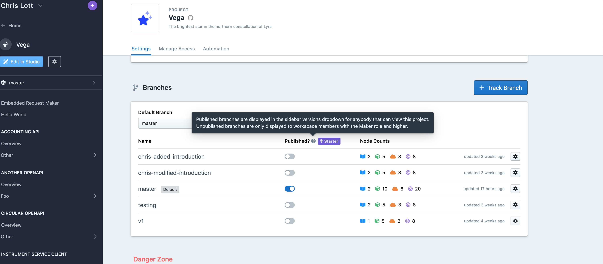
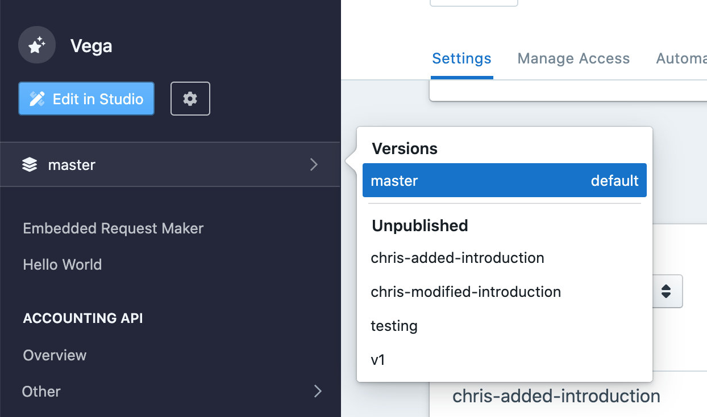
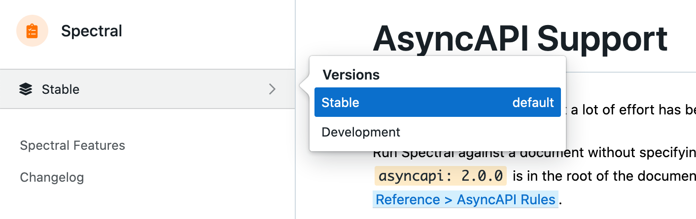
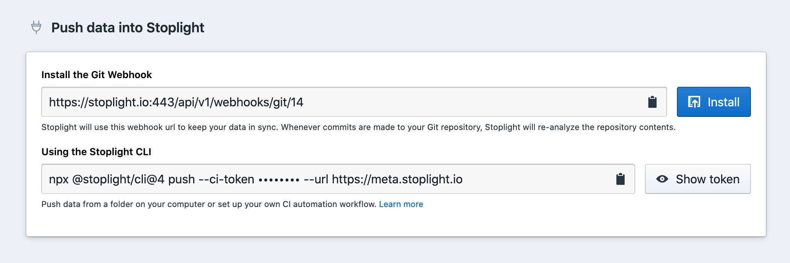

# Branch Management

Projects powered by Git can leverage the awesome power of [Git branches](https://git-scm.com/book/en/v2/Git-Branching-Branches-in-a-Nutshell). 

Sometimes branches are used for versioning, so a repository might have a `v4` and a `v5` branch.

Sometimes branches follow certain "branching models" for common workflows such as [Git Flow](https://www.atlassian.com/git/tutorials/comparing-workflows/gitflow-workflow). These repositories will have a `master` and a `develop` branch, along with all sorts of "feature branches" in the format of `feature/adding-a-thing`.

Regardless of the model, there is always a default branch. Branches could be named absolutely anything, but there are some common default branch names used by most of the popular Git providers: `trunk`, `main`, or `master`.

## Publishing Multiple Branches

> This feature is available on the Stoplight **Starter** plan, and above.

The [publishing process](g.automating-publishing.md) is automatically enabled for the default branch. When the default branch is published it updates all sorts of things: Explorer, Documentation, Mock Servers, and Design Library. 

You can enable more branches for publishing than just the default branch.



Currently, explorer, mock servers, and the design library will only show content for the default branch, but documentation lets viewers pick between branches, using the "Versions" dropdown (because this sort of thing is usually used for showing different versions!)



There are two types of branches shown in the versions dropdown:

- **Published branches** (called "Versions") are viewable to everyone including Guest and Viewer roles.
- **Unpublished branches** are only viewable to workspace Makers, Admins, and Owners.

One use-case for unpublished branches is checking how documentation looks in a Pull Request before merging it. If you do [API Design Reviews](../3.-design/c.reviewing-your-api-design.md), unpublished branches would be part of that process.

If you don't like the branch names as they're displayed, you can give them a display name within Stoplight.

## Renaming Branches

Changing the name of the branch will only update what is viewed in the Versions dropdown, it does not change the underlying Git branch's name. Think of it as giving them an alias. 

Doing this can make things more clear for end-users of your software, API, etc. who might not be familiar with your branching model or workflow.

For example, if you are using Git Flow, you could name your branches this:

git | Stoplight
---------|----------
master | Stable
develop | Development


When viewed in documentation:



Another example might be keeping different versions of APIs in different branches, and you want to advertise which APIs people should be using without changing the names in Git:

git | Stoplight
---------|----------
v4 | v4 (Legacy)
v5 | v5 (Stable)
v6 | v6 (Beta)

Maybe the v5 branch is marked as stable, then when v6 is deployed ti production the default is changed.

## Changing Default Branches

Say you want to switch from `master` to `main` at your organization, which I am doing as I write this documentation. I can do this in Studio or quickly via the CLI in the locally cloned repository for a particular project.

1. Run this command in the terminal to push the master branch up, but give it a new name: `main`.

```shell
git push origin master:main
```

2. Now we have two probably identical branches. Pop over to your project settings to change it.



3. Change the default branch using the dropdown, and you should see a message letting you know the default branch was updated successfully.

4. You will probably need to update your default branch on your repository too:

- [GitHub Cloud Instructions](https://docs.github.com/en/github/administering-a-repository/setting-the-default-branch)
- [GitHub Enterprise Instructions](https://docs.github.com/en/enterprise/2.21/user/github/administering-a-repository/setting-the-default-branch)
- [GitLab Cloud Instructions](https://docs.gitlab.com/ee/user/project/repository/branches/)
- [GitLab Server Instructions](https://docs.gitlab.com/13.1/ee/user/project/repository/branches/index.html)

5. Remove the old branch from your Git repository.

```shell
git push origin :master
```

6. If [webhooks](./g.automating-publishing.md) have been setup then this branch has already been automatically removed from Stoplight. If webhooks are not enabled, you will need to delete the branch from the list by clicking on the cog and clicking the "Remove from Stoplight" button.


## Track Branches

There's a freeform text box input to enter the name of an existing Git branch to track. 

Tracking a Git branch will analyze it, and add it to your list of branches in Stoplight. 

This won't create a new Git branch, it's just going to tell Stoplight to keep an eye out for webhooks mentioning a branch of that name.

## Remove Branch

Similarly, Stoplight will allow you to remove a branch from being displayed in Platform, but this does not remove the branch from Git itself. Once you've removed a branch, you can add it back using the Track Branch functionality.
