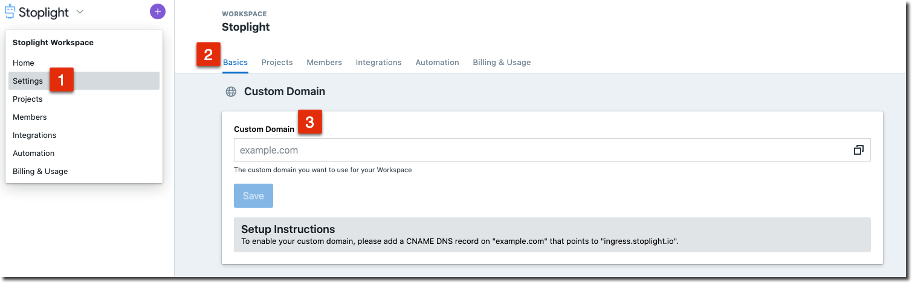

# Using a Custom Domain

Using a custom domain allows you to host your Stoplight workspace from a domain
fully under your control. To setup a custom domain for your Stoplight workspace,
follow the steps below:

1. Select Workspace settings from the top-left drop-down
2. In Settings > Basics > Custom Domain
3. Enter the custom domain you would like to use. To complete the configuration
   process, you will need to create a CNAME DNS record for your domain that
   points to `ingress.stoplight.io`.

Once properly configured, accessing the custom domain should allow you to access
the Stoplight workspace and an SSL certificate for your domain will
automatically be generated with [Let's Encrypt](https://letsencrypt.org/).

A "noindex" tag will be automatically included on your Stoplight workspace domain in order to provide the best SEO indexing for your custom domain.

> ### Limitations
>
> Stoplight currently requires the **full domain** to be allocated for use,
> meaning that it is not possible to expose documentation from a single path or
> route. As an example, the domain "api.example.com" can be used to host your
> Stoplight documentation, however "example.com/api" (note the "/api" base path)
> cannot.
>
> See the roadmap item
> [here](https://roadmap.stoplight.io/c/57-embeddable-component-library) for
> more information on how we plan on addressing this limitation in the future.

## Troubleshooting

### Cloudflare-hosted domains

If you are using [Cloudflare](https://cloudflare.com/), be sure to set your
CNAME record to "DNS Only" (signified by a grey cloud, and **not** an orange
cloud).

You can read more about what this means in the CloudFlare documentation
[here](https://support.cloudflare.com/hc/en-us/articles/200169626-What-subdomains-are-appropriate-for-orange-gray-clouds-).

### The connection has timed out

If you see an error related to "The connection has timed out", this typically
means that a CAA DNS record is present on your domain, which is preventing the
TLS verification process from completing.

> To learn more about CAA records and what they are used for, see the Let's
> Encrypt documentation [here](https://letsencrypt.org/docs/caa/). You can
> perform a CAA lookup on your domain [here](https://dnslookup.online/caa.html)
> for reference.

To resolve this issue, use either option below:

- **RECOMMENDED** Add `letsencrypt.org` to the CAA record to allow Let's Encrypt
  to generate certificates for your domain.

- **NOT RECOMMENDED** Remove the CAA DNS record from your domain, which will
  allow any authority to generate certificates for the domain.

Once updated, try to navigate to your custom domain again to verify the issue
has been resolved.
