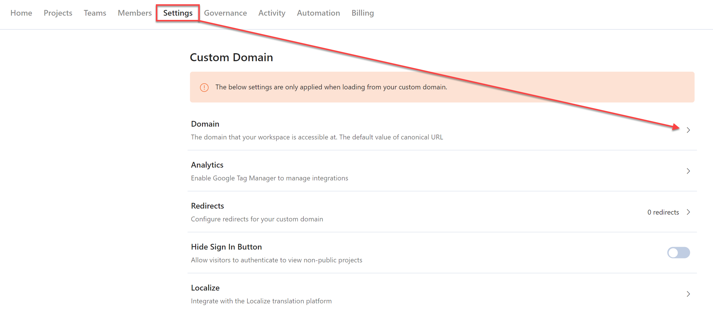

# Use a Custom Domain

Use a custom domain to host your Stoplight workspace from a domain fully under your control. 

> Custom domains are available for Starter plans and above. The Localize integration is available for Professional plans and above. 

Once configured: 

- You can access the Stoplight workspace from the custom domain.
- An SSL certificate for your domain will automatically be generated with [Let's Encrypt](https://letsencrypt.org/). 
- A "noindex" tag will be automatically included on your Stoplight workspace domain to provide the best SEO indexing for your custom domain.

To set up a custom domain for your Stoplight workspace:

1. From the workspace home page, select **Settings**. 
2. Select the right arrow next to **Domain**.
3. Enter your custom domain. 

To complete the configuration process, you must create a CNAME DNS record for your domain that points to `ingress.stoplight.io`.

> ### Limitations
>
> Stoplight currently requires the **full domain** to be allocated for use, meaning that it's impossible to expose documentation from a single path or route. As an example, the domain "api.example.com" can be used to host your Stoplight documentation, however "example.com/api" (note the "/api" base path) can't.
>
> See the [roadmap item](https://roadmap.stoplight.io/c/57-embeddable-component-library) for
> more information on how this limitation will be addressed in the future.

## Additional Options

Once your domain has been configured, you can set these options:

- **Analytics**: [Enable analytics using Google Tag Manger](../4.-documentation/e.configure-analytics.md).
- **Redirects**: Use to move documentation without breaking links. See [Redirects](../4.-documentation/e2.configure-redirects.md)
- **Hide Sign In Button**: Enable to remove sign-in options from the sidebar when your Workspace is loaded from your domain.
- **Localize** (Professional plans and above): Use to [configure an integration](../4.-documentation/e1.configure-localize.md) to Localize. 

## Troubleshooting

### Cloudflare-hosted domains

If you are using [Cloudflare](https://cloudflare.com/), be sure to set your CNAME record to "DNS Only" (signified by a grey cloud, and **not** an orange cloud).

You can read more about what this means in the Cloudflare documentation.

### The connection has timed out

If you see connection time-out errors, this typically means that a CAA DNS record is present on your domain, which is preventing the TLS verification process from completing.

> To learn more about CAA records and what they're used for, see the [Let's Encrypt documentation](https://letsencrypt.org/docs/caa/). You can
> perform a [CAA lookup on your domain](https://www.entrust.com/resources/certificate-solutions/tools/caa-lookup)
> for reference.

To resolve this issue, use either option below:

- **RECOMMENDED** Add `letsencrypt.org` to the CAA record to allow Let's Encrypt to generate certificates for your domain.

- **NOT RECOMMENDED** Remove the CAA DNS record from your domain, which will allow any authority to generate certificates for the domain.

Once updated, try to navigate to your custom domain again to verify the issue has been resolved.