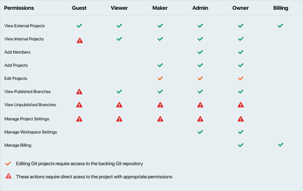

# Workspace Roles

Workspace roles are predefined according to varying access needs. You can assign these roles to members once they've been invited to your workspace. Roles include: 

**Guests**: can view documentation for projects that they are granted explicit access to. Guests are folks outside your company or organization, such as partners who require authenticated access to the documentation.

**Viewer**: can view documentation and consume mock servers. Viewers are usually developers and other stakeholders inside the organization consuming the API but don't need to make changes to API design and docs. Viewers can view **published branches** of all internal projects and **all branches** of projects they are granted direct access to. [Learn how to add members to a project](l.project-roles.md)

**Maker**: in addition to viewer access, can create projects, edit all internal Git projects and projects they are granted direct access to. Makers are usually product managers, technical writers and architects creating/editing API designs and docs.

**Owners, Admins and Billing**: in addition to maker access can manage team members, billing and make changes to the workspace like landing page content and themes.

## What's Next?

Since you now have a fair idea of how workspace roles work in Stoplight, start by: 

1. [**Inviting Team Members**](d.inviting-your-team.md)
2. [**Manage Project Access**](l.project-roles.md)