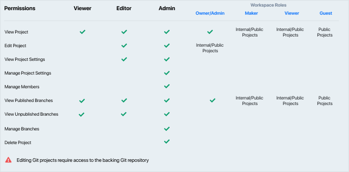

# Manage Project Access

While workspace roles define workspace wide access, not all projects need to be accessible/editable by everybody in the workspace. 

Visbility and permission settings within projects allow granular control over who can do what. 

## Project Visibility

Project visbility determines who can view projects within or outside the workspace. 

**Private**: Only members with direct acess can view the projects.

**Internal**: Anybody within the workspace can view the published branches of the project except guests. Guests need direct access to the project. Makers within the workspace can edit these projects.

**Public**: Everyone including anonymous visitors can access the project. Makers within the workspace can edit these projects.

> **Note:** Makers would require access to the git repository in order to edit Git projects.

### Change Project Visbility

To update the project visibility or add users to a project, navigate to the **Manage Access** tab in the project settings screen (using the cog icon next to **Edit in Studio**). From this screen, you will be able to modify the visibility settings of a project

> Keep in mind that users will see different projects depending on the following criteria:
> - Their permissions in the **workspace**, or
> - Their role in the **project**, or
> - The **visibility settings** of the project (private, public, or internal)

## Project Roles

Project roles determine who can edit projects and their settings. These roles include:

**Viewer**: Viewers can view documentation and consume mock servers **including unpublished branches**.

**Editor**: Makers in addition to viewer access, can edit this project.They can also view project settings and automation logs. To edit these settigns, members require admin access.

**Admin**: Admins in addition to maker access can update visbility, manage branches, add members and delete the project. 

> Project creators start as the only admin when a project is created. *Everybody elese including workspace owners/admins would require the project admin to add them explictly in the project in order to manage settings and/or view unpublished branches*.

### Grant Project Permissions

To add users to a project, navigate to the **Manage Access** tab in the project settings screen (using the cog icon next to **Edit in Studio**). From this screen, you will be able to add members with appropiate roles to the project

