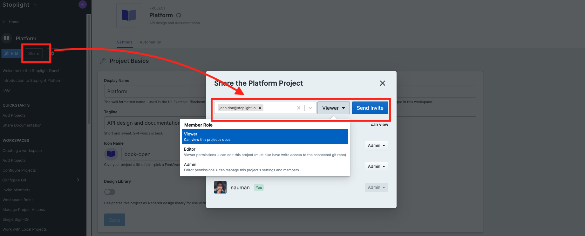

# Manage Project Access

While workspace roles define workspace-wide access, not all projects need to be accessible or editable by everybody in the workspace. 

Visibility and permission settings within projects allow granular control over who can do what. 

## Project Visibility

Project visibility determines who can view projects within or outside the workspace. 

**Private**: Only Workspace Members and Guests with direct project access can view the project.

**Internal**: All Workspace Members can view the project. Guests need direct access to the project.

**Public**: Everyone including anonymous visitors can view project.

### Change Project Visibility

To update the project visibility or add users to a project, click on the **Share** button in the project's sidebar (next to **Edit in Studio**).

> Keep in mind that users will see different projects depending on the following criteria:
> - Their permissions in the **workspace**, or
> - Their role in the **project**, or
> - The **visibility settings** of the project (private, public, or internal)

## Project Roles

Project roles determines the level of access for each project member. These roles include:

**Viewer**: Viewers can view documentation and access mock servers including unpublished branches.

**Editor**: Editors can edit the project in Studio and track new branches.

**Admin**: Admins can edit project settings, manage member roles and remove members.

**Owner**: Owners can remove the project and transfer ownership to another member. There can only be one Owner per project.

View the full list of permissions for each role below:

| Permission                | Owner | Admin | Editor | Viewer |
|---------------------------|-------|-------|--------|--------|
| View published branches   | ✅     | ✅     | ✅      | ✅      |
| View unpublished branches | ✅     | ✅     | ✅      | ✅      |
| Access mock servers       | ✅     | ✅     | ✅      | ✅      |
| Add members               | ✅     | ✅     | ✅      | ✅      |
| Edit in Studio            | ✅     | ✅     | ✅      |        |
| Track branches            | ✅     | ✅     | ✅      |        |
| View settings             | ✅     | ✅     | ✅      |        |
| Edit settings             | ✅     | ✅     |        |        |
| Remove members            | ✅     | ✅     |        |        |
| Remove project            | ✅     |       |        |        |
| Transfer ownership        | ✅     |       |        |        |
| Leave the project         |       | ✅     | ✅      | ✅      |

> **Note:** In order to edit Git projects, users will still need permissions in both Stoplight and the Git repository.

### Grant Project Permissions

Every Project member can add members to the project with their role or lower. For example, a Project Editor can add a new member with either the Editor role or Viewer role but not with the Admin or Owner role.

To add users to a project, click on the **Share** button (next to **Edit in Studio**). From here, you will be able to add existing Workspace members by their username or invite new members by email.

### Request Project Permissions

If you need access to a project, you can the project's owner to add you to the project or upgrade your project role. You can find a project's owner by hovering over their avatar in the projects list.

