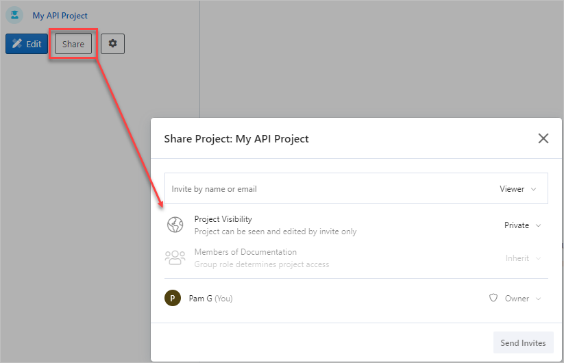
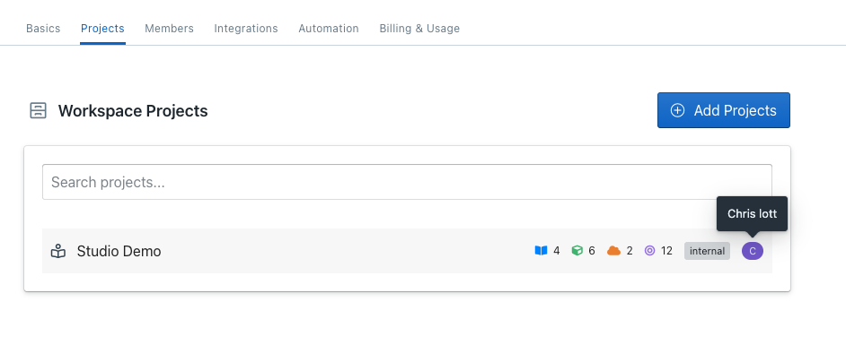
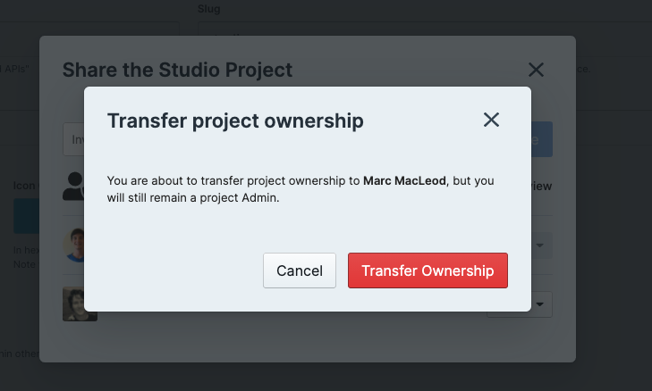

# Manage Project Access

While workspace roles define workspace-wide access, not all projects need to be accessible or editable by everybody in the workspace. 

Visibility and permission settings within projects allow granular control over who can do what. Users will see different projects depending on the following criteria:

- Their permissions in the **workspace**. See [Workspace Roles](k.workspace-roles.md).  
- The **visibility settings** of the project (private, public, or internal).
- Their role in the **project**. 

Project access is managed from the **Share** dialog. From here, you can:

- Invite users to the project by name or email address.
- Set the project visibility.
- Set the role for each project member.
- Change project ownership.
- Remove members.

## Invite Users

To add users to a project, select the **Share** button (next to **Edit** once a project is published). From here, you can add existing workspace members by their user name or invite new members by email.

Project members, except guests, can add members to the project with their role or lower. For example, a project editor can add a new member with either the Editor role or Viewer role, but not with the Admin or Owner role.

## Project Visibility

Project visibility determines who can view projects within or outside the workspace. 

**Private**: Only workspace members and guests with direct project access can view the project.

**Internal**: All workspace members can view the project. Guests need direct access to the project. New projects have internal visibility by default. 

**Public**: Everyone including anonymous visitors can view project.

### Change Project Visibility

To update the project visibility or add users to a project, select the **Share** button in the project's sidebar (next to **Edit** once a project is published).

## Project Roles

Project roles determine the level of access for each project member. To change a user's role for a project, open the **Share** dialog, locate the user, then change the role. 

**Guest**: Can view documentation in published branches once they've been invited. You cannot assign the guest role; it is automatically assigned when guests are invited to a project.

**Viewer**: Can view documentation, access mock servers for published and unpublished branches, and invite users. 

**Editor**: Can edit the project in Studio and track new branches.

**Admin**: Can edit project settings, manage member role, and remove members.

**Owner**: Can remove the project and transfer ownership to another member. There can only be one owner per project.

Permissions for each project role:

| Permission                | Owner | Admin | Editor | Viewer | Guest (Restricted) |
|---------------------------|-------|-------|--------|--------|--------|
| View published branches   | ✅     | ✅     | ✅      | ✅      | ✅     |
| View unpublished branches | ✅     | ✅     | ✅      | ✅      |        |
| Access mock servers       | ✅     | ✅     | ✅      | ✅      |        |
| Add members               | ✅     | ✅     | ✅      | ✅      |        |
| Edit in Studio            | ✅     | ✅     | ✅      |        |         |
| Track branches            | ✅     | ✅     | ✅      |        |         |
| View settings             | ✅     | ✅     | ✅      |        |        |
| Enable style guides       | ✅     | ✅     | ✅    |        |        |
| Edit settings             | ✅     | ✅     |        |        |        |
| Remove members            | ✅     | ✅     |        |        |        |
| Remove project            | ✅     |       |        |        |        |
| Transfer ownership        | ✅     |       |        |        |        |
| Leave the project         |       | ✅     | ✅      | ✅      |✅       |

> **Note:** To edit Git projects, users need permissions in both Stoplight and the Git repository.

### Request Project Permissions

If you need access to a project, the project's owner can add you as a member or upgrade your role. To find out who is the project owner, hover over their avatar in the projects list.

## Project Ownership

Every project must have only one owner. Before the owner can leave a project, ownership must be transferred to another project member. 

### Transfer Project Ownership

To transfer ownership, open the **Share** dialog and change the member's role to Owner. Once confirmed, your role will change to Admin, and the selected member will become the Owner.

<!--
focus: false
-->

### Remove a Project Owner

When removing members from the workspace or downgrading members to guests, you will automatically take ownership of all projects they currently own. You can then transfer ownership of those projects to another member.

<!--
focus: false
-->

