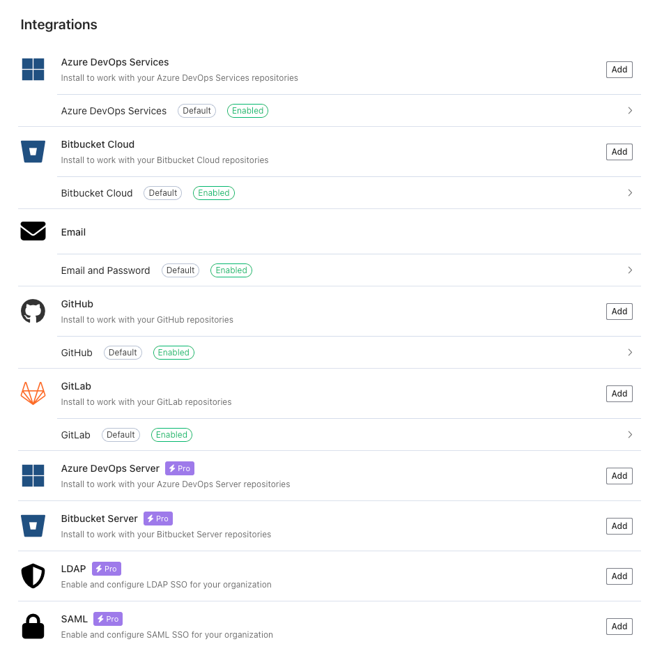
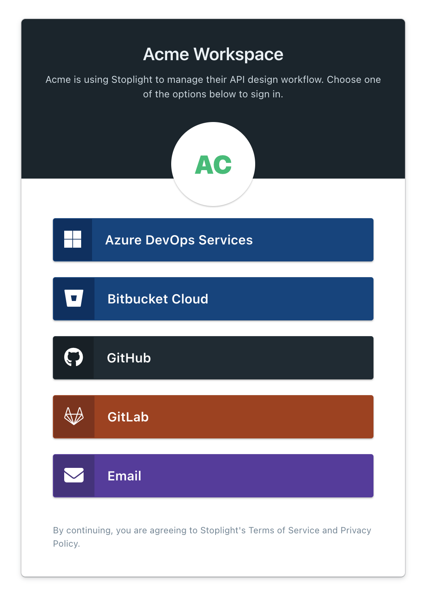

# Log In to a Workspace

When creating a new workspace, you have to provide an email, company/workspace name, and password.

Once the workspace is set up, you can go to the **Workspace Settings** tab and scroll down to the **Integrations** section to configure additional login options, including SAML and LDAP.

By default, workspaces have the following integrations enabled:

- Azure DevOps Services
- Bitbucket Cloud
- Email
- GitHub
- GitLab

That means users that access your workspace can sign up using an email and password, or by authenticating with any of the services on that list.

For more details about Git integrations, see [Git Overview](configure-git/a.configuring-git.md).

For more details about SSO and SAML integrations, see [Single Sign-On](e.configuring-authentication.md).

> For on-premise users, contact your organization administrator or the [Stoplight Support Team](https://support.stoplight.io) if you are unsure of how to access your instance of Stoplight.