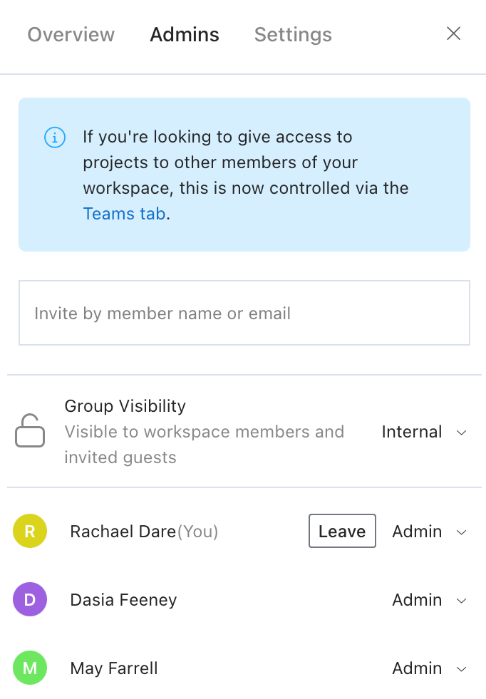

# Groups

<!-- theme: info -->
> This feature is available on the Stoplight **Professional** and **Enterprise** plans.

> As of October 5, 2022, if you were using the Groups feature to manage user access to projects this functionality has been moved to [Teams](teams.md). The Groups feature is now only used for organizing projects and the project sidebar.

Groups provide a way to organize projects for easy navigation and maintenance.

For example, Stoplight uses groups to organize its public documentation into two groups: one primarily focused on the Stoplight platform and one for open-source products.

These groups help users navigate the documentation projects in the workspace sidebar.

<!-- focus: false -->

Groups also make maintenance easier by organizing the Projects list. Groups are organized into collapsible folders. Folders are collapsed by default, and the list is sorted alphanumerically. You can sort the list by name, owner, type, etc.

## Create Groups

1. Log in to your workspace, and then select the **Projects** tab.
2. Select **New Group**.
3. From the **Create New Group** page, provide a name and description for the group.
4. Set the [group visibility](o.group-access.md) to public or internal.
5. Select **Save**.

When you create a group, you are automatically set as the group owner.

## Add Groups to the Sidebar

Use one of these methods to add groups to the workspace sidebar:

1. Pin one or more of the projects in the group. This controls your personal view of the sidebar.

2. Add public projects to public groups. This controls the sidebar view for non-logged-in users and guests.

See [Workspace Sidebar](../4.-documentation/Sidebar/a.workspace-sidebar.md).

## Move Projects to Groups

Project owners can move individual projects in and out of groups they own. Workspace owners can move any project in and out of groups and can do so in bulk.

**Option 1: Move a Single Project to a Group**

1. Log in to your workspace, and then select the **Projects** tab. 
2. Select the **ellipsis** at the right of the project you want to move.
3. Select **Move Project**.

**Option 2: Move Multiple Projects to a Group**

Workspace owners can move multiple projects to a group. 

1. Log in to your workspace, and then select the **Projects** tab.
2. Select the **checkbox** for each project you want to move, and then select the **folder** icon.
3. From the **Move** page, select a group to move selected projects to.
4. Select **Move**.

## Manage Groups

### Group Overview

Select a group from the list to see the **Overview** page.

<!--
focus: true
-->

Here, you can:

* See the group owner.
* See the number of projects, admins, and pending admins.

### Group Admins

Select a group from the list, and then select the **Admins** page. 

<!--
focus: true
-->

Here, you can:

* Invite admins to the group by name or email address.
* Set the group visibility to internal or public (group or workspace owners only).
* See the list of group admins and remove members.

### Group Settings

Select a group from the list, and then select the **Settings** page.

<!--
focus: true
-->

Here, a group owner or administrator can:

* Change the group name that's displayed in the workspace sidebar and in the projects list.
* Update the group's description that's displayed below the group name in the workspace sidebar.
* Set the group visibility.
* Customize the group's avatar and color.
* Delete the group. Projects assigned to the group aren't deleted nor is their access changed.

