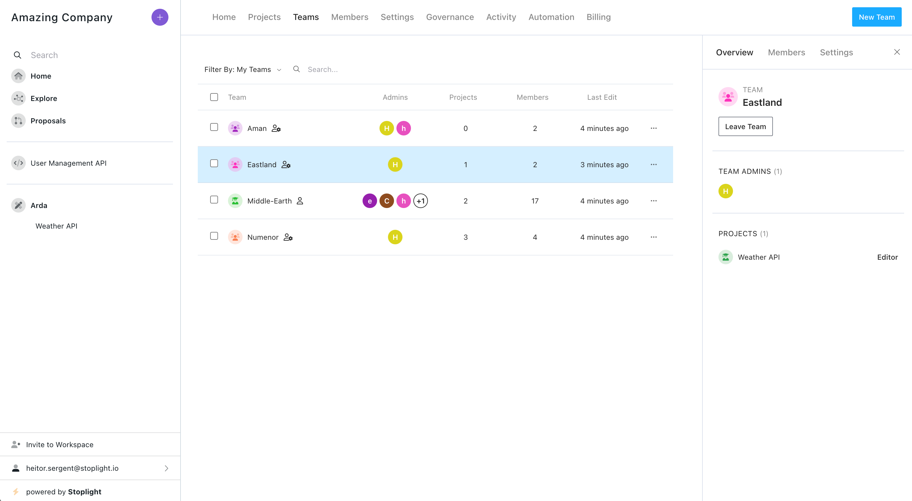
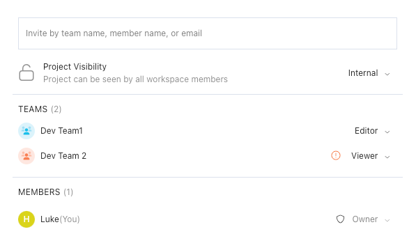

# Teams

<!-- focus: false -->

<!-- theme: info -->
> This feature will be available on the Stoplight **Professional** and **Enterprise** plans.

<!-- > As of October 5, 2022, if you were using the [Groups](m.groups.md) feature to manage user access to projects this functionality has been moved to Teams. The Groups feature is now only used for organizing projects and the project sidebar.    -->

Teams are a powerful and flexible way for larger organizations to more easily manage which users have access to Stoplight projects, as well as controlling project permissions. This can make it easier for more users to collaborate on projects, while giving administrators more security over access controls.

With teams you can:

- Create teams that group together any number of workspace members
- Add teams to projects instead of adding users individually
- Control users project permissions by setting team roles

## Create Teams

You must be a workspace maker or higher to create a team.

To create a team:

1. Log in to your workspace and select the **Teams** tab.
2. Select **New Team** on the top-right.
3. From the **Create New Team** page, provide a name and description for the team.
4. Select **Create**.

When you create a team, you are automatically set as the team admin.

## Manage Teams

Users with the [workspace owner role](k.workspace-roles.md) and team admins can manage teams.

When a user creates a team, they're automatically added to that team and set as a team admin. Teams can have multiple team admins to allow users to more easily manage team members, and all teams must have at least one team admin.

### Team Roles

- **Team Admin**: Can manage team members and team settings.
- **Team Member**: Can view team members.

### Add User to Team

You must be a team admin or workspace owner to add users to a team.

To add a user to a team:

1. Log in to your workspace and select the **Teams** tab.
2. Select a team from the **Team List**.
3. Select the **Members** tab on the Teams panel.
4. Select the invite field and enter one or more member names or emails.
5. Select their team role from the drop-down menu.
6. Select **Send**.

Once you select **Send**, users in the workspace are automatically added to the team. Users who aren't in the workspace will receive an email [invite to join the workspace](d.inviting-your-team.md#invite-members-to-your-workspace). Once they accept the invite, they will be automatically added to the team.

### Remove User from Team

Only team members with the admin team role can remove other team admins. A team must always have at least one team admin.

To remove a user from a team:

1. In your workspace, select the **Teams** tab.
2. Select a team from the team list.
3. Select the **Members** tab on the team panel.
4. Select the team role dropdown next to the team member you wish to remove.
5. Select **Remove Member**.
6. Select **Remove** in the confirmation dialog.

###  Team Settings

- **Team Name**: The display name for the team. Shown in the teams list, project invite field, and project members list.
- **Description**: The purpose of the team.
- **Avatar**: The avatar icon (using [FontAwesome](https://fontawesome.com/icons)) and color that's displayed next to the team name.

## Add Team to Project

Adding a team to a project will give all team members access to that project with the selected role permissions.

> **Note**: If a user belongs to multiple teams with different project permissions, the user will have the highest project permissions assigned to them.

There are three ways to add a team to a project:

1. When editing a project, select **Share** on the top-right. 

Or:

1. Select a project from the workspace sidebar.
2. Select **Share** from the project sidebar.

Or:

1. In your workspace, select the **Projects** tab.
2. Select a project from the project list.
3. Select the **Members** tab on the project panel.

In any of the options above:

1. Search for a team name on the invite field.
2. Select the team or teams you'd like to add to the project.
3. Select the [project role](l.project-roles.md).
4. Select **Send**.

## Remove Team from Project

There are three ways to remove a team from a project:

1. When editing a project, select **Share** on the top-right. 

Or:

1. Select a project from the workspace sidebar.
2. Select **Share** from the project sidebar.

Or:

1. In your workspace, select the **Projects** tab.
2. Select a project from the project list.
3. Select the **Members** tab on the project panel.

In any of the options above:

1. Select the project role dropdown next to the team you wish to remove from the project.
2. Select **Remove Team**.
3. Select **Remove** in the confirmation dialog.

## Leave Teams

Team admins and team members can leave a team, as long as there's a team admin remaining in that team.

To leave a team:

1. In your workspace, select the **Teams** tab.
2. Select a team from the team list.
3. Select **Leave Team** in the team **Overview** tab.

## Delete Teams

To delete a single team:

1. In your workspace, select the **Teams** tab.
2. Select a team from the team list.
3. Select the **Settings** tab on the team panel.
4. Select **Delete Team**.
5. Type the team name in the dialog and select **Delete**.

If you're a workspace owner, you can also delete multiple teams at once:

1. In your workspace, select the **Teams** tab.
2. Select the checkbox next to the team name for the teams you wish to delete.
3. Select the trash icon at the top of the team list.
4. Select **Delete** in the confirmation dialog.

When a team is deleted, that team is removed from any projects it had been added to, and all team members are removed from that team.

## Permissions

### Team Permission Roles

|                                 | Member | Admin |
|---------------------------------|--------|-------|
| Can view team members           | ✅     | ✅     | 
| Can leave team                  | ✅     | ✅     | 
| Can add team members            |       | ✅      | 
| Can manage team members         |       | ✅      | 
| Can manage team settings        |       | ✅      | 

### Team Permission Workspace Roles

|                            | Guest | Viewer | Maker | Admin | Owner |
|----------------------------|--------|-------|-------|-------|-------|
| Can be invited to teams    | ✅     | ✅     | ✅    | ✅    | ✅    |
| Can create teams           |        |       | ✅    | ✅    | ✅    |
| Can have team admin role   |        |       | ✅    | ✅    | ✅    |
| Can manage teams (if team admin) |  |       | ✅    | ✅    | ✅    |
| Can delete teams (if team admin) |  |       |  ✅   |  ✅   | ✅    |
| Can manage all teams       |        |       |       |      | ✅    |  
| Can delete all teams       |        |       |       |      | ✅    |  
| Can bulk delete teams      |        |       |       |      | ✅    |
| Can add teams to projects*  |        | ✅    | ✅    | ✅    | ✅    |
| Can update team project role* |      | ✅    | ✅   | ✅    | ✅    |
| Can remove team from project** |     |       | ✅   | ✅    | ✅    |

\* Users can only add or update a team's project role with their project level of permissions or lower.

** Workspace makers and admins can only remove a team from a project if they're also a project owner or project admin.

### Project Access for Team Members

Every member of a team automatically has access to any projects that team has been added to. Project administrators can change the permissions in a project for a team from the **Share Project** window. See [Project Access](l.project-roles.md#grant-project-permissions).

Guests have restricted access and can only view documentation in published branches. (Guests are automatically given restricted access when they're invited to a project.)

#### User Permissions

Users can be added to projects directly as members, or they can be added to projects as part of a team. A user can also belong to multiple teams that can have different project permissions. To understand what permissions a user has on a project, there's an order of priority:

- If a user is added to a project as a member and as part of a team, the member project permissions take precedence over any team permissions.
- If a user is added to a project via multiple teams, the team with the highest permissions takes precedence over other team permissions.