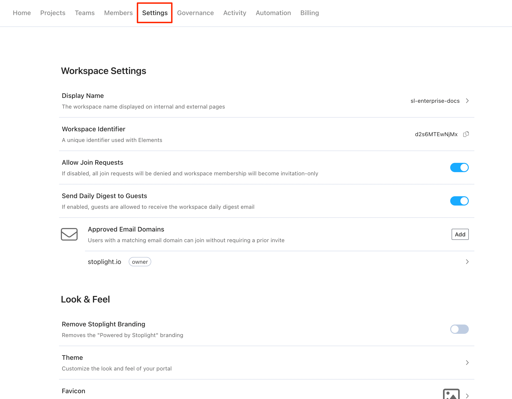

# Workspace Settings

To customize workspace settings, select **Settings** from the workspace home page. This opens the **Workspace Settings** page.

## Display Name

Select this option to change the name that appears in the upper left corner of your workspace if you have the portal enabled. 

## Workspace Identifier

Used by the [Elements Dev Portal](https://meta.stoplight.io/docs/elements/ZG9jOjEyMDU2Njc2-introduction-to-elements-dev-portal) to identify the workspace.

## Allow Join Requests

Use to control join requests. Once disabled, new members must be invited to join your workspace. See [Invite Workspace Members](d.workspace-access.md#invite-members-to-your-workspace) for details.

## Send Daily Digest to Guests

Use to control whether users with the [**guest**](d.workspace-access.md) workspace role can disable daily digest emails in their [**Account Settings**](q-account-settings.md#notifications). Disable this option to prevent guests from receiving daily digest emails.

## Approved Domains

Set approved email domains that enable users to join your workspace without an invitation. See [Allowed Email Domains](d.workspace-access.md#allow-access-by-email-domain) for details.

>Available for Starter packages and above.

## Remove Stoplight Branding

Select this option to remove the **powered by Stoplight** label from the bottom of the navigation page.

>Available for Professional packages and above.

## Set the Sidebar Theme

Select this option to change sidebar colors to match your company branding. 

You can select a preset theme or customize colors for:

- **Background color**: Controls the main sidebar color.
- **Text color**: Controls sidebar text color.
- **Primary color**: Controls **Edit** button and link text color.
- **Accent color**: Controls the color of the **Add Project** button.
- **Border color**: Controls the color of the border that separates the sidebar from the main page.

Select the **Show Live Preview** option to see changes as you make them.

To revert your theme changes to the default, select the **Reset** button.

## Add a Favicon

Change the favicon for your site. The ideal size is 16x16 pixels, and the favicon should have a transparent background. 

1. Select the right arrow next to **Favicon**.
2. Add a URL to you favicon. Make sure the URL is accessible to your users. 

>Available for Starter packages and above.

## Add a Company Logo

Change the logo for your site. The ideal icon is a rectangular image approximately 250 pixels wide and 75 pixels high. The logo should have a transparent background. 

1. Select the right arrow next to **Logo**.
2. Add a URL to your company's logo. Make sure the URL is accessible to your users. 

## Customize Your Landing Page

The **Home Screen** is the landing page for your workspace and the first thing users will see. Use the landing page to highlight important APIs, getting started guides, or tutorial videos. 

You can:

- Use the default template to get started.
- Edit the default template to personalize it for your company. 
- Completely replace the default template. 

> Use traditional Markdown along with [Stoplight Flavored Markdown](../4.-documentation/stoplight-flavored-markdown.md). 

1. Select the right arrow next to **Landing Page**.
2. Use the **Home Screen Markdown** page to add information to the page. 
3. Select **Preview** to test your changes. 
4. Select **Use Default Template** to replace your content with default content provided by Stoplight.

The **HTTP Request Maker** and **JSON Schema** options aren't supported in the Landing Page Markdown editor.
