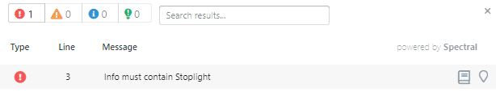

# Overview

<!-- theme: warning -->
>**Warning**:
>Limited early access content for Shared Style Guides. Shared style guides are available on the **Professional** and **Enterprise** plans for early access participants. 

Style guides add consistency, reusability, and easy governance to your API program. Use a dedicated project type to create style guides managed by workspace owners and administrators, then share them across projects, business units, or workspace groups. 

Style guides contain rules that help you govern versioning, filtering, error formats, naming conventions, pagination, and more. Examples include:

- Ban the use of HTTP basic
- Verify that every endpoint has security settings
- Ensure URL standards are set and followed

Once you apply style guides, you'll receive immediate feedback in the **Validation List** if your API designs do not comply. 

See our [rule examples](g-rule-examples.md) to get started.

## Style Guide Organization 

How you manage style guides depends on your organization, but here are some ideas:

- **Global governance**: Create rules that apply to all APIs. For example, create a rule that targets the `contact` object and the `email` field to ensure that all APIs use the correct support email for your company.
- **Project overrides**: Certain teams may have governance needs that other teams don't. In this case, you can enable your company's global style guide for your project, and then disable rules that don't apply. You can also create local targets and rules that are needed for your API, but not others. 
- **Organize style guides into groups**: Consider creating a group to organize all of your style guides. This will make it easier for those enabling style guides and those who review and maintain them.

When a shared style guide is updated, you can apply those updates to your project to ensure you're always using the latest version.

[What's Next: Create Style Guide](a1.create-style-guide.md)

