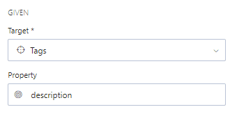

# Create Rules

<!-- theme: warning -->
>**Warning**:
>Limited early access content for Shared Style Guides. Shared style guides are available on the **Professional** and **Enterprise** plans for early access participants. 

See our [rule examples](g-rule-examples.md) to get started.

## Add a Rule

To create a rule:

1. Edit a style guide project. 
2. In the **Rules** area of the left pane, select the plus icon next to Local to open the **Rules** editor in the right pane.
3. Configure the three main rule areas:
    - [Rule Settings](#Rule-Settings)
    - [Given](#Given-Settings)
    - [Then](#Then-Settings)

### Rule Settings

Set severity, name, message returned in validation, and the description for documenting the rule.

- **Rule severity**
   Options are error, warning, information, and hint. When applied to an API project, the severity levels appear in the **API Design** editor. 
   
   You can also choose to disable a rule.

- **Name**

   Provide a short descriptive name. There are no restrictions on the name format, but kabab case is recommended. Example: `require-description`.

- **Message**
  
   Provide the message that will appear in the validation results list in the **API Design** editor. Add your own message text or include placeholders that are evaluated at runtime: 

   - `{{error}}`: Returns the function error. 
   - `{{description}}`: Returns the rule's description.
   - `{{path}}`: Returns the full path to the property in the API design document. 
   - `{{property}}`: Returns the last segment of the property path in the API design document.
   - `{{value}}`" Returns the linted value in the API design document. 

- **Description**

  Open the Markdown editor to add helpful information used to document the rule.

### Given Settings

Set the area of the API specification the rule applies to.

- **Target** 

  Select a target to specify the area of an API specification document. Targets are predefined and required for each rule. See [Create Targets](b-create-targets.md).

- **Property**

  Add properties to reference a specific entity in the target. For example, when you target the `$tags[*]` area of the OAS 3.1 specification, enter `description` to enforce rules on tag descriptions. 

### Then Settings

Set the function that will evaluate your API design content. You can use Spotlight's [core functions](https://meta.stoplight.io/docs/spectral/ZG9jOjExNg-core-functions) or [create your own](h-create-custom-functions.md). 

[What's Next: Publish Style Guide](e.publish-style-guide.md)

   
 
