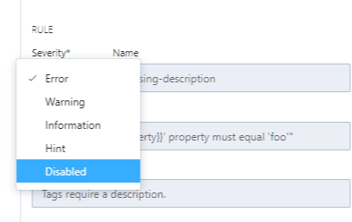

# Enable a Style Guide

<!-- theme: warning -->
>**Warning**:
>Limited early access content for Shared Style Guides. Shared style guides are available on the **Professional** and **Enterprise** plans for early access participants.  

You can enable style guides in any API project. Once you add style guides, you can:

- Disable inherited rules
- Create local targets, custom functions, and rules
- Use inherited targets and custom functions in new rules

To enable a style guide:

1. Edit an API project.
2. Select the **Styles** tab in the left pane.
3. On the Overview pane, select **+ Add/Edit** from the **Enabled Style Guides** page. 
4. In the **Style Guides** dialog box, select one or more style guides, and then select **Save**.
5. In the right pane, provide a description for your style guide.

## Disable Inherited Rules

To disable an inherited rule:

1. Select the rule in the **Inherited Rules** list.
2. In the **Rule** editor, select **Disabled** from the **Severity** list.

[What's Next: Refresh Style Guide](f.refresh-style-guide.md)