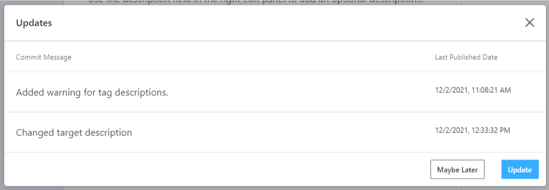

# Update Style Guides

<!-- theme: warning -->
>**Warning**:
>Limited early access content for Shared Style Guides. Shared style guides are available on the **Professional** and **Enterprise** plans for early access participants. 

Style guides are meant to be dynamic documents that change as your organization grows and adopts
API governance best practices.

When a style guide that has been enabled for a project changes, you are alerted on the **Overview** page. You can refresh the enabled style guide immediately or wait until a more convenient time.

To update a style guide:

1. Edit a project that has an enabled style guide.
2. Select the **Overview** page. Note the **Update Available** alert for style guides that need to be refreshed in your project.
3. Select **Update Available**. 
4. Review the commit messages so you can decide if you want to take the updates or wait until a later time.

5. Select **Update** to refresh the style guide or **Maybe later** to wait.