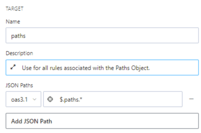
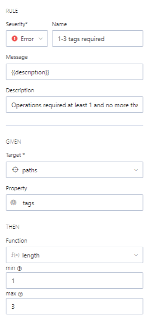
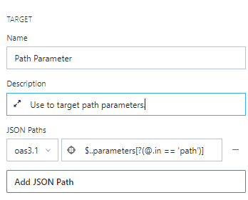
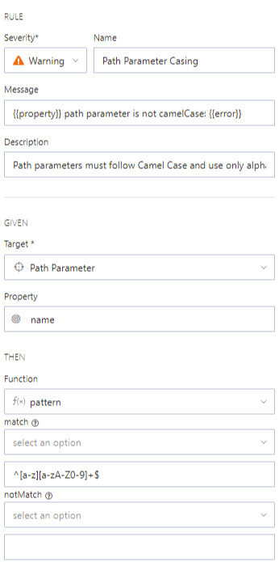

# Rule Examples

<!-- theme: warning -->
>**Warning**:
>Limited early access content for Shared Style Guides. Shared style guides are available on the **Professional** and **Enterprise** plans for early access participants. 

## Control the Number of Tags

Use the length core function to require all operations have between one and three tags. Use your description for the validation list and as your rule's documentation. 

1. [Create a target](b-create-targets.md) for the `path` object. This example returns all objects regardless of their names: `$.path.*`.

2. Add a rule with these settings:

    - **Severity**: *Error* 
    - **Name**: *1-3 tags required*
    - **Message**: {{description}} (This returns your provided description in the validation list.) 
    - **Description**: *Operations required at least 1 and no more than 3 tags.*
    - **Target**: Select the *paths* target you created in step 1.
    - **Property**: *tags* (This targets the tags field in the paths object.)
    - **Function**: *length* 
    - **min**: *1*
    - **max**: *3*

## Path Parameters Must Adhere to Camel Case

Use the pattern function to ensure that all path parameters use Camel Case (example: myPath) and alphanumeric characters.

1. [Create a target](b-create-targets.md) for the `path` object. This example targets parameters in the object: `$..parameters[?(@.in == 'path')]`.

2. Add a rule with these settings:

    - **Severity**: *Warning* 
    - **Name**: *Path Parameter Casing*
    - **Message**: *{{property}} path parameter is not camelCase {{error}}* (This returns the last segment of the property path in the API design document, your text, and the function error.) 
    - **Description**: *Path parameters must follow Camel Case and use only alphanumeric characters.*
    - **Target**: Select the *paths* target you created in step 1.
    - **Property**: *name* (This targets the name field in the path object.)
    - **Function**: *pattern* 
    - **Match**: *^[a-z][a-zA-Z0-9]+$*
    
  

