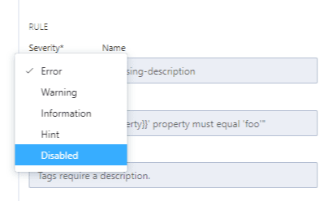

## Disable Inherited Rules

<!-- theme: info -->
<!--Shared style guides are available on the **Professional** and **Enterprise** plans.--> 

> This feature is in preview. Reach out to nauman@stoplight.io for more information.

To disable an inherited rule:

1. Select the rule in the **Inherited Rules** list.
2. In the **Rule** editor, select **Disabled** from the **Severity** list.

