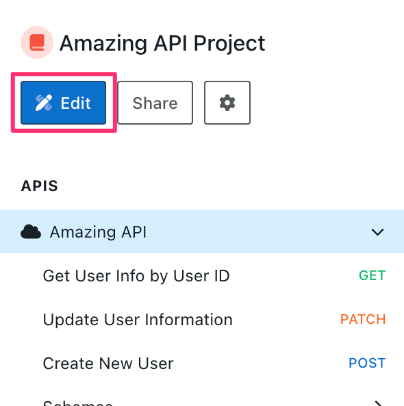
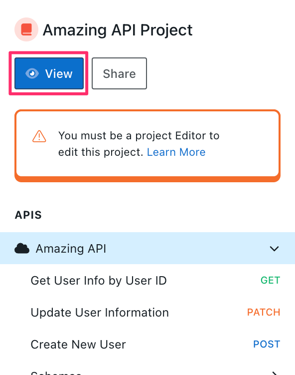

# Design Editor Overview

Use the Design Editor, also referred to as Stoplight Studio, to view, design, and manage APIs, documentation, and related files stored in projects.

Workspace guests can't access the Design Editor.

Projects work and look the same in Studio Web and Studio Desktop, with a few differences. Learn more about the differences in our [design overview](design-overview.md#studio-web-vs-studio-desktop).

> This topic describes API projects in Studio Web. For [style guide projects](api-design-editor.md), only the **Styles** tab is available.

## Open a Project

To open a project from the **Home** page:

* Select the project from the project sidebar (left pane), or 
* Select **Projects** from the tab on the top of the page, and then select a project. 

### Edit Project

Project owners, admins, and editors can select **Edit** to manage the project.

### View Project

For web projects and Git projects that have a [service account](../2.-workspaces/configure-git/h.service-accounts.md) configured, project viewers can select **View** to view the project.

Viewing projects in the Editor allows users to navigate projects in a different format than the workspace view, as well as look at the Form and Code views side-by-side in the Editor panel, which can be helpful when looking at new APIs or reviewing API changes.

## Use the Designer

Once you are viewing or editing a project, there are three key areas of the interface:

1. [Project sidebar](#project-sidebar)
2. [Project toolbar](#project-toolbar)
3. [Editor panel](#editor-panel)

## Project Sidebar

Switch between tabs to work with project content:

- **APIs** lists APIs, endpoints, models, request bodies, responses, parameters, and examples.
- **Docs** lists Markdown and image files.
- **Files** lists all project files.
- **Styles** lists rules, targets, and functions that are either inherited from an enabled style guide or have been created in the API project.

Select an item on any tab to open it in the Editor panel. 

You can customize the published [project sidebar](https://meta.stoplight.io/docs/platform/ZG9jOjIxOTkxNTkz-project-sidebar) to:

- Customize the order of APIs, endpoints, and articles
- Organize endpoints within a single API into groups
- Override the title of files

## Project Toolbar
<!-- The options in this section match the UI but go againt Vale rules -->

The project toolbar at the top includes functionality that can help you navigate in your project, as well as project settings:

**Back to Workspace**: Leaves edit mode and returns you to the workspace home.

**Hamburger menu icon**: Includes the following project configuration options: 
- **Preferences**: 
  - Autosave (Git projects only)
  - Show empty directories
  - Theme (dark, light, or the default set in Workspace settings)
- **Git** (Git projects only):
  - Auto-pull 
  - Auto-translate SSH URLs
- **Reclone Project** (Git projects only)
- **Download Project ZIP**

<!-- focus: center -->

**Search**: Find anything in your project files. 

**Add (+) Icon**: Use to add new assets to your project. This includes APIs, endpoints, models, articles, style guides, images, table of contents, files and directories. You can also import files and import directories and add a [Stoplight Config file](https://meta.stoplight.io/docs/platform/ZG9jOjE4ODEyNA-configure-projects) to your project. 

**Project Actions** (Changes depending on your state and the type of project):

- **Publish**: When the project isn't connected to a repository, this option is enabled when at least one change has been made in the project. 
- **Commit and Publish**: When the project is connected to a repository, this option is enabled when at least one change has been made in the project.  
- **Discard changes since last publish**: Once changes are made to a project, select the down arrow next to **Publish** or **Commit and Publish** to see this option, and select it to discard any changes. 

For Viewers, the **Project Action** section is disabled at the top and users can't make changes or add new files.

> For web projects, discarding impacts unpublished changes made by all users and not just the user performing the discard.

**Project Name**: Shows the name of the current project, as well as the version (for Stoplight projects) or branch (for Git projects).

Select the down arrow to pull changes into your project or to switch versions or branches. 

## Editor Panel

Use the main editor panel to visualize, review, and design APIs, write supporting documentation, and update style guides. 

Choose different views:

- **Form**: Offers an intuitive editor for APIs, endpoints, and models. Use the [JSON Schema Editor](json-schema-editor.md) to design data models for requests and responses.
- **Code**: Enables the code view for applicable files (not available for style guides).
- **Preview**: Provides a preview of what the selected file will look like when it's published. For API operations, the [Try It](try-it.md) feature is available in Preview mode. 

**Validation and Linting** displays issues related to your API Specification using [style guide rules](../2a.-style-guides/a.style-guide-projects.md) and powered by [Spectral](https://meta.stoplight.io/docs/spectral/ZG9jOjYx-overview). Select to expand window and view error and warning details and locations.

A **Secondary Panel** is available on larger screens (width > 1400px). Switch between view types via the view toggle in the top right of the panel.