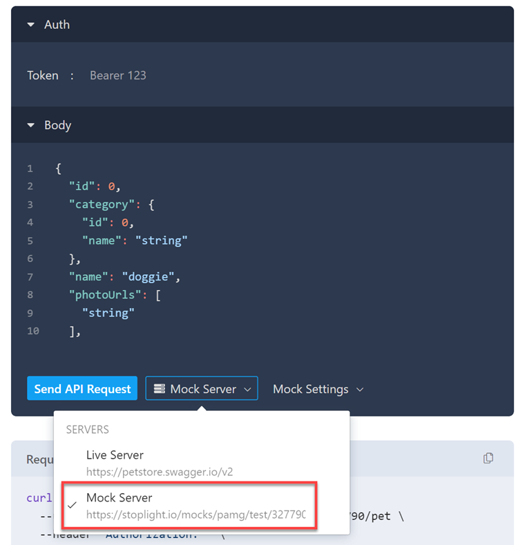
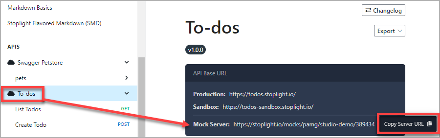
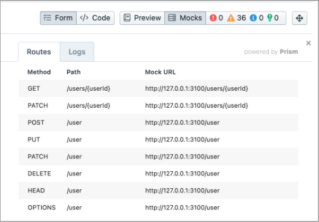
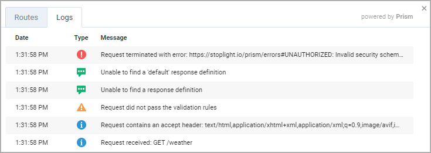

# Work with Mock Servers

Stoplight offers free, automatically updated HTTP mock servers for every API published in your workspace. These mock servers simulate real APIs by providing endpoints and validation rules described in your API documentation. 

This allows client developers to begin writing code for frontend services like web, mobile, or other backend applications while API developers are writing their code. This can help find and solve problems early on, before the API is built.

Stoplight mock servers are powered by the open-source mock server, [Prism](https://stoplight.io/open-source/prism). Learn more about Prism:

- [Response Generation](https://meta.stoplight.io/docs/prism/ZG9jOjk1-http-mocking#response-examples)
- [Static Generation](https://meta.stoplight.io/docs/prism/ZG9jOjk1-http-mocking#static-response-generation)
- [Dynamic Generation](https://meta.stoplight.io/docs/prism/ZG9jOjk1-http-mocking#dynamic-response-generation) 
- [Request Validation](https://meta.stoplight.io/docs/prism/ZG9jOjk2-request-validation)
- [Help with Errors](https://meta.stoplight.io/docs/prism/ZG9jOjE2MDY1NjY5-errors)

> Stoplight provides hosted mock servers for convenience so that API consumers can experiment with an API without the need for backend code. However, a standalone Prism Proxy server is suggested for CI/CD integrations that will result in a large number of API calls. For guidance, see the [Prism documentation](https://meta.stoplight.io/docs/prism/72d69fb629de0-validation-proxy) or [this blog](https://blog.stoplight.io/a-deep-dive-into-prism-for-open-source-october).

## Use Mock Servers

Use mock servers for any OpenAPI file:

- From the documentation for any endpoint in [Studio Web](#studio-web)
- From your own [HTTP client or front-end application](#any-http-client)
- From any endpoint in [Studio Desktop](#studio-desktop).

Mock servers can be used for all branches for projects that are up to date with the latest version of API specifications. 

## Studio Web

Use Studio Web to get sample data and a hosted mock server URL that you can use in another application.

To use mock servers from published documentation:

1. From the **Workspace sidebar**, select an API project.
1. In the **APIs** area of the left sidebar, select an operation.
2. On the right side of the documentation page, select the **Servers** down arrow, and then select **Mock Servers** to use the Stoplight-hosted mock server.

> Servers specified in the API description can also be selected. These could be production or testing servers. 
   
3. Response codes (200, 201, 404, etc.) are shown in the **Mock Settings** list. Choose a code, and then choose one of these options:
   * **Dynamically generated**: Responses with random values are generated by Prism. 
   * **Statically generated**: Responses are based on response body examples in the  OpenAPI schema object, if they exist. If not, a fake response is generated. 
   To learn about each type, see the [Prism response generation guidelines](https://meta.stoplight.io/docs/prism/ZG9jOjk1#static-or-dynamic-generation).

4. Provide any needed parameters for the request, and then select **Send API Request**.



The Response shows sample data for the operation based on the selected response codes and data generation type.

## Any HTTP Client

Use the hosted mock server in any HTTP client or front-end application.

Locate the mock server URL on the Description page for your API. Hover over the URL, and then select **Copy Server URL**.



Consider the hosted mock server to be a special server that's not mentioned in your API description. For example, if you have an OpenAPI description with the following servers:

```yaml
servers:
  - description: Production
    url: "https://api.example.com"
  - description: Staging
    url: "https://api.staging.example.com"
paths:
  /hello:
    get: 
      # ...
```

You can swap those URLs for your hosted Prism URL:

<!-- markdown-link-check-disable -->
https://stoplight.io/mocks/{workspaceName}/{projectName}:{optionalBranchName}/{ID}
<!-- markdown-link-check-enable -->

The actual contents of the responses depends on the examples in the API Description, if the request prefers static or dynamic mode, and if you requested specific status codes to come back. 

## Studio Desktop 

Studio Desktop automatically uses local mock servers. 



To use mock servers in Studio Desktop:

1. Open a project that has an OpenAPI file.
2. On the **APIs** tab, select an operation.
3. Add parameters to the request URL as required by the operation.
3. Select **Mocks**, and then select a link on the **Routes** tab at the bottom of the page.
4. A browser window opens showing sample data for the operation. You can choose to view the data in raw or parsed format.
5. Select the **Logs** tab to see information about the request. Use this information to adjust your API as needed.



