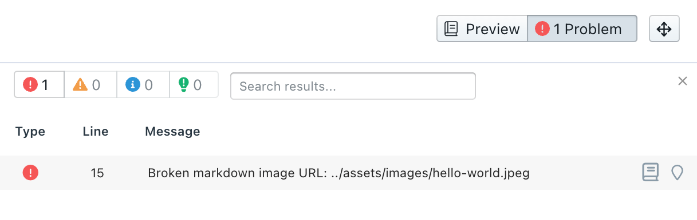

# Validation and Linting

The Style and Validation rule engine is powered by the open-source project [Spectral](https://stoplight.io/open-source/spectral). 

Stoplight automatically:

* Validates YAML and JSON files
* Lints OpenAPI v2 and v3.x documents against the OpenAPI specification (with the [Stoplight Style Guide](../2a.-style-guides/d-enable-style-guide.md) enabled)
* Lints OpenAPI v2 and v3.x documents against enabled [style guides](../2a.-style-guides/a.style-guide-projects.md)
* Lints Markdown articles for broken image URLs for local files.

The following **API Design Checker** example shows:

- One style error (line 27)
- Two JSON validation errors (line 31) 
- Five style warnings (lines 6, 21, and 35)

Select each item in the list to go directly to the line that needs attention.

### Validation Rules

Validation rules signify whether your API descriptions and generic JSON/YAML are valid. An example OAS validation rule is one that requires a unique `operationId` for every operation.

> **Tip**:
> Validation is available for the [Table of Contents file](../4.-documentation/Sidebar/d.table-of-contents.md) used to organize the project sidebar.

### Style Rules

Style rules differ from validation rules because they provide guidance for naming conventions, missing information which would improve the quality of documentation, and more.

Depending on the ruleset, the **API Design Checker** can show errors, warnings, informational messages, and hints.

Each Stoplight API project is automatically linted using the [Stoplight Style Guide](https://apistylebook.stoplight.io/docs/stoplight-style-guide). You can disable rules in this guide, change their severity (error to warning, for example), and add your own rules. See [Stoplight Style Guides](../2a.-style-guides/a.style-guide-projects.md) for more information.

### Markdown Linting

When editing Markdown articles, the **Docs Checker** pane will display an error if you have a broken image URL of a local file.

