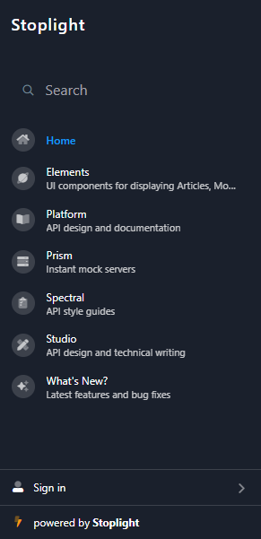
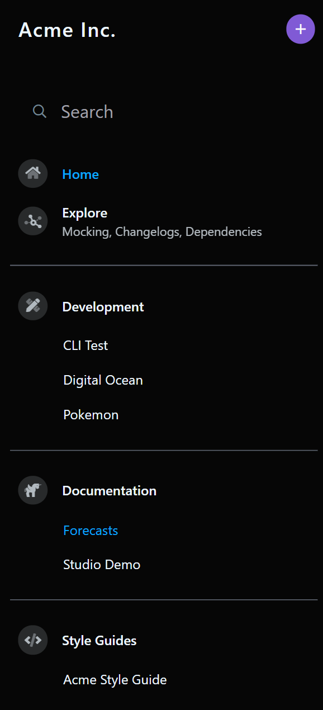

# Sidebar Customization

The Stoplight sidebar changes depending on who you are and what page you're viewing. 

## Workspace Projects List
For **anonymous users**, the workspace sidebar shows public projects and public groups. 

<!-- focus: center -->

For **authenticated workspace members**, the workspace sidebar shows the projects and groups you've pinned or created. 

<!-- focus: center -->

For **workspace guests**, the sidebar is [automatically populated](a.workspace-sidebar.md#guest-sidebar-visibility) with public projects and projects the guests have been invited to. 

<!-- theme: success -->
> Ready to pin your favorite projects? Learn how to [Populate Your Sidebar](a.workspace-sidebar.md).

## Project Table of Contents

The project sidebar contains API descriptions and documentation. You can use the [default order](d.table-of-contents.md#the-default-structure) or use a [Table of Contents](d.table-of-contents.md) file to customize the order and structure of your project sidebar. 

