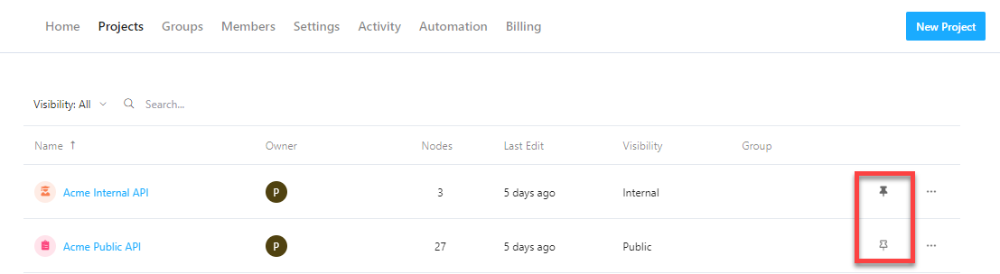

# Workspace Sidebar

The sidebar is the primary navigation for all workspaces and contains the following elements:

1. **Search** - Available to all users, but only returns results for projects users have access to.
2. **Explore** - Available to logged-in workspace members only. The explorer makes it easier to find, search, and manage all available API artifacts.
3. **Projects** - For workspace members, all projects that you've pinned or created are shown in the sidebar. External users (those not logged in) see only public projects. Learn to [manage project-level access](../../2.-workspaces/l.project-roles.md).
4. **Groups** - Customers on either *Professional* or *Enterprise* plans can further control their sidebars by creating groups of projects. Learn more about [Groups](../../2.-workspaces/m.groups.md).

<!-- focus: center -->

## Add Projects to the Sidebar

All members, except guests, can pin favorite projects to their workspace sidebar. If pinned projects are part of a group, the group is automatically added to the sidebar.

1. Log in to your workspace, and then select the **Projects** tab. 

2. Select the pin icon to the right of a project to add it to your sidebar. To remove a project from your sidebar, clear the pin.

<!-- focus: center -->

## Guest Sidebar Visibility

To help ease project setup, the sidebar for guests automatically shows:

- Public projects
- Projects that guests have been invited to
- Non-private projects in groups that guests have been invited to

