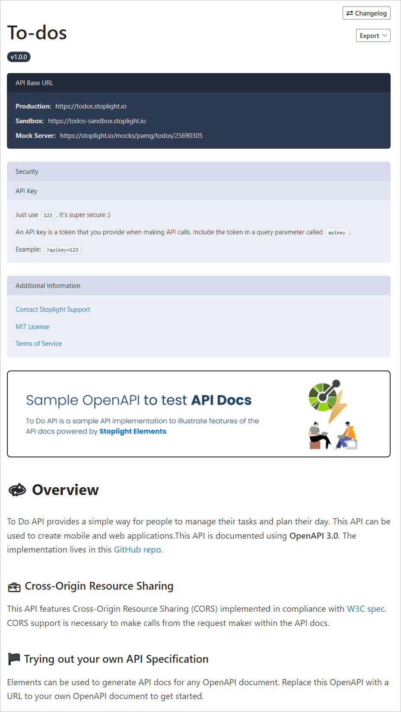
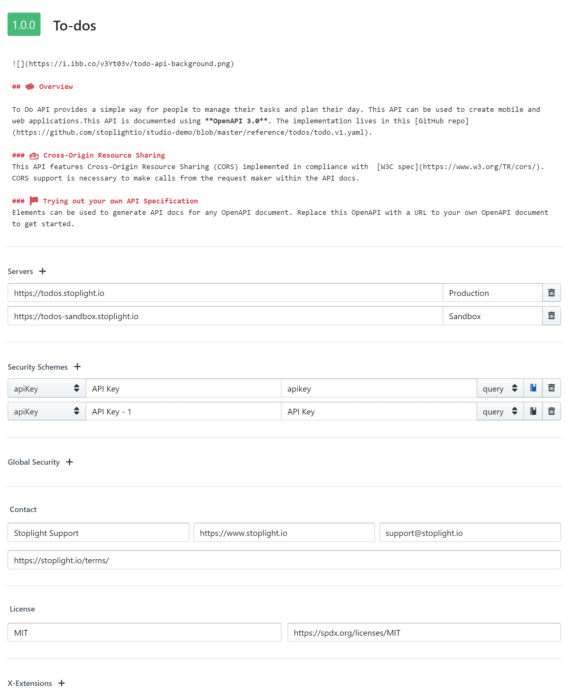
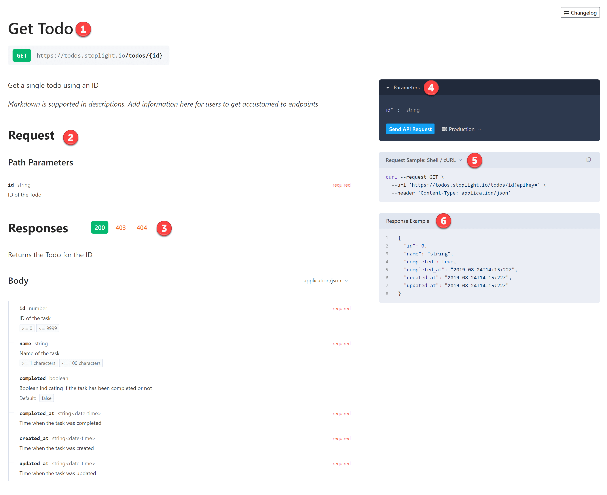
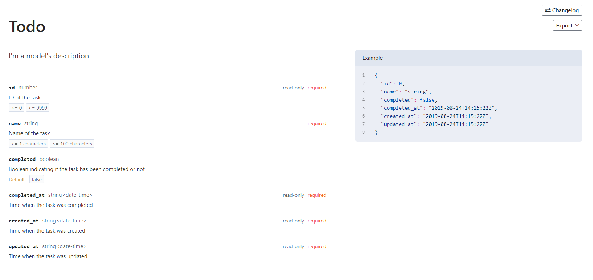

# Types of Documentation

When people think of API documentation, they often think of API reference documentation, but that's only one of several types of documentation that your API consumers need to solve various use-cases. 

With Stoplight, you can deliver:

- API Reference Documentation
- Quick Start Guides
- How-to Tutorials

Stoplight documentation also provides API consoles and automatic sample code. 

## API Reference

Stoplight automatically generates API reference documentation from your API descriptions. After you publish a project with an OpenAPI document, API reference documentation becomes available. By reusing request and response examples that exist or creating examples from default and example property values, you can automatically create high-quality API reference documentation.

> If you don't already have an API description, get started by creating a new API design or converting some other machine-readable formats like RAML, HAL, or Postman, to OpenAPI with [Apimatic Transformer](https://www.apimatic.io/transformer/).

Stoplight API reference documentation includes:

- **API Overview**: Description, server information, security schemas, global security, and contact information. 
- **Endpoints**: Paths, descriptions, parameters, responses, examples, and error messages.
- **Models**: Schemas and examples. 

See [Quality API Reference Docs](https://meta.stoplight.io/docs/api-best-practices/ZG9jOjM2NTM5Nzc1-quality-api-reference-documentation) for guidance.

### API Overview

The **API Overview** page appears at the top of the API section in the right side panel after your documentation is published. Select the link to the **API Overview** page to open it. 

Information included on the **Overview** form is added to the **API Overview** page once your documentation is published. 

You can:

- Use Markdown to format the description on your API overview page.
- [Add images](f.adding-images.md) to illustrate your API's use cases.
- Add server, security, contact, and license information.

### Endpoints

Detailed documentation can be provided for each endpoint in your API. Endpoints are listed in the API section when your documentation is published. Select an endpoint to open its documentation. 

Endpoint documentation is organized into easy-to-navigate sections:

1. Endpoint path and description
2. Request
   - Security information
   - Path parameters
   - Query parameters
3. Reponses
   - Response codes organized into tabs
   - Response headers
   - Reponse body
4. ["Try It"](https://meta.stoplight.io/docs/studio/ZG9jOjc0-try-it) 
   - Provide authorization and parameters as part of each request
   - Select servers configured for the API
   - Get responses in preview or raw mode
5. Request samples
   - Multiple code types available
   - Copy function for easy testing
6. Response examples

### Models

[Models](https://meta.stoplight.io/docs/studio/ZG9jOjcy-working-with-models) are the schemas that go in your API's request or response bodies. They're included in your API documentation.

## Guides and Tutorials

API reference documentation is critical to helping developers understand and use your APIs, but it can rarely stand on its own. 

In Stoplight, there is no difference between a getting started guide, a tutorial, or any other sort of Markdown article. You can view documentation on the **Docs** tab when you are editing a project. 

To learn more, see:

- [Table of Contents](../4.-documentation/Sidebar/d.table-of-contents.md)
- [Project Configuration](../2.-workspaces/c.config.md)
- [Stoplight-flavored Markdown](https://meta.stoplight.io/docs/studio/ZG9jOjg0-stoplight-flavored-markdown-smd)
- [Add Images](f.adding-images.md)

### Getting Started Guides 
Use these to explain the most common tasks, identify the steps to authenticate, and help developers get their first "aha" moment by helping them create a resource on the server or some other successful transaction.

### How-to Tutorials 
Use tutorials to expand on specific use cases. 

For example, pagination may not be fully covered in your API Reference Documentation. A tutorial for how pagination works for your API is a great place to explain why you chose your specific pagination approach [of the many that exist](https://www.citusdata.com/blog/2016/03/30/five-ways-to-paginate/), and explain how your users should interact with it. E.g.: [Slack](https://api.slack.com/docs/pagination) and [Stripe](https://stripe.com/docs/api/pagination).

### Troubleshooting Guides
Explain how your [error objects](https://apisyouwonthate.com/blog/useful-api-errors-for-rest-graphql-and-grpc) work, what common status codes mean so you don't need to document 500, 501, 502 on every single operation, and any other useful information that can help users troubleshoot your API. 

