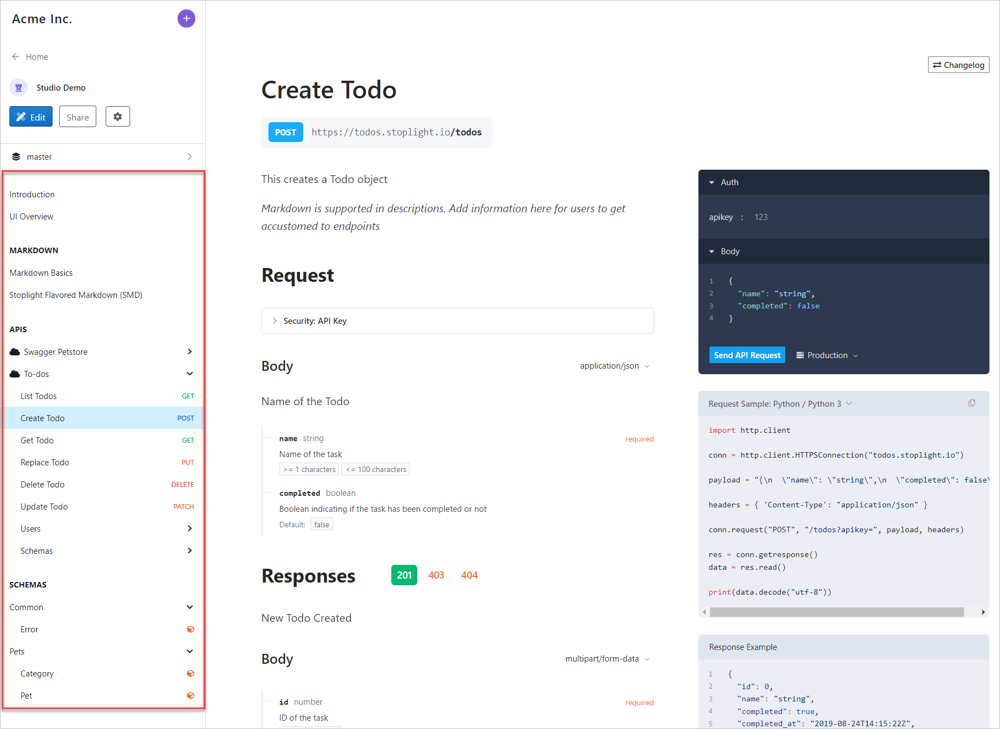
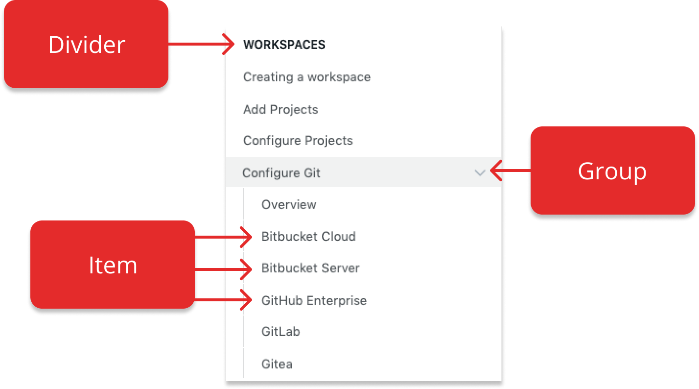
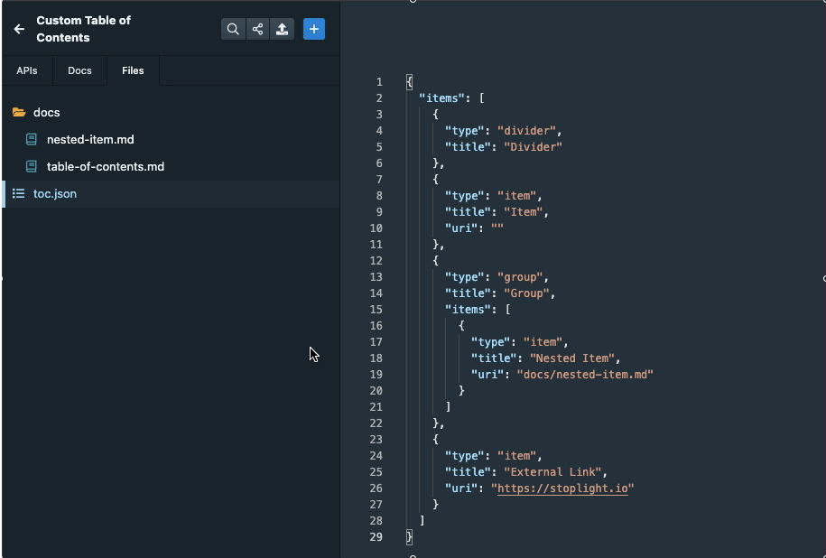
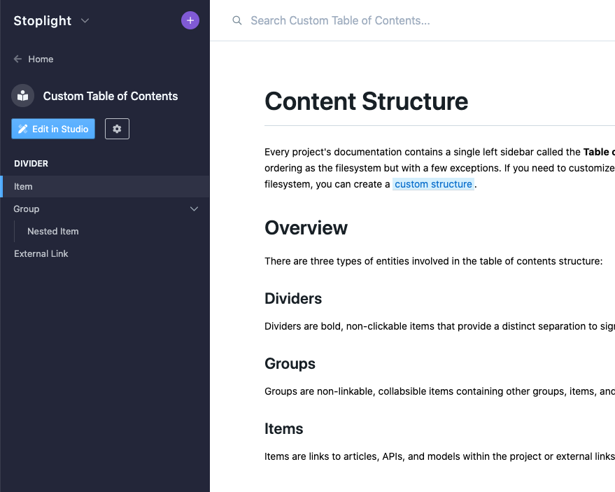

# Customizing the Sidebar

Project documentation contains a single left sidebar called the **Table of Contents** (or ToC). The [default structure](#the-default-structure) of this sidebar loosely follows the filesystem of the project, with a few exceptions for APIs and models. You can [customize the appearance](#customizing-the-sidebar) of this sidebar using a Table of Contents file (`toc.json`), which supports:

- Customizing the order of files in the sidebar
- Overriding the title of a file in the sidebar
- Selectively exposing files in the sidebar, allowing you to hide items by not including them in your Table of Contents file



> ### Limitations
> 
> There are a few known limitations with this functionality:
> 
> 1. **You can only reorder articles, APIs, and model files.** Endpoints and internal models will follow the [default structure](#the-default-structure) outlined below. [(roadmap)](https://roadmap.stoplight.io/c/110-custom-ordering-for-endpoints-and-models)
> 2. **The `toc.json` file must be written by hand.** [(roadmap)](https://roadmap.stoplight.io/c/112-table-of-contents-editor)
> 3. **Renaming a file does not automatically update the `toc.json`.** You'll need to remember to update your TOC whenever a file is renamed. Otherwise your project sidebar might contain broken links. [(roadmap)](https://roadmap.stoplight.io/c/96-automatically-rewrite-references-and-links-on-filename-change)
> 4. **Renaming a file does not automatically redirect to the new docs url**. This means changing a filename might result in broken links. [(roadmap)](https://roadmap.stoplight.io/c/68-automatic-redirects)
> 

## Overview

There are three types of entities in the Table of Contents:



### Dividers

Dividers are bold, non-clickable items that signify the start of a section of content within the sidebar.

### Groups

Groups are non-linkable, collabsible items containing items and other groups that all relate to the same subject matter. Dividers cannot be nested within a group.

### Items

Items are links to articles, APIs, and model files located within the project directory or external links to content outside of the documentation.

## Using a Custom Structure

If you want to customize the organization of your project's content structure, you can create a custom table of contents file. To get started, create a `toc.json` file in your project's **root directory**.

### Rules

The `toc.json` file should start off with an empty `items` array where you will define your content structure using [dividers](#dividers), [groups](#groups) and [items](#items).

<!-- title: toc.json -->
```json
{
  "items": []
}
```

Note:

- Each entity should have a `type` and a `title` property. 
- Items should also have a `uri` property that either points to a file somewhere within the project or an external link to another website. 
- Groups should have an `items` property allowing you to futher nest more items and groups.

> **TIP**: The easiest way to get a file's URI in Studio is to click the `...` button next to the file, click the "copy path" menu item then paste the contents.
>
> 

### Example

Here is an example to demonstrate the format of the `toc.json` file. 

<!--
title: toc.json
-->
```json
{
  "items": [
    {
      "type": "divider",
      "title": "Divider"
    },
    {
      "type": "item",
      "title": "Item",
      "uri": "docs/table-of-contents.md"
    },
    {
      "type": "group",
      "title": "Group",
      "items": [
        {
          "type": "item",
          "title": "Nested Item",
          "uri": "docs/nested-item.md"
        }
      ]
    },
    {
      "type": "item",
      "title": "External Link",
      "uri": "https://stoplight.io"
    }
  ]
}
```

The above `toc.json` file displays the following structure in the docs sidebar.




## The Default Structure

When the `toc.json` file is not present, the default structure is organized based on a few factors, such as the file type, but primarily follows the same alphanumeric ordering of the filesystem.

### Articles

Markdown articles come first in the table of contents and are ordered alphabetically by their file path. The first directory is represented as a [divider](#dividers) and any directories after appear as [groups](#groups). 

There are a few exceptions. If a "docs" folder exists, it is flattened and not represented in the table of contents. Any articles located in the root of the project are sorted to the top. 

> If a `README.md` file exists, it is put in the first position.

### APIs

Next in the list below articles are your APIs. Each API's title is represented as a [divider](#dividers) followed by an item titled "Overview". The overview item contains the API's description, contact, licensing, servers and global security. 

All of the API endpoints and models are nested inside [groups](#groups) titled after their first tag. Any without tags are placed into a group titled "other". If none of your endpoints or models contain tags, they are placed into groups titled "Endpoints" and "Models" respectively.

### Models

Finally at the bottom of the table of contents are JSON Schema model files, sorted alphabetically under a [divider](#dividers) titled "Models".
