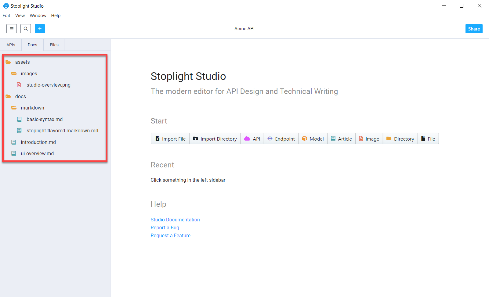

# Quickstart Guide

Follow these steps to move from API specification to ready-to-publish API documentation. Steps are provided for [Studio Web](#studio-web) and [Studio Desktop](#studio-desktop).

Regardless of which you use, you can:

* Start with existing files in a [Git repository](../7.-projects/adding-projects.md#add-projects-from-git).
* Import existing [OpenAPI](../7.-projects/adding-projects.md#import-an-open-api-file) and Markdown files.
* Start with an empty project and create content from scratch.

This quickstart focuses on adding an empty project, creating an API, and  creating Markdown files to supplement the API specification.

## Studio Web

### Create a Project

1. [Create a workspace](../2.-workspaces/a.creating-a-workspace.md).
2. Select the **Add** icon (+) at the top of the left pane.
3. From the **Create a Project** page, select **Create Blank Project**.
4. Provide a name for your project, and then set the [project visibility](../2.-workspaces/l.project-access.md). 
5. Select **Create Project**.

Once you have a project, you can add APIs, articles, images, and more. See [Work with Files](../7.-projects/working-with-files.md) for details or continue through this quickstart.

### Add an API

1. From the **Project** window, select the **Add** icon (+) at the top of the left pane.
2. Select **API**.
3. On the **New API** window, provide a name for the API, and then select the OpenAPI version and format (YAML or JSON). 
4. Select **Create**.

Two starter endpoints (`/users/{userid}` and `/user`) and a model (`user`)are provided with new APIs. Use the **Form** or **Code** editors to explore these items and add your own.

> If you have an existing OpenAPI file, or a [Postman Collection](../6.-migrations/postman.md) file, you can import it from this window rather than adding a blank API.

### Add Markdown Files

1. From the **Project** window, select the **Add** icon (+) at the top of the left pane.
2. Select **Article**.
3. Provide a title, and then select **Create**.

4. Modify the Markdown article and add other Markdown files as needed. 

### Publish Documentation and Invite Users

1. Select the **Publish** button.
2. The first time you publish, the **Share Project** window opens. Here, you can:
   * [Invite users](../2.-workspaces/d.workspace-access.md) by name or email address.
   * [Set the project visibility](../2.-workspaces/l.project-access.md#project-visibility).
   * [Set or change access for invited users](../2.-workspaces/l.project-access.md#project-visibility).

Then, select the **Back to Workspace** link to see the published version of the files you added.

Select the **Share** button to invite others to the project.

### Explore More

Learn about:

* Updating the [Table of Contents](../4.-documentation/Sidebar/d.table-of-contents.md).
* Organizing [project files](../2.-workspaces/c.config.md).
* Linking across [APIs and articles](../4.-documentation/stoplight-urls.md#about-relative-links).
* [Creating style guides](../2a.-style-guides/a.style-guide-projects.md) to enforce API consistency.

## Studio Desktop

Studio Desktop provides a similar experience for creating APIs and supplemental documentation. The most noticeable difference between Studio Web and Studio Desktop is that you can't publish documentation to Stoplight from Studio Desktop. You can, however, use the Stoplight CLI to publish from an continuous integration server or from local files. See [Stoplight CLI](https://meta.stoplight.io/docs/platform/ZG9jOjQ1NTQxMw-publish-with-the-stoplight-cli).  

The Studio Desktop start page contains three options: 

* New Local Project 
* Open Git Project
* Open Existing Folder

For now, create a local project.

### Create a New Local Project

1. Provide a name for your project.
2. Select **Include Tutorial Files** to add example files to your project to help you get started. 
3. Select **Create**.

The new local project opens. API files and directories listed in the left panel, and the design panel is shown on the right.

### Review Example Files

Select the **APIs** tab to view provided APIs and models. You can modify these example files or create new APIs, endpoints, and models. Use the **Form**, **Code**, and **Preview** options to switch between edit and preview modes. 

Select the **Docs** tab to switch from the API Design workspace to the documentation workspace. This is where all documentation-related files (Markdown files and image files) can be created, managed, modified, and deleted. Because you added tutorial files, the **Docs** tab includes samples of Markdown and image files.

From the Markdown folder, select **basic-syntax**. The **Markdown Basics** article opens in the main panel. You can modify existing content and create new content. Use the **Code** and **Preview** options to switch between edit and preview modes.

To start working with Git projects in Studio Desktop, see the [Git for Studio Desktop](../2.-workspaces/configure-git/j.git-studio-desktop.md) page.
