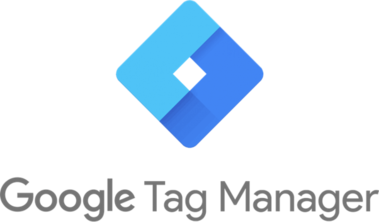
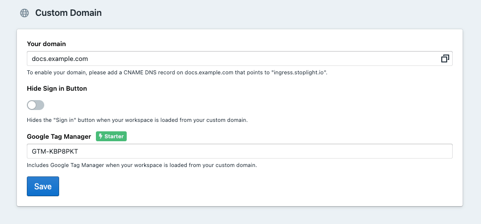

# Google Tag Manager Integration

## Overview

[Google Tag Manger](https://marketingplatform.google.com/about/tag-manager/) is a free tool that allows you to manage and deploy marketing tags, such as analytic scripts or tracking pixels, to your website. Google Tag Manger offers several built-in tags including Google Analytics, CrazyEgg, Hotjar, LinkedIn Insight and more!

> This feature is available on the [Stoplight **Starter** plan](https://stoplight.io/pricing/), and above.

## How it works

Within your Stoplight Workspace, you can configure your Google Tag Manager ID and a custom domain. Then when your workspace is loaded from your custom domain, Google Tag Manger will be included with all of your configured marketing tags.

Here are the steps to get started:

1. [Create a free Google Tag Manager account](https://tagmanager.google.com/?hl=en#/admin/accounts/create) and copy your GTM ID (Eg. `GTM-XXXXX-X`).
2. Navigate to your Stoplight workspace settings and [configure your custom domain](../2.-workspaces/j.custom-domains.md).
3. Enter your Google Tag Manager ID and hit save.

Now all you need to do is add marketing tags to your Google Tag Manager account, and they will be included when loading your custom domain. Check out this guide to [configure Google Analytics using Google Tag Manger](https://support.google.com/tagmanager/answer/6107124?hl=en).

## Limitations

Stoplight blocks the use of any tags associated with the "customScripts" class in Google Tag Manager. These tags, such as the "Custom HTML" Tag, are capable of running JavaScript code provided by the user which could pose a security risk.

See the full list of tags associated with "customScripts": https://developers.google.com/tag-manager/web/restrict.
