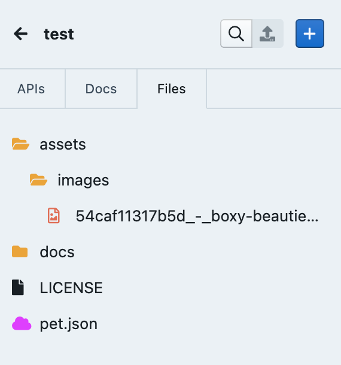
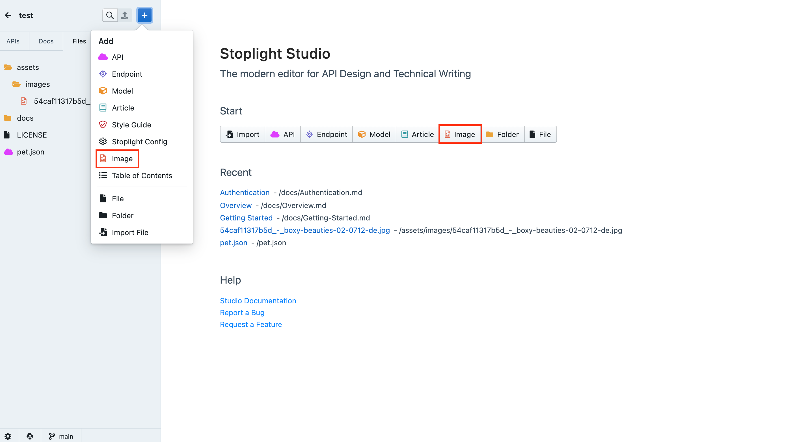
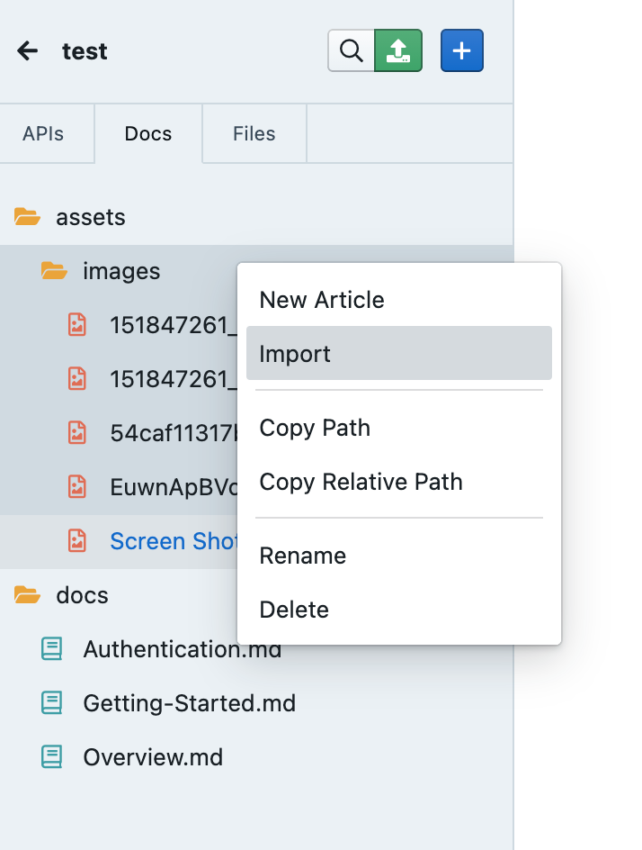
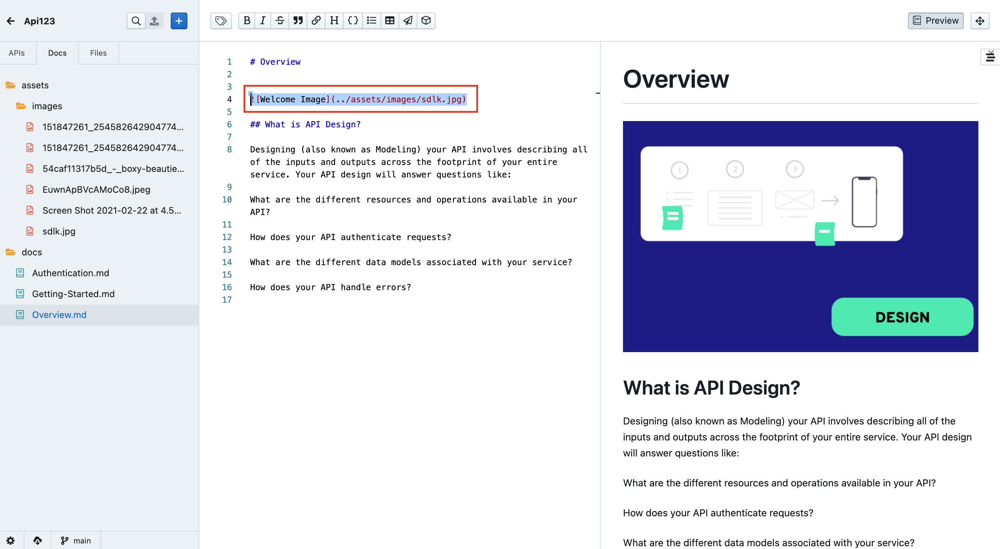

# Adding Images

Adding images in Stoplight is now easier than ever. Add images to your project to create beautiful documentation layouts that supplement text content.

## Why add Images?

Visual help on your documentation compliments the text on it, and gets your users to their goals faster. Add flowcharts, infographics or screenshots on pages like **Getting Started guides** and **Authentication guides** to help explain flows and use cases better. 

You can add multiple images within a documentation file. 

<!-- theme: info -->
> 👉 **Note:** Supported  image formats include: **JPEG,** **JPG** and **GIF**

Images within your projects are listed under the **Files** section. 

<!-- theme: info -->
> 👉 **Note:** If you already have image files stored in a cloned Git Repository, adhere to the Studio Directory Structure to access those files in Studio. 

## **Adding Images to your Projects**

Adding images to your projects is fairly easy. You can add one or multiple at the same time. To do that: 

1. From your dashboard, select your **project** and open **Studio**. 
2.  Click the **+** button on the top left of the page, and select I**mage** from the dropdown. Or select **Image** from the Studio landing page. 

3. Select the i**mages** you want to upload from your file explorer. By default, images will be stored in the **assets/images** folder in your file tree.

4. You can also just right click the images folder and click **Import** to add **images.** 

5. Once you are done, **push** images to your **Git repo**, by clicking the **push** button. 

## Placing Images inside Documentation

Once the images are inside your projects, you can place them on your documentation pages. It's very easy. 

1. Select the docs file where you want to add images and open the Markdown editor. 
2. Inside editor use the following syntax  `` to place the image. 
3. Make sure you add the relative path to the image.
4. Once you are done, click **push** to push changes to Git. 

**Splendid! Your documentation now contains images. Your users are gonna love it 👏**

## Example:

<!-- theme: warning -->
> 👉 **Limitations:** Currently Stoplight Docs only supports displaying images within public Git repositories. If you're working in a private Git repository, you'll need to host the images on a public cloud service such as Imgur or Amazon S3. 

If you'd like for us to prioritize this feature, please give it a vote on our public roadmap: [https://roadmap.stoplight.io/c/100-display-images-from-private-git-repositories]

## What's Next?

Here's what you can do next, once you have added images to your documentation: 

- [Sharing Documentation](../1.-quickstarts/share-documentation-quickstart.md)