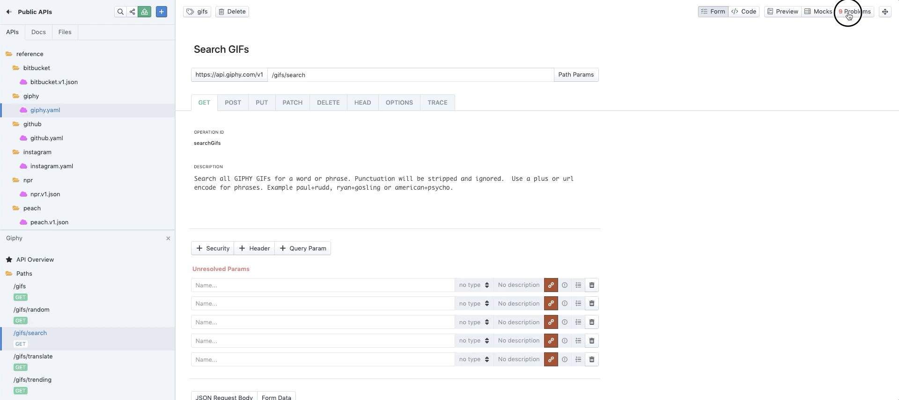

## Style Guides

Ask 100 developers where a semicolon should go, and you'll either get 100 answers, or a all-on-all fist fight. To save this from happening most API teams that grow beyond a handful will implement a style guide.

Also known as "API Design Guides", "Design Guidelines", "Style Books", or "API Standards", the concept of "make a bunch of decision's and write them down" has helped API teams for decades.

These style guides might contain rules about how to handle versioning, filtering, error formats, naming conventions, pagination, or any of a million other variable parts of an API, which different teams would likely make different decisions on.

### Style Guide Ideas

What sorts of decisions might go into a style guide? Well, you might want to cover some security concerns.

- Ban "HTTP Basic" entirely.
- Make sure every endpoint has some sort of security (OAuth 2, API Key, but not both).
- IDs as integers let people [crawl your API](https://phil.tech/http/2015/09/03/auto-incrementing-to-destruction/) a bit too easily, switch to UUIDs in URLs.

You might have noticed the APIs across your ecosystem use infinite different error formats, so why not help folks standardize error formats, and make those errors more useful.

- Error format should be [RFC 7807](https://tools.ietf.org/html/rfc7807).
- Your `20X` response seems to have errors in it, which is confusing.
- There are no URLs in your errors, how can anyone find out more information about what went wrong?

Everyone has a lot of opinions about API versioning, so why not write down the decisions once they're made to avoid litigating this again for every new API.

- Keep [version numbers out of the URL](https://apisyouwonthate.com/blog/api-versioning-has-no-right-way/)
- Version numbers in headers please
- Ban all versioning and enforce [evolution](https://apisyouwonthate.com/blog/api-evolution-for-rest-http-apis/) 🙊

Whatever it is you want to do, you can avoid a lot of bike shedding by making some decisions and writing them down.

### Where Style Guides Live

Some companies will write these down as Google Documents, an internal Wiki, and some companies - even giant multi-million dollar corporations - provide a style guide in the form of one API description document somewhere with comments sprinkled in...

Sometimes these style guides are published publicly, which can give useful insight into what big companies and government organizations consider to be a "good API" for them. [API Stylebook.com > Design Guidelines](http://apistylebook.com/design/guidelines/) is a collection of these style guides if you want to take a look and get some ideas.

The trouble with these text-based documents is that they are large, terse documents which developers rarely read. If developers _do_ read them cover to cover, the chanced of them remembering everything is pretty slip. Even if they somehow remember 100% of the words written down, that knowledge gets out-of-date when changes and additions to the style guide are made. 

Unless you expect all API developers to regularly re-read the API Style Guide cover to cover, you might want to look into automating your style guide. How? Robots! 🤖

- [Spectral](https://stoplight.io/open-source/spectral/) by [Stoplight](https://stoplight.io/)
- [api-linter](https://github.com/googleapis/api-linter) by Google
- [graphql-schema-linter](https://github.com/cjoudrey/graphql-schema-linter) by [Christian Joudrey](https://twitter.com/cjoudrey)

We've talk about Spectral here, because we quite like it. It's been designed to let you create style guides for anything in the form of "Rulesets", and comes with a few default rulesets for popular API Description formats like OpenAPI, AsyncAPI, and JSON Schema.

<!-- theme: info -->
> Seeing as Spectral works with JSON/YAML-based data, you could write custom rulesets for RAML, Kubernetes config, or any other structured data, but we're gonna focus on APIs here.

The style guides made with Spectral can focus on the API descriptions (helping developers new to OpenAPI write better quality, more readable, more consistent OpenAPI), or it can focus on the API the API description is describing, to help the API developers make better APIs. 

Or a style guide can do both! 

### Spectral Rulesets

Spectral focuses a bit more on helping you write better API descriptions by default, because when it comes to making a "good API"... there's no such thing. There's lots of ways to do things badly, but there's a myriad of tradeoffs to most approaches which may work in some situations and not in others. 

So, we help you write valid _and useful_ [OpenAPI](https://meta.stoplight.io/docs/spectral/docs/reference/openapi-rules.md) and [AsyncAPI](https://meta.stoplight.io/spectral/docs/reference/asyncapi-rules.md) with our core rulesets, which you can then extend in your own custom style guides.

For example, adding contact information to the API description is often overlooked, but massively useful for people who have questions about the API later.

```yaml
openapi: '3.0.3'
info:
  version: 1.0.0
  title: PokeAPI
  license:
    name: MIT
paths:
  # ...
```

This will trigger a warning:

> Info object should contain `contact` object

Another handy rule is catching out copy-and-paste mistakes like reusing an `operationId` between multiple operations. Seeing as many tools use this for unique URLs, and some code generators even use these to create function names, catching this out can solve a lot of confusion later.

```yaml
paths:
  /pet:
    patch:
      operationId: "update-pet"
      responses: 
        200:
          description: ok
    put:
      operationId: "update-pet"
      responses: 
        200:
          description: ok
```

Spectral will give anyone repeating an operationId a warning: 

<!-- theme:warning -->

> Every operation should have a unique `operationId`.

Let's look at creating a style guide using "Custom Rulesets".

### Custom Rulesets with Spectral

[Rulesets](https://meta.stoplight.io/docs/spectral/docs/getting-started/rulesets.md) is the term we use for a collection of Rules, which is essentially going to be your automated style guide. Each rule is one bit of style you'd like to enforce.

You can do pretty much anything with a ruleset, by using our built-in functions, or get more powerful with [custom functions](https://meta.stoplight.io/docs/spectral/docs/guides/5-custom-functions.md)!

Stoplight Platform, Studio, Spectral, etc. will all look for a `.spectral.yaml` file (or `.spectral.json` if you prefer) which contains a rules object. 

If I want to enforce all operations (API endpoints) are kebab-case `/berry-flavor/` instead of camelCase `/berryFlavour` or some other case, we could do that.

```yaml
# .spectral.yml
rules:
  paths-kebab-case:
    description: Should paths be kebab-case.
    message: '{{property}} is not kebab-case: {{error}}'
    given: $.paths[*]~
    then:
      function: casing
      functionOptions:
        type: kebab
        separator:
          char: "/"
```

Want to stop people using `X-Foo` headers? Block it for all headers everywhere with the built-in `notMatch` function.

```yaml
rules:
  no-x-headers:
    description: "Please do not use headers with X-"
    message: "Headers cannot start with X-, so please find a new name for {{property}}. More: https://tools.ietf.org/html/rfc6648"
    given: "$..parameters.[?(@.in === 'header')].name"
    then:
      function: pattern
      functionOptions:
        notMatch: '^(x|X)-'
```

Done early enough, this will shape the actual API as it is being developed. The ruleset will come into effect in Studio, so that as people are typing they get feedback if they break a style guide rule. 



If you're a code-first team then this is not ideal, as you'll potentially need to change code which exists in production just to get it to match this style guide.

[Custom functions](https://meta.stoplight.io/docs/spectral/docs/guides/custom-functions.md) can be created for more advanced use cases. Maybe you want to implement a dictionary check to ban British spelling of words like "flavour" - that should _of course_ be "flavor". 😅

#### Automation

Seeing as Spectral is a JavaScript library wrapped in a CLI, enforcing this style guide can be done in all sorts of ways.

- in [a git hook](https://meta.stoplight.io/docs/spectral/docs/guides/1-workflows.md#git-hooks)
- in a JavaScript test suite using the [JS API](https://meta.stoplight.io/docs/spectral/docs/guides/3-javascript.md)
- on [continuous integration](https://meta.stoplight.io/docs/spectral/docs/guides/1-workflows.md#continuous-integration) to fail builds with errors

#### Distributing Rulesets

Rulesets can just be defined as a file in a repository, but that will lead to every API having their own different rules, which somewhat defeats the purpose.

One approach is to publish your ruleset to a publicly available URL which folks can then extend in their repo:

```yaml
extends: https://example.com/api/spectral.yaml
```

Alternatively, especially if you need [custom functions](https://meta.stoplight.io/spectral/docs/guides/5-custom-functions.md), you can [publish a ruleset as a NPM module](https://meta.stoplight.io/docs/spectral/docs/guides/7-sharing-rulesets.md#NPM).

```yaml
extends: example-npm-ruleset
```

Pegging a ruleset on given version can be done in the following manner:

```json
{
  "extends": ["example-npm-ruleset@1.0.4"]
}
```

#### Evolving Rulesets

New rulesets can be added as your style guide evolves, as new problems occur and new standards need to be met.

For example, the API Governance team decides that all APIs need to be running on HTTPS, and only HTTPS. No HTTP allowed anywhere in the company. They could add this rule:

```yaml
  oas2-hosts-https-only:
    description: "ALL requests MUST go through `https` protocol only"
    severity: info
    formats: [oas2]
    message: "Schemes MUST be https and no other value is allowed."
    given: $.schemes
    then:
      function: schema
      functionOptions:
        schema:
          type: array
          items:
            type: string
            enum: ["https"]
          maxItems: 1
```

As the severity is just `info` this will show up in Studio, be output by Spectral CLI, and show up in continuous integration results, all without causing any problems. It's just an informative message, that folks should notice and tweak as they go.

A few weeks or months later when you know most people have implemented this change, you can bump up the severity in order to get the slackers to do the work. 

```yaml
  oas2-hosts-https-only:
    description: "ALL requests MUST go through `https` protocol only"
    severity: warn
    # ...
```

This change will start to show up in Studio as a warning, which will also fail Spectral CLI and trigger a failed build in any Continuous Integration running it too. 

Doing this at the right time for the right reason is a powerful tool to communicate change across large organizations, but using this too heavy handedly can be a problem.

If there are any problems (like hotfixes cannot go out because of CI failures) then anyone can disable rules for specific resources using a feature we call [Exceptions](https://meta.stoplight.io/docs/spectral/docs/guides/6-exceptions.md): 

```yaml
extends: spectral:oas

except:
  "one.yaml#":
    - oas3-api-servers
  "./one.yaml#/info":  # Beside relative ones, also supports rooted paths ;-)
    - info-contact
```


If you already have a style guide, see how much of it you can solve with the build-in functions, then start to get more creative with custom functions to solve the organizations biggest issues.
