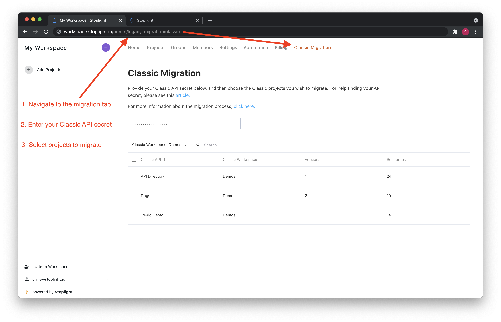
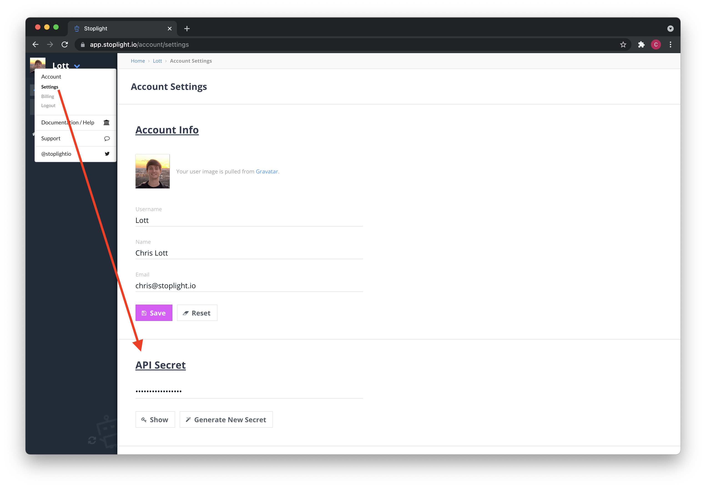
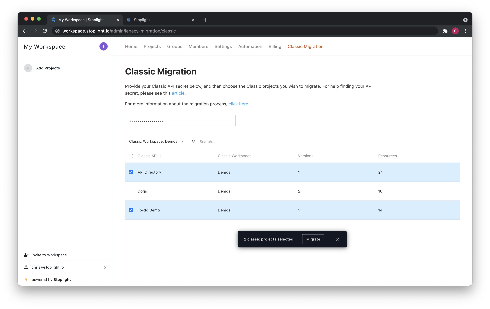

# Migrating from Stoplight Classic

## Introduction

One of the main goals for this new version of the Stoplight Platform has been to
make it easier for you to integrate Stoplight into your existing Git-based
workflows. In Stoplight Classic, projects were hosted in the Stoplight cloud
with no connection to Git. With the latest version of Stoplight, all of your
designs and related assets can be fully managed directly in your Git VCS
provider.

## How do I migrate?

To start, head over to Stoplight Platform and [create a workspace](https://stoplight.io/welcome/create) for your company. Note that while you might have multiple workspaces for your company in Stoplight Classic, you will only have one workspace for your company on the new Stoplight Platform.

After creating your workspace, you should land on the Classic Migration screen. If not, click on your workspace name in the top left of the screen and navigate to "Settings". From there you should see a "Classic Migration" tab.

If you don't see the "Classic Migration" tab, you can navigate there directly by adding `/admin/legacy-migration/classic` to the end of your workspace URL.

Now you'll need to retrieve your Classic API secret to start the migration process. In a new browser tab, navigate to your [account settings in Classic](https://app.stoplight.io/account/settings) and copy your API secret.

Back on the Classic Migration screen in Stoplight Platform, paste your API secret in the input. If successful, you'll see a list of all the Classic workspaces you own and all of their APIs.

Choose the Classic APIs you want to migrate to your Stoplight Platform workspace. After selecting at least one project, you'll see a button to migrate them.

Wait a few moments for the projects to migrate and you'll see them appear in your left sidebar. Success!

You can continue this migration process as many times as you want. If you migrate the same project multiple times, **it will overwrite the existing project data in Stoplight Platform**. This will allow you to migrate APIs at your own pace until Classic is officially shutdown.

## Limitations

### Migration tool

The Classic Migration tool can migrate all of your Classic APIs, including groups, text sections, endpoints, and models.

However, there are a few items that won't be migrated:

- **Members** - the roles and permission system is slightly different in Stoplight Platform (see FAQ below), so Stoplight won't be able to migrate your teammates. You can [configure an allowed email domain](../2.-workspaces/allowed-email-domains.md) so your teammates can automatically join your workspace or [invite them manually by email](../2.-workspaces/d.inviting-your-team.md).
- **Hosted docs** - Stoplight won't be able to migrate your hosted documentation settings, such as custom domains, themes, layouts, authentication, and integrations. You will need to reconfigure these in your new Workspace's settings.

### Stoplight Platform vs Stoplight Classic

While the new Stoplight Platform includes a lot of new functionality, there are
some features from Classic that have not yet made their way over.

Below are several features that were available in Classic that are linked to our
upcoming roadmap. We encourage you to follow the features relevant to you -
we'll notify you as each is released.

|                                                                                                                    |  Timeline   | Description                                                                        |
| ------------------------------------------------------------------------------------------------------------------ | :---------: | ---------------------------------------------------------------------------------- |
| [~~Design: Shared parameters/responses~~](https://roadmap.stoplight.io/c/138-support-for-openapi-shared-responses) |  Launched   | Form based editing for OpenAPI shared components                                   |
| [~~Docs: Integrations~~](https://roadmap.stoplight.io/c/64-analytics-integrations)                                 |  Launched   | First class support for integrations like Google analytics, Segment, Intercom, etc |
| [~~Docs: Custom CSS, JS, and HTML~~](https://roadmap.stoplight.io/c/57-embeddable-component-library)               |  Launched   | Rich component library for creating custom API docs site                           |
| [Docs: Custom variables](https://roadmap.stoplight.io/c/47-custom-variables)                                       | Considering | Allow users to set a variable once and have it used everywhere                     |
| [Design: CRUD Builder](https://roadmap.stoplight.io/c/63-crud-builder)                                             | Considering | Automatically generate a list of CRUD endpoints for a schema                       |
| [API Discovery](https://roadmap.stoplight.io/c/66-learning-recording)                                              | Considering | Automatically create an OpenAPI document by proxying requests to an existing API   |

## FAQ

The concepts in the new Stoplight Platform should be very similar to what you're
used to in Classic. Here are some commonly asked questions to help clarify those
similarities and differences. If you have any additional questions, please don't
hesitate to [contact us](mailto:support@stoplight.io).

**Is a Stoplight Workspace similar to a Workspace in Classic?**

Yes, they are very similar. Just like in a Classic workspace, your workspace is
where you'll invite members, add projects, and create a billing subscription. However the main difference is you will only have one Workspace for your entire company in Stoplight Platform.

**How do the members roles compare to the ones in Classic?**

The roles and permissions work similar to Classic, but some of the role names
have changed.

Below is a mapping of Classic to Platform roles:

| Stoplight Classic | Latest Stoplight |                                   |
| ----------------- | ---------------- | --------------------------------- |
| Owner             | Owner            | Can change workspace settings     |
| Admin             | Admin            | Can manage members                |
| Member            | Maker            | Can add projects                  |
| Guest             | Viewer           | Can view projects                 |
|                   | Guest            | Can be granted access to projects |

**How do I publish my API documentation?**

In the new Platform, API documentation is automatically generated from the files
in your projects. You control access to projects by configuring the project's
visibility settings.

For example, if you want a project to only be visible by Workspace members, you
can set the project's visibility to `internal`. You can also give members and
guests explicit access to view specific private or internal projects.

**How do I update the contents of my project's documentation?**

When adding a project to your Stoplight Workspace, a webhook will be installed
within the Git repository. This allows Stoplight to automatically update your
documentation when any of the API design assets in the repository have changed.

The contents of the project can then be updated from any one of your favorite
tools, such as Stoplight Studio or even directly in the VCS provider. As long as
the changes are pushed to the Git repository, they will be automatically synced
with your Stoplight Workspace.

If you need more control over when documentation is updated, see our publishing
guide [here](../2.-workspaces/g.automating-publishing.md).

**How do I add a custom domain to my documentation?**

To configure a custom domain for your workspace, please review the guide
[here](../2.-workspaces/j.custom-domains.md).

**How do I configure authentication such as Auth0 or SAML?**

To configure a custom SSO provider for your workspace, please review the guide
[here](../2.-workspaces/e.configuring-authentication.md).

**How do I create a new version of my API project?**

Versions in Stoplight are managed through branches. For more information
on this subject, please review the guide
[here](../2.-workspaces/h.branch-management.md).

**How do I configure a Prism mock server?**

Similar to Classic, every OpenAPI file in your Workspace has a mock server
configured automatically. All you need to do is send requests to the API's
unique mock URL. For more information, please read this [guide on mocking in Stoplight](../3.-design/setting-up-a-mock-server.md).
