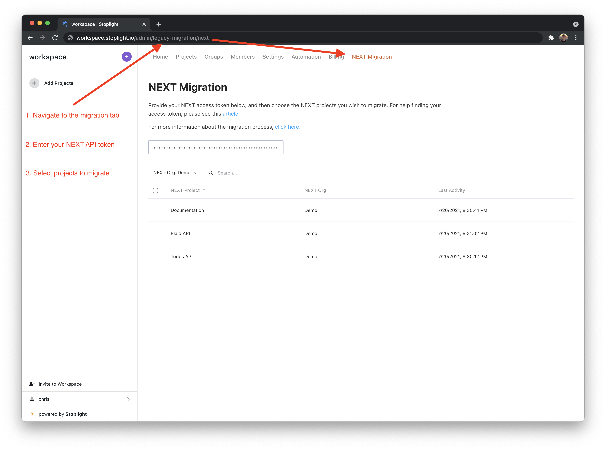
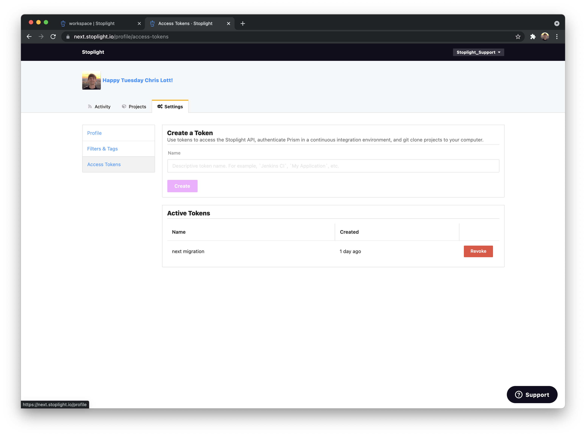
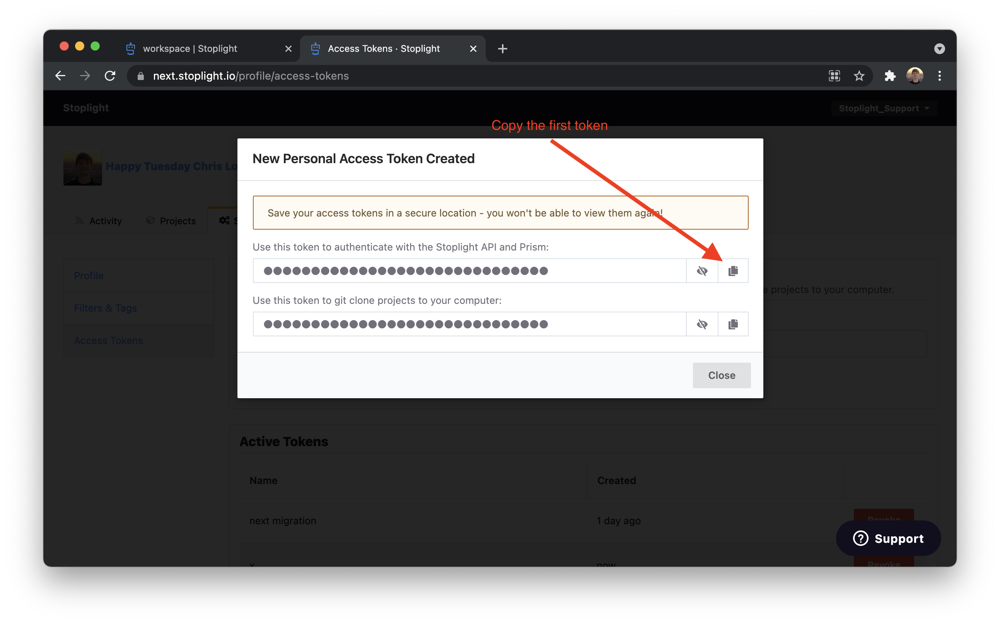
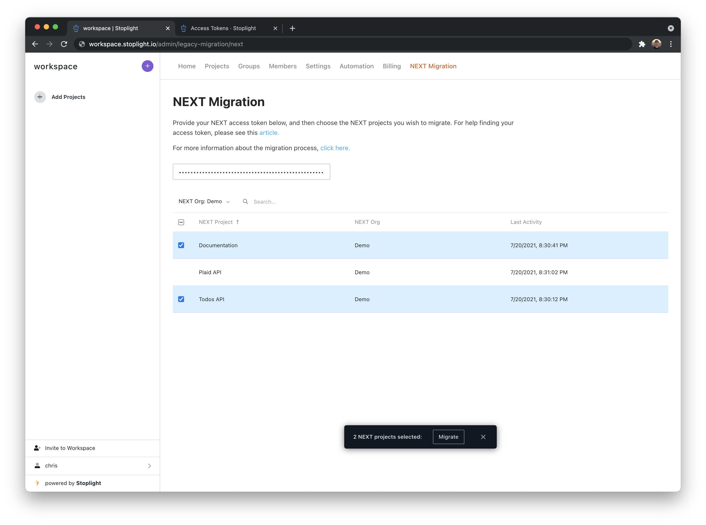

# Migrating from NEXT

## Introduction

The new Stoplight Platform is the third generation of our product, and fundamentally reimagines how Stoplight integrates into your development workflow.

When we began developing the new platform, our primary goal was to make it as easy as possible to integrate Stoplight into your existing workflows. Stoplight should enrich - not replace - these workflows, thus reducing the friction involved with rolling out a modern API development strategy at your company.

To that end, the new Stoplight Platform was built to act as a layer on top of the version control system(s) at your company - GitHub, GitLab, Bitbucket, etc. In NEXT, your API designs and docs are stored in Stoplight. In the new Stoplight Platform, these assets are stored in your own version control system.

This shift leads to a number of benefits:

1. **No lock-in:** Your data is your own, stored in your Git repositories.
2. **Tooling flexibility:** Convincing developers to adopt a new tool can be difficult. With our new approach, developers can continue to use the tools that they're most comfortable with - all they need to do is commit design/docs files to your Git repos. If some of them prefer to write OpenAPI by hand in VS Code rather than using Stoplight Studio, no problem!
3. **Workflow flexibility:** Since Stoplight is built on your VCS, it's easy to leverage the development workflows that already exist at your company - PR reviews, CI, GitHub actions, custom VCS integrations, you name it.
4. **Co locate alongside implementation:** In NEXT you are forced to store your design/docs files in a flat list, separate from the implementation they are meant to describe. In our new Platform you can organize your files however you like, including managing them in the same repo as the actual API implementation! This has a number of benefits, such as reviewing changes to design and implementation in a single Pull Request.

The list above describes some of the large fundamental opportunities our new approach opens up. Beyond that there are of course dozens of new features and enhancements packed into the new Platform.

## How do I migrate?

To start, head over to Stoplight Platform and [create a workspace](https://stoplight.io/welcome/create) for your company. Note that while you might have multiple organizations for your company in Stoplight NEXT, you will only have one workspace for your company on the new Stoplight Platform.

After creating your workspace, you should land on the NEXT Migration screen. If not, click on your workspace name in the top left of the screen and navigate to "Settings". From there you should see a "NEXT Migration" tab.

If you don't see the "NEXT Migration" tab, you can navigate there directly by adding `/admin/legacy-migration/next` to the end of your workspace URL.

Now you'll need to retrieve your NEXT access token to start the migration process. In a new browser tab, navigate to your [account settings in NEXT](https://next.stoplight.io/profile/access-tokens) and create an API token.

Copy the first access token and paste it into the input on the NEXT Migration screen in Stoplight Platform. If successful, you'll see a list of all the NEXT orgs you own and all of their projects.

Choose the NEXT projects you want to migrate to your Stoplight Platform workspace. After selecting at least one project, you'll see a button to migrate them.

Wait a few moments for the projects to migrate and you'll see them appear in your left sidebar. Success!

You can continue this migration process as many times as you want. If you migrate the same project multiple times, **it will overwrite the existing project data in Stoplight Platform**. This will allow you to migrate projects at your own pace until NEXT is officially shutdown.

## Limitations

### Migration tool

The NEXT Migration tool can migrate all of your NEXT projects, including all versions, OpenAPI files, Markdown files, and a single Hub file per project.

However, there are a some items that won't be migrated:

- **Members** - the roles and permission system is slightly different in Stoplight Platform (see FAQ below), so Stoplight won't be able to migrate your teammates. You can [configure an allowed email domain](../2.-workspaces/allowed-email-domains.md) so your teammates can automatically join your workspace or [invite them manually by email](../2.-workspaces/d.inviting-your-team.md).
- **Teams** - Stoplight is currently developing [Groups](https://roadmap.stoplight.io/c/137-workspace-groups) functionality.
- **Multiple Hubs** - Only one Hub will be migrated per project. The migration tool will try to find a published `main.hub` file or the most recently published Hub file. If there are no published Hubs, the most recently edited Hub will be chosen. If you have multiple Hubs in a NEXT project and want them all migrated, you will need to move each Hub into its own NEXT project.
- **Hub Layout** - Stoplight Platform's documentation layout is completely driven by the sidebar, so the Hub's header and footer items will not be migrated. However, the migration tool will transform all of the Hub's pages and routes into markdown files, while keeping them in the same order in the sidebar as the Hub's table of contents. Once migrated, you will be able to [customize the sidebar](../4.-documentation/Sidebar/a.customize-sidebar.md).
- **Hosted docs** - Stoplight won't be able to migrate your hosted documentation settings, such as themes, [custom domains](../2.-workspaces/j.custom-domains.md), [authentication](../2.-workspaces/e.configuring-authentication.md), and [analytics](../4.-documentation/e.configure-analytics.md). You will need to reconfigure these in your new Workspace's settings.
- **HTML, CSS and JS** - Stoplight Platform does not support HTML, CSS or JS. If you need a fully customizable documentation, please take a look at our open source tool, [Elements](https://stoplight.io/open-source/elements/) to embed your API reference documentation into a custom developer portal.
- **Scenarios** - Stoplight Platform does not support Scenarios. If you need contract testing, please take a look at our open source tool, [Prism](https://stoplight.io/open-source/prism/), and its built in [Validation Proxy](https://meta.stoplight.io/docs/prism/ZG9jOjk3-validation-proxy).

### Stoplight Platform vs Stoplight NEXT

While the new Stoplight Platform includes a lot of new functionality, there are some features from NEXT that have not yet made their way over. We are taking this opportunity to re-imagine and improve the functionality listed below, and will be rolling it out through the rest of the year.

Each feature is linked to a card on our public roadmap, and we encourage you to follow the features relevant to you - we'll notify you as each is released.

|                                                                                                                    |  Timeline   | Description                                                                                                                               |
| ------------------------------------------------------------------------------------------------------------------ | :---------: | ----------------------------------------------------------------------------------------------------------------------------------------- |
| [~~Docs: Theming~~](https://roadmap.stoplight.io/c/52-theming-and-branding)                                        |  Launched   | Customize the branding and colors                                                                                                         |
| [~~Docs: Versioning~~](https://roadmap.stoplight.io/c/60-multiple-branches)                                        |  Launched   | Show/hide specific branches in each project's docs                                                                                        |
| [~~Docs: Table of Contents ordering~~](https://roadmap.stoplight.io/c/59-customize-docs-sidebar-ordering)          |  Launched   | Completely custom ordering of your docs sidebar. By default, files will be organized alphabetically, matching the order in the filesystem |
| [~~Design: Shared parameters/responses~~](https://roadmap.stoplight.io/c/138-support-for-openapi-shared-responses) |  Launched   | Form based editing for OpenAPI shared components                                                                                          |
| [~~Docs: Integrations~~](https://roadmap.stoplight.io/c/64-analytics-integrations)                                 |  Launched   | First class support for integrations like Google Analytics, Segment, Intercom, etc                                                        |
| [~~Docs: Custom CSS, JS, and HTML~~](https://roadmap.stoplight.io/c/57-embeddable-component-library)               |  Launched   | Elements: a rich component library for creating custom API docs site                                                                      |
| [~~Docs: Redirects~~](https://roadmap.stoplight.io/c/68-redirects)                                                     | Launched | Automatic redirects when docs routes are changed                                                                                          |
| [Docs: Try It OAuth token generation](https://roadmap.stoplight.io/c/58-request-maker-authentication)              | Considering  | Generate OAuth 1 & 2 tokens for HTTP requests in Try It                                                                                   |
| [Design: Lifecycle Tags](https://roadmap.stoplight.io/c/65-lifecycle-tags)                                         | Considering | Add tags to build workflows around your API lifecycle                                                                                     |
| [Discussions](https://roadmap.stoplight.io/c/61-discussions-comments)                                              | Considering | Create and resolve discussions on API designs and docs                                                                                    |
| [Docs: Custom variables](https://roadmap.stoplight.io/c/47-custom-variables)                                       | Considering | Allow users to set a variable once and have it used everywhere                                                                            |
| [Design: CRUD Builder](https://roadmap.stoplight.io/c/63-crud-builder)                                             | Considering | Automatically generate a list of CRUD endpoints for a schema                                                                              |

## FAQ

The concepts in the new Stoplight Platform should be very similar to what you're used to in NEXT. Here are some commonly asked questions to help clarify those similarities and differences. If you have any additional questions, please don't hesitate to [contact us](mailto:support@stoplight.io).

**Is a Stoplight Workspace similar to an Organization in NEXT?**

Yes, they are very similar. Just like in a NEXT organization, your Workspace is where you'll invite members, add projects, and create a billing subscription.

**How do the members roles compare to the ones in NEXT?**

The roles and permissions work similar to NEXT, but some of the role names have changed. The main difference in the new Platform is members who need to edit a git project will need to be given editing access within your VCS.

We've also added a `guest` role which allows you to invite members from outside of your company and grant them access to view specific projects.

Below is a mapping of NEXT to Platform roles:

| NEXT        | Platform |                                   |
| ----------- | -------- | --------------------------------- |
| Owner       | Owner    | Can change workspace settings     |
| Admin       | Admin    | Can manage members                |
| Contributor | Maker    | Can add projects                  |
| Reader      | Viewer   | Can view projects                 |
|             | Guest    | Can be granted access to projects |

**How do I publish my documentation as a Hub?**

In the new Platform, your Workspace is your documentation Hub. Workspaces are publicly accessible, and you control access to view projects by configuring a project's visibility settings.

For example if you want a project to only be visible by Workspace members, you can set the project's visibility to `internal`. You can also give members and guests explicit access to view specific private or internal projects.

**How do I update the contents of my project's documentation?**

When adding a project to your Stoplight Workspace, a git webhook will be installed on the VCS repository. This allows Stoplight to automatically update your documentation when any of the API design assets in the repository have changed.

The contents of the project can then be updated from any one of your favorite tools such as Stoplight Studio or even directly in the VCS provider. As long as the changes are pushed to the git repository, they will be automatically synced with your Stoplight Workspace.

<!-- TODO **How do I add a custom domain to my documentation?** -->

**How do I configure authentication such as Auth0 or SAML?**

Currently Stoplight Platform supports the following Auth providers:

- LDAP
- SAML
- Bitbucket Cloud
- Bitbucket Server
- GitHub
- GitLab
- Azure Devops

For more information on how this all works, read our [Single Sign-on Documentation](../2.-workspaces/e.configuring-authentication.md).

**How do I create a new version/release of my project?**

In NEXT, the versioning and releases feature was built on top of [git branching](https://git-scm.com/book/en/v2/Git-Branching-Basic-Branching-and-Merging). To accomplish the same in Platform, you can use [multiple branches in your project](../2.-workspaces/h.branch-management.md).

**How do I configure a Prism mock server?**

Every OpenAPI file in your Workspace has a mock server configured automatically. All you need to do is send requests to the API's unique mock URL. For more information, please read this [guide on mocking in Stoplight](../3.-design/d.setting-up-a-mock-server.md).

<!-- TODO: Add a link -->
