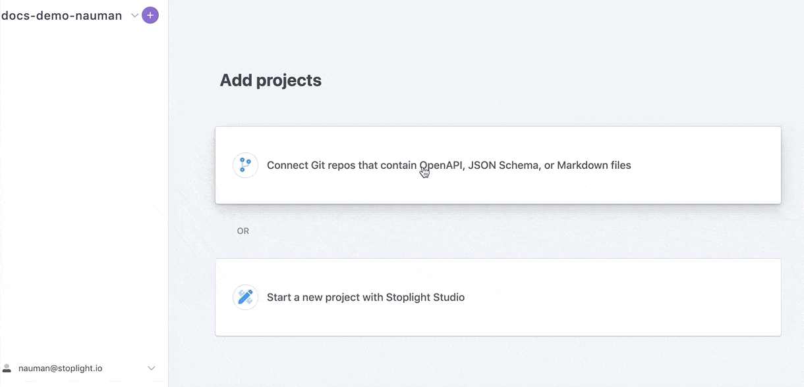
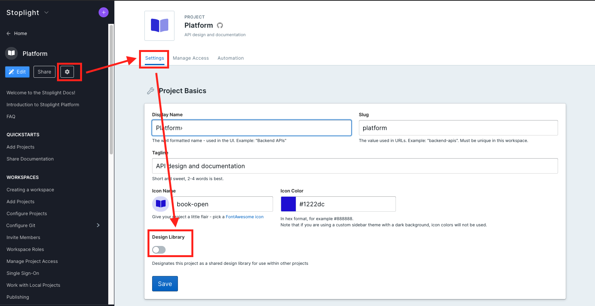

# Migrating from V1

## Introduction

The new Stoplight Platform is the second iteration of our Platform, and brings various new features and a large set of improvements. It's now a publicly available SaaS offering for teams of all shapes and sizes. If you're a current user of our V1 Platform, this guide should help you migrate to the latest and greatest. 

## Why should I migrate?

Here's a list of some of the major improvements you'll get as you make the move from V1 to V2:

Feature | What's new in V2 |
---------|----------|
 SaaS | Stoplight Platform V2 comes as a ready to use SaaS service with rolling updates. Learn about changes in the [Release Notes](https://docs.stoplight.io/docs/whats-new/).
 Performance Improvements | V2 has major performance improvements with the ability to support a large number of nodes and references inside a project.
 **Git:** Easy Connection | One click connection with cloud and internal Git providers.
 **Git:** Webhooks and Automation | Webhooks that automatically update the workspace with changes in Git repository. 
**Git:** Project Import | Easily import projects from multiple Git organizations from a list within the Stoplight UI. 
**User Management:** Invite Users| Robust user management system, with the ability for anybody to invite users with different roles and permissions. 
**User Management:** Approved Email Domains | Allow anybody from a particular domain to join the workspace which enables large organizations to scale their workspaces easily.
**User Management:** Guest Access | Onboard external partners with limited access using the guest roles
**Project Management:** Improved Project Permissions | Private projects that can be shared with particular members on top of the internal/public projects from V1. 
Custom Domain | Built in support to add a custom domain
**Design:** Stoplight Backed Projects | Stoplight backed projects in addition to Git Projects that will include real time live collaboration without requiring a backing Git repository.
**Design:** Improved Model and Example generation | Generate JSON Schema to and from example JSON 
**Design:** Shared Components | Share examples, responses, parameters and models within a project. 
**Design:** Hosted Mocking | Up to date hosted mock servers powered by the latest version of Stoplight Prism.
**Design:** Multiple design libraries | Any project can be converted into a design library with flexible permissions.
**Docs:** Theming | Theme you workspace according to your brand guidelines. 
**Docs:** Home Page | Customizable landing page with markdown support to support internal/external use cases.
**Docs:** Customizable table of contents | Organize sidebar with a TOC.json file to ensure a better navigation experience for consumers.

<!-- markdown-link-check-disable-next-line -->
For a more detailed comparison, read this [datasheet](https://www.notion.so/stoplight/e9a6bf85651e4ab3999e307136814c56?v=adc1c0337f2a4acab1c3d32ba1ebbd1c).

## How do I migrate?

<!-- markdown-link-check-disable-next-line -->
> If you feel comfortable and ready to migrate, follow the instructions below. If you have any questions or concerns, don't hesitate to [reach out](https://support.stoplight.io) and we will schedule time to assist you. 

### Create a New Stoplight Workspace

[Create a new Stoplight Workspace](../2.-workspaces/a.creating-a-workspace.md). Choose a domain (Preferably your company name) your workspace would be available at. 

### Import Projects

Follow this [step-by-step guide](../2.-workspaces/configure-git/a.configuring-git.md) to connect the Git provider of your choice.

Next, [import all projects](../7.-projects/adding-projects.md) that you had added into your V1 workspace. 

### Invite Users

Currently Stoplight Platform supports the following Auth providers:

- LDAP
- SAML
- Bitbucket Cloud
- Bitbucket Server
- GitHub
- GitLab
- Azure Devops

To setup a auth provider of your choice, read our [Single Sign-on Documentation](../2.-workspaces/e.configuring-authentication.md).

Alternatively, you can also [invite members](../2.-workspaces/d.workspace-access.md) 
individually using their email.

The fastest way to get your team moved over to Stoplight Platform is to [configure an email domain](../2.-workspaces/d.workspace-access.md#make-your-workspace-discoverable) and share a link to your workspace sign up page. This would allow anybody with your company domain to join the workspace with the specified role.

Learn about the different workspace roles [here](../2.-workspaces/k.workspace-roles.md).

### Share Projects

V2 Platform comes with granular control over project permissions and visibility. Set appropriate project access by following this [guide](../2.-workspaces/l.project-access.md).

### Use Mock Servers

V2 comes with up to date hosted mock servers to help speed up development. Follow this [guide](../3.-design/setting-up-a-mock-server.md) to get started with hosted mocking.

### Set Up Design Libraries

<!-- markdown-link-check-disable -->
<!-- theme: warning -->
> Design libraries in V2 aren't a public feature and are limited to existing V1 users only. If you are a V1 user and don't have design libraries enabled don't hesitate to [reach out](https://support.stoplight.io) and we will assist you. 
<!-- markdown-link-check-enable -->

V2 comes with support for multiple design libraries. You can set complete Git projects as design libraries unlike in V1 where you'd have to add schemas individually to a single design library. 

To set a project as a design library, go to the project settings and designate the project to a design library. 

Next up go to the projects using design libraries, and update the links to point to the latest links using the format: `https://stoplight.io/api/v1/projects/{workspace-name}/{project-name}/nodes/{node-url}`.

### Migrate Documentation

If you have published documentation for external stakeholders (customers, the general public, etc), you can share your documentation by setting appropriate visibility settings.

You can also:
- [Setup a custom domain](../2.-workspaces/j.custom-domains.md)
- [Publish multiple versions using branches](../2.-workspaces/h.branch-management.md)
- [Configure analytics](../4.-documentation/e.configure-analytics.md)
- [Customize the sidebar](../4.-documentation/Sidebar/a.customize-sidebar.md)