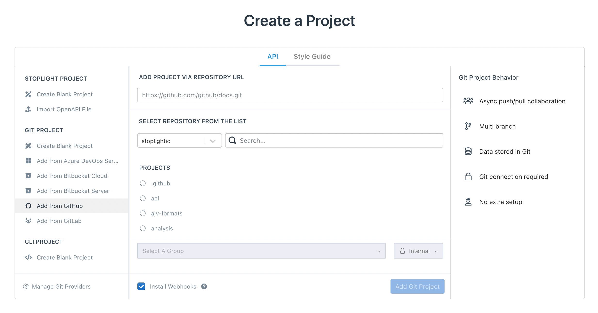

# Add Projects

There are two types of projects you can add to your workspace:

- API Projects, which include:
  - [Stoplight web projects](#add-stoplight-projects)
  - [Git projects](#add-projects-from-git)
  - [CLI projects](#add-cli-projects)
- [Style Guide Projects](../2a.-style-guides/a1.create-style-guide.md)

To add a project, log in to your workspace, and then use one of these options:

* Select the **Add** icon (+) at the top of the left pane.
* Select the **Projects** tab on the workspace toolbar, and then select **New Project**.

The **Create a Project** page opens with the **API** tab selected.

> Style guide projects can be created by workspace owners and admins only.

## Add Stoplight Projects

Stoplight projects offer real-time collaboration. Data is stored in Stoplight. A Git connection isn't required and there is no extra setup. You can:

  - Create a blank project
  - Import an existing OpenAPI file

  

### Add a Blank Project

1. From the **Create a Project** page, select **Create Blank Project**.
2. Provide a name for your project, and then set the [project visibility](../2.-workspaces/l.project-roles.md). 
3. Optionally, select a group to help organize your projects (Professional plan and above).
4. Select **Create API Project**.
5. Select **Edit** to design your API with Stoplight Studio.

### Import an OpenAPI File

1. From the **Create a Project** page, select **Import OpenAPI File**.
2. Provide a name for your project, and then set the [project visibility](../2.-workspaces/l.project-roles.md). 
3. Optionally, select a group to help organize your projects (Professional plan and above).
4. Select **Create Project & Import File**.
5. Select the OpenAPI file to import, and then select **Import**.
6. Use Stoplight Studio to update the API.

## Add Projects from Git

The best way to get projects into Stoplight is to pull them in from Git. Git projects offer asynchronous push/pull collaboration across multiple branches. Data is stored in Git, but there is no extra setup. You can:

  - Create a blank project
  - Add a project from [any supported Git provider](../2.-workspaces/configure-git/a.configuring-git.md)

To add projects from Git:

1. From the **Create a Project** page, select an option under **Git Project**.
2. Select **Connect**. Follow the instructions on the popup screen to authorize.
3. Upon successful authentication, choose your organization, and then add repositories using one or both of these options:
    - **Add project via repository URL**: here you can paste the URL of a Git repository that you want to import. For GitHub, GitLab, and Bitbucket repositories, the URL must end with `.git`.
    - **Select repository from the list**: this list will display all repositories you have access to from the selected organization. You can use the search bar to filter the list, and then select the repositories you would like to add.
4. The **Install Webhooks** option is selected by default. This enables automatic publishing from your project when changes are pushed to the repository. Clear this option to disable automatic publishing. See [Publishing Git Projects](../7.-projects/publishing-git-projects.md) for details. 
5. Next, select **Add Git Project**.

Once the project is created and the analyzer has completed, it will contain Markdown articles and API descriptions that are stored in the Git repository. Files used by [Stoplight Style Guides](../2a.-style-guides/style-guides-and-git.md) are added to your repository during your first push. Use Stoplight Studio to modify these files.

### Custom Git Configurations

See [Git Overview](../2.-workspaces/configure-git/a.configuring-git.md) for a list of Git configurations supported by Stoplight.

## Add CLI Projects

If you use a version control system other than Git (Mercurial, SVN, SourceSafe, Bazaar), use the Stoplight CLI to add a local project. 

 

Stoplight CLI is a command-line tool, available as [an NPM module](https://www.npmjs.com/package/@stoplight/cli), that can publish changes to Stoplight. CLI projects are shown in the Explorer like other projects. They won't be editable in Studio Web, but the content will be available to read and search like anything else. 

Read more about [working with local projects](../2.-workspaces/f.working-with-local-projects.md).

## Share Projects

For external users, share your workspace URL with users to let them access your documentation. For internal or private projects, [invite users](../2.-workspaces/d.inviting-your-team.md) to the workspace directly. 

